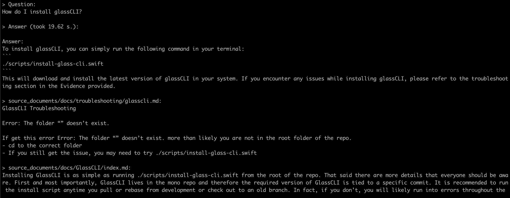

# Ask Me
Ask questions to your Walmart Project's documentation without an internet connection, using the power of LLMs. 100% private, no data leaves your execution environment at any point. You can ingest additional documents and ask questions even offline!

This Proof-Of-Concept is currently designed for 0-shot queries, so it is not currently configured for chat-style interaction with Walmart Documentation. You ask a question, and the AI will do it's best to give you an accurate answer. Each question stands as a separate interaction.

Built with [LangChain](https://github.com/hwchase17/langchain), [GPT4All](https://github.com/nomic-ai/gpt4all), [LlamaCpp](https://github.com/ggerganov/llama.cpp), [Chroma](https://www.trychroma.com/), [SentenceTransformers](https://www.sbert.net/) and [PrivateGPT](https://github.com/imartinez/privateGPT).



# Environment Setup
In order to set your environment up to run the code here, first install conda to help manage python environments **(optional but recommended)**:
[Instructions here.](https://conda.io/projects/conda/en/latest/user-guide/install/macos.html)
After install, create a new environment:
```shell
conda create -n askWally python=3.11
```

After creating the new environment, activate it by using the following command:
```shell
conda activate askWally
```

Then, install the project requirements:
```shell
pip3 install -r requirements.txt
```

Next, download the LLM model and place it a directory called "models" in the project root:
- LLM: default to [Llama2 7B](https://huggingface.co/TheBloke/Llama-2-7B-Chat-GGML/resolve/main/llama-2-7b-chat.ggmlv3.q4_K_M.bin). If you prefer a different LlamaCpp or GPT4All-J compatible model, just download it and reference it in your `.env` file. (The "models" folder is setup by default. If you prefer to store it in a different folder, be sure to reference it in your `.env` file)

Copy the `example.env` template into `.env`
```shell
cp example.env .env
```

and edit the variables appropriately in the `.env` file.
```
# Vector DB Settings
PERSIST_DIRECTORY: The folder you want your vectorstore in
EMBEDDINGS_MODEL_NAME: SentenceTransformers embeddings model name (see https://www.sbert.net/docs/pretrained_models.html)
TARGET_SOURCE_CHUNKS: The amount of chunks (sources) that will be used to answer a question

# LLM Settings
MODEL_TYPE: Supports LlamaCpp or GPT4All
MODEL_PATH: Path to your GPT4All or LlamaCpp supported LLM
MODEL_N_CTX: Maximum token limit for the LLM model
MODEL_N_BATCH: Number of tokens in the prompt that are fed into the model at a time. Optimal value differs a lot depending on the model (8 works well for GPT4All, and 1024 is better for LlamaCpp)

# Atlassian Confluence Settings
CONFLUENCE_INTEGRATION_ENABLED: Enable or disable the Confluence integration
CONFLUENCE_USERNAME: Your Confluence username
CONFLUENCE_PASSWORD: Your Confluence password
CONFLUENCE_SPACE: The Space Key for the Confluence Space that you want to download the documents from.
CONFLUENCE_URL: URL of your Confluence instance.
```

Note: because of the way `langchain` loads the `SentenceTransformers` embeddings, the first time you run the script it will require internet connection to download the embeddings model itself.

## Test dataset
This repo comes with the "#" and "A" sections in the [Walmart Organization acronyms document](https://confluence.walmart.com/display/PMO/GeC+Acronyms+and+Glossary#GeCAcronymsandGlossary-%23) for testing. To get started using the included dataset, just run;
```shell
python ingest.py
```
from the project root to build the vectorstore.

## Instructions for ingesting your own dataset

Delete everything in the ```db``` folder. (This will delete the vector datastore)
Next, put any and all of your files into the `source_documents` directory

The supported extensions are:

   - `.csv`: CSV,
   - `.docx`: Word Document,
   - `.doc`: Word Document,
   - `.enex`: EverNote,
   - `.eml`: Email,
   - `.epub`: EPub,
   - `.html`: HTML File,
   - `.md`: Markdown,
   - `.msg`: Outlook Message,
   - `.odt`: Open Document Text,
   - `.pdf`: Portable Document Format (PDF),
   - `.pptx` : PowerPoint Document,
   - `.ppt` : PowerPoint Document,
   - `.txt`: Text file (UTF-8),

Run the following command to ingest all the data.

```shell
python ingest.py
```

Output should look like this:

```shell
Creating new vectorstore
Loading documents from source_documents
Loading new documents: 100%|██████████████████████| 1/1 [00:01<00:00,  1.73s/it]
Loaded 1 new documents from source_documents
Split into 90 chunks of text (max. 500 tokens each)
Creating embeddings. May take some minutes...
Using embedded DuckDB with persistence: data will be stored in: db
Ingestion complete! You can now run privateGPT.py to query your documents
```

It will create a `db` folder containing the local vectorstore. Will take 20-30 seconds per document, depending on the size of the document.
You can ingest as many documents as you want, and all will be accumulated in the local embeddings database.
If you want to start from an empty database, delete the `db` folder.

Note: during the ingest process no data leaves your local environment. You could ingest without an internet connection, except for the first time you run the ingest script, when the embeddings model is downloaded.

## Ask questions to your documents, locally!
In order to ask a question, run a command like:

```shell
python askWally.py
```

And wait for the script to require your input.

```plaintext
> Enter a query:
```

Hit enter. You'll need to wait 20-30 seconds (depending on your machine) while the LLM model consumes the prompt and prepares the answer. Once done, it will print the answer and the 4 sources it used as context from your documents; you can then ask another question without re-running the script, just wait for the prompt again.

Note: you could turn off your internet connection, and the script inference would still work. No data gets out of your local environment.

Type `exit` to finish the script.


### CLI
The script also supports optional command-line arguments to modify its behavior. You can see a full list of these arguments by running the command ```python askWally.py --help``` in your terminal.


# How does it work?
Selecting the right local models and the power of `LangChain` you can run the entire pipeline locally, without any data leaving your environment, and with reasonable performance.

- `ingest.py` uses `LangChain` tools to parse the document and create embeddings locally using `HuggingFaceEmbeddings` (`SentenceTransformers`). It then stores the result in a local vector database using `Chroma` vector store.
- `askWally.py` uses a local LLM based on `GPT4All-J` or `LlamaCpp` to understand questions and create answers. The context for the answers is extracted from the local vector store using a similarity search to locate the right piece of context from the docs.
- `GPT4All-J` wrapper was introduced in LangChain 0.0.162.

# System Requirements

## Python Version
To use this software, you must have Python 3.10 or later installed. Earlier versions of Python will not compile.

## C++ Compiler
If you encounter an error while building a wheel during the `pip install` process, you may need to install a C++ compiler on your computer.

### For Windows 10/11
To install a C++ compiler on Windows 10/11, follow these steps:

1. Install Visual Studio 2022.
2. Make sure the following components are selected:
   * Universal Windows Platform development
   * C++ CMake tools for Windows
3. Download the MinGW installer from the [MinGW website](https://sourceforge.net/projects/mingw/).
4. Run the installer and select the `gcc` component.

## Mac Running Intel
When running a Mac with Intel hardware (not M1), you may run into _clang: error: the clang compiler does not support '-march=native'_ during pip install.

If so set your archflags during pip install. eg: _ARCHFLAGS="-arch x86_64" pip3 install -r requirements.txt_

# Disclaimer
This is a test project to validate the feasibility of a fully private solution for querying Walmart Documentation and question answering using LLMs and Vector embeddings. It is not production ready, and it is not meant to be used in production.

# Potential directions for further development
The concepts explored in this project can be applied toward the following possibilities:
1. The development of a more universal chat bot that can be integrated with Slack and Teams for easy interaction with our engineers.
2. The creation of an API for use by other Coding Assistant AIs (or other services) to provide further context around a user's question.
3. Increase the accuracy of other AI assistants by utilizing a vectorstore to provide additional context around user queries.

# Opportunities for Improvement
There are a couple areas we can focus on to improve the quality of the overall output:
1. The LLM
2. The Vectorstore

In regard to the LLM, here are a few ways we can improve it:
1. Run a "smarter" model: The current default is WizardLM-7B which is a 7 Billion parameter model. This one runs fairly quickly on standard hardware due to it's small size. Better results can be obtained by running a larger 13B (or even larger) model, however more compute and memory resources are required to run those.
2. Fine-tune the model on Walmart specific data: LLMs have some knowledge embedded within it that comes from the source data it was originally trained on. Sometimes this intrinsic knowledge interferes with information inside Walmart's documentation. A good example of this is in regard to common acronyms and acronyms used in the Walmart Organization. Sometimes the LLM will use it's own internal knowledge, instead of the documentation references it is provided. Fine-tuning an LLM on Walmart Data will further reinforce the likelyhood of getting more accurate answers out of the LLM.
3. Improve the core prompt: Under the surface, this system uses a prompt wich combines the user's question with relevant sections from the reference documents. Tweaking this prompt may greatly improve the quality of the output.

In regard to the Vectorstore, we can improve the output of the LLM by ensuring the most relevant sections of the documentation are provided at querytime. Possible ways to improve this include:
1. Modify the sentence transformer: Different sentence transformer embeddings can yield different results. This project uses the most accurate sentence transformer currently available, but innovations here could improve results as well.
2. Use a different vector datastore: This project uses DuckDB along with Chroma for storing the information ingested from the source_documents folder into a form available to the LLM. Innovations here could improve output as well.

# Change Log:
**##Aug-09-2023:**
1. Changed the default LLM from Wizard 7B to Llama2 7B. Much better answers with this model.
2. Modified the prompt to conform to the Llama2 prompting template.
3. Updated LlamaCpp to a version that supports newer GGMLv3 models.
4. Started adding Confluence support. Still currently not working.
