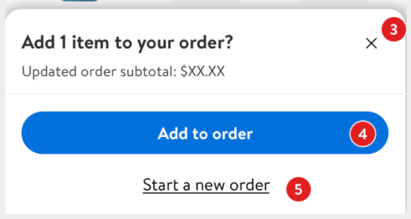

# VoiceOver

One of iOS's built-in accessibility offerings is VoiceOver, a screenreader that can not only read the text but also describe functionality aloud to the user. VoiceOver knows how to interact with iOS's default elements and views, but for custom ones, it needs help in the form of [labels](https://gecgithub01.walmart.com/walmart-ios/glass-app/blob/91b6bdf1f0d931ab14a559bdbc6a2a2b301a933d/Plugins/CXO/CXO/Sources/Checkout/Substitutions/Views/SubstitutionsOptInView.swift#L115)(for descriptions), [traits](https://gecgithub01.walmart.com/walmart-ios/glass-app/blob/91b6bdf1f0d931ab14a559bdbc6a2a2b301a933d/Plugins/CXO/CXO/Sources/Checkout/Substitutions/Views/SubstitutionsOptInView.swift#L116)(what type of element, such as a button, link, static text, or image), and values.

## Accessibility Labels

Accessibility labels are automatically generated for most UI elements. However, it is important to verify that each and every control's label is _appropriate_.

For example, consider the button labeled (3) in the image below:



Without an explicit accessibility label, the user won't know this button closes the dialog. It is also important to make use of localized strings when setting accessibility labels to make internationalization work properly:

**Don't**
```swift
someButton.accessibilityLabel = "Close button"
```

**Do**
```swift
someButton.accessibilityLabel = NSLocalizedString(@"Close button", nil)
```

### AccessibilityTraits

Traits are what VoiceOver uses to let the user know what element they’re currently focused on and what type of interaction is possible for that element. Much like the label, this is a property on every view, and it tells the user additional information about what the view is in context.

**Example:**
```swift
someView.accessibilityTraits = .summaryElement
```

### AccessibilityHint

The hint allows VoiceOver to briefly describe the result of performing an action on the accessibility element, in a localized string.

**Don't**
```swift
someButton.accessibilityHint = NSLocalizedString("Tap to navigate to your cart", comment: "")
```

**Do**
```swift
someButton.accessibilityHint = NSLocalizedString("navigates to your cart", comment: "")
```

### AccessibilityIdentifier

The identifier is not used by VoiceOver, but it is used to uniquely identify elements for functional UI tests.

**Example:**
```swift
someView.accessibilityIdentifier = "unique_identifier_name"
```

For Glass iOS app, we get [accessibilityIdentifier](https://developer.apple.com/documentation/uikit/uiaccessibilityidentification/1623132-accessibilityidentifier) for free as the [Accessible](https://gecgithub01.walmart.com/walmart-ios/glass-platform/blob/development/GlassUI/GlassUI/Accessibility/Accessible.swift#L15) protocol allows automatic assignment of accessibility identifiers to any stored [UIView](https://developer.apple.com/documentation/uikit/uiview) properties. 

The identifier is based on class and property name, e.g. [FulfillmentSummaryView.actionButton](https://gecgithub01.walmart.com/walmart-ios/glass-app/blob/e671a452f56ab46370a054cee5d62f96fffb0bb4/Plugins/CXO/CXOTests/FulfillmentSummaryViewTests.swift#L169) and can be overridable.

**Don't** use the default accessibility identifier without verifying that it's unique on the screen
**Do** override the default accessibility identifier with a unique value if there is more than one with the same ID

### AccessibilityContainer

Provide a set of methods that view subclasses use to make subcomponents accessible as separate elements.

**Example:**
```swift
self.accessibilityElements = [titleLabel, changeButton]
```

An array of [accessibility elements](https://gecgithub01.walmart.com/walmart-ios/glass-app/blob/d8c1975f92d1fe7fd605ada8bf94579887b7ca27/Plugins/CXO/CXO/Sources/ReserveSlot/Views/FulfillmentDetailView.swift#L105) in the container.
