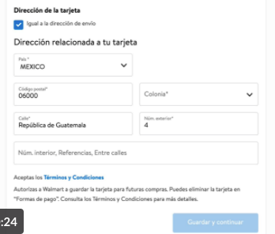
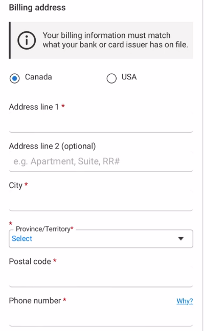
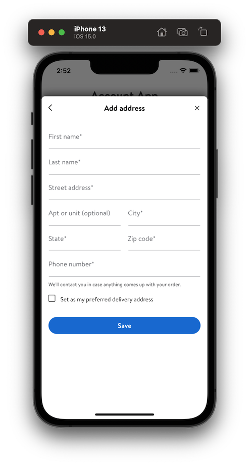

# Configurable Address

- Authors: [Cardwell Cupp](https://gecgithub01.walmart.com/b0c02oh), [Wellington](https://gecgithub01.walmart.com/w0m01q1)
- Status: In Progress
- Decision: In Progress

## Introduction

This ADR delves into a few different options for markets to configure address forms for use in Glass

## Motivation

Glass currently ships with a US-centric address form.  While much of the form can be reused for
other markets, we must provide a level of configuration that supports these countries.

Examples of Differing Fields
- CA and MX both must include a Country field
- CA and MX both have a dynamic form based on the country selected  
- CA and MX both need to supply a list of supported countries
- CA and MX both need to supply different copy for the the States title (e.g. Provinces)
- CA and MX both need to supply a list of states/provinces for validation
- MX needs to be able to supply Neighborhood (Colonia)
- Validation needs to be country specific





### Guiding Principles

- Configuration should only be allowed for the fields that require it
- The LOE to implement the configuration should be kept to a minimum
- Reduce as much duplicate code across configurations as possible

## Considered Options

### Option 1. Hide / Show Fields based on Plugin/Market Configuration

In this solution, the address form and display views are built with all possible fields.  These fields
are then toggled on/off based on injectable config that is passed in.

#### Pros:
- Minimal amount of change to existing forms. This allows the fields to be added incrementally as needed
- Configuration is modified as needed  
- Easies to understand

#### Cons:
- Each addition to the form requires a lot of testing to make sure it doesn't break the multiple configuration permutations.
- Markets are restricted to what has been implemented and must request additions to support their flow

#### Example

##### Address Config

```swift

enum CountryCode: String, CaseIterable {
    case CA
    case MX
    case US
}

struct AddressConfiguration {

    /// The country code this address is configured for
    let countryCode: CountryCode
    
    /// Name of the country, for example "United States"
    let countryName: String
    
    /// valid list of states/provinces in the country
    /// ["AL", "AK", "AR"]
    let stateList: [String]

    /// The title for the state list, for example, "State", or "Province"
    let stateTitle: String
    
    /// this is a field that is only needed by MX (colonia)
    let showNeighborhoodField: Bool
    
    // no defaults for these
    let postalCodeValidator: PostalCodeValidator
    let phoneNumberValidator: PhoneNumberValidator
}


// NOTE: These should reside in a common module so they can be reused across modules
extension AddressConfiguration {

    static let us = AddressConfiguration(
        countryCode: .US,
        countryName: "United States",
        stateList: [
            "AL",
            "AK",
            "AR",
            //etc
        ],
        showNeighborhoodField: false,
        postalCodeValidator: .usValidator,
        poneNumberValidator: .usValidator
    )
}

extension AddressConfiguration {

    static let canada = AddressConfiguration(
        countryCode: .CA
        countryTitle: "Canada"
        stateTitle: "Province"
        stateList: [
            "Alberta", 
            "Manitoba"
            //etc
        ]    
        postalCodeValidator = .caValidator,
        phoneNumberValidator = .caValidator
    )
}

extension AddressConfiguration {

    static let mexico = AddressConfiguration(
        countryCode: .MX
        countryTitle: "Mexico"
        stateTitle: "State"
        stateList: [
            "Aguascalientes", 
            "Baja California"
        ]
        isNeighboorhoodEnabled: true
        postalCodeValidator: .mexicoValidator,
        phoneNumberValidator: .mexicoValidator
    )
}

```

##### Plugin Config

```swift

/// The configuration used by the AccountPlugin
public struct AccountPluginConfiguration: Equatable {

    /// Configuration for the address
    public var addressConfiguration: AddressConfiguration
    /// The base URL for Account.
    public var baseURL: URL
    /// The http client URL for Account.
    public var httpClientURL: URL
    /// The configuration to be used in the Links.
    public var links: Links
    /// Allows customization of the Plugin's behavior.
    public var options: Set<PluginOptions>
    public var marketBundle: Bundle

    public init(
        addressConfiguration: AddressConfiguration,
        baseURL: URL,
        httpClientURL: URL,
        links: Links,
        options: Set<PluginOptions> = [],
        bundle: Bundle = .main
    ) {
        self.addressConfiguration = addressConfiguration
        self.baseURL = baseURL
        self.httpClientURL = httpClientURL
        self.links = links
        self.options = options
        self.marketBundle = bundle
    }
}
```

### Option 2. TBD

## Recommended Solution

Hide / Show Fields on Address Modules
