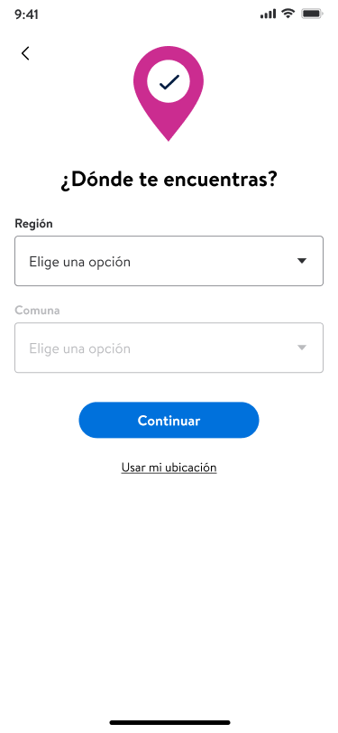
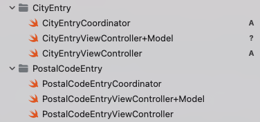
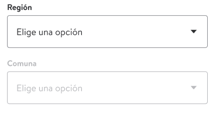
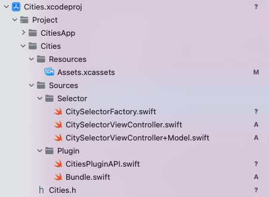

# City Selector

- Authors: [Diego Sepulveda](https://gecgithub01.walmart.com/vn52glw), [Francisco Salinas](https://gecgithub01.walmart.com/vn5291h)
- Status: In Progress
- Decision: Option 1

## Introduction

This ADR delves into a some options, how selecting state and city to tell to the application my location, a new alternative to postal code, for example in the onboarding flow in Glass.

## Motivation

Glass currently use postal code in all the current markets, but Chile don't use postal code for your address, it uses states and cities. The idea is providing a solution for this requirement.

UX proposal of the new fields in the Onboarding, states and cities selector (Región y Comuna in case Chile)



### Guiding Principles

- Could be applied to all markets that need it.
- Allow custom data and text
- Reduce as much duplicate code across configurations as possible

## Considered Options

### Option 1. Create new view on current Onboarding plugin

In this solution, It will create a similar struct as postalCodeEntry, it looks like that:



It's necessary including new attributes in the current configuration of Onboarding plugin, such as:
- Flag to decide which flow run postal code or cities selector
- Including data for states and cities.
- Finally another attribute named radius, for spacial search in location service.

Example:

```swift
public struct OnboardingPluginConfiguration {

    ...

    /// Indicates which view should show postal code or city selector,
    /// default false for all market except Chile market.
    static var shouldHidePostalCode: Bool = false

    /// Indicate numbers of stores that must return the location service
    static var radius: Int = 10

    /// List of states with cities for show in selector fields
    Static var states: [State]? = nil

}

public struct City {
    let name: String
    let lat: Int
    let long: Int
    let postalCode: Int
}

public struct State {
    let name: String
    let cities: [City]
}
```

And Adding new condition in Onboarding flow , with which flow must start.

 ```swift
 private func handleLocationFlow(with isPostalEntry: Bool = false) {
         guard permission.isLocationServicesEnabled else {
             if shouldHidePostalCode {
                  cityEntryCoordinator.start()
             } else {
                  postalEntryCoordinator.start()
             }
             return
         }

         locationCoordinator.start()
         if shouldHidePostalCode {
                cityEntryCoordinator.start()
            } else {
                postalEntryCoordinator.start()
            }
     }
```

Note: The new condition maybe a factory method pattern.

All changes will be in the Onboarding Plugin, and list of the States and Cities based on injectable config that is passed in.

#### Pros:
- Only one plugin is modified, very similar to current implementation
- Easies to understand

#### Cons:
- The new code is not reusable for other plugins.

### Option 2. Create new plugin City Selector

Create new plugin Cities

 In this approach the idea is creating a new plugin cities, it will manage view logic such as validations and load of data in the fields state and cities.

The plugin will return a view with state and cities fields, example:



Example of configuration for City Plugin:

```swift
public struct CitiesPluginConfiguration {

  /// List of states with cities for show in selector fields
  Static var states: [State]? = nil

}

public struct City {
    let name: String
    let lat: Int
    let long: Int
    let postalCode: Int
}

public struct State {
    let name: String
    let cities: [City]
}
```

In current Onboarding plugin, will include attributes for managing of flow and location service.

```swift
public struct OnboardingPluginConfiguration {

    ...

    /// Indicates which view should show postal code or city selector,
    /// default false for all market except Chile market.
    static var shouldHidePostalCode: Bool = false

    /// Indicate numbers of stores that must return the location service
    static var radius: Int = 10

}
```

 The appearance of new City plugin is something like that:

 


In the current class OnboardingFlowCoordinator, we will use the factory class (CitySelectorFactory from new plugin) to determine which coordinator to use, postal code or cities.

```swift
import PluginAPIs
...

class OnboardingFlowCoordinator: Coordinator<Void>, OnboardingCoordinator {
    private let citySelectorFactory: CitySelectorFactory?

    ....

    private func handleLocationFlow(with isPostalEntry: Bool = false) {
    guard permission.isLocationServicesEnabled else {
        coordinatorEntry = citySelectorFactory.getCoordinatorEntry(shouldHidePostalCode)
        coordinatorEntry.start()
        return
    }

    locationCoordinator.start()
    if isPostalEntry {
        coordinatorEntry = citySelectorFactory.getCoordinatorEntry(shouldHidePostalCode)
        coordinatorEntry.start()
    }
}
}

```

In the current onboarding plugin, will create a new class named CitiesEntryCoordinator into the new folder CitiesEntry similar to PostalCodeEntryCoordinator, into this class we'll create the view from new plugin Cities.

```swift
import PluginAPIs
...

class CitiesEntryCoordinator: BaseOnboardingCoordinator<CitiesEntryCoordinator.Result> {
  // plugin Cities
  private var citiesAPI: CitiesAPI?
  // view controller from new plugin Cities
  private var viewController: BaseCityViewController?

    override func start() {
        citiesAPI = container.get(CitiesAPI.self)
        viewController = citiesAPI!.makeCitySelectorView()
        super.start()
        navigator.pushViewController(viewController, animated: true, completion: nil)
        didFinishSetup()
    }

}
```

#### Pros:
- The logic of view and data is contained in this new Plugin
- This code is reusable for others plugins
- Easies to understand

#### Cons:
- Although we will create the new plugin, we still have to create a new class in Onboarding plugin and modify some classes.


#### LocationAPI for option 1 and option 2

In both approach we need to create new method that will include coordinate for selected city in the plugin LocationAPI.

Example of this new method:

```swift
func updateStoreForCoordinates(latitude latitude: Double, longitude longitude: Double, radius radius: Int) -> AnyPublisher<AssignedLocationData, Error>
```
