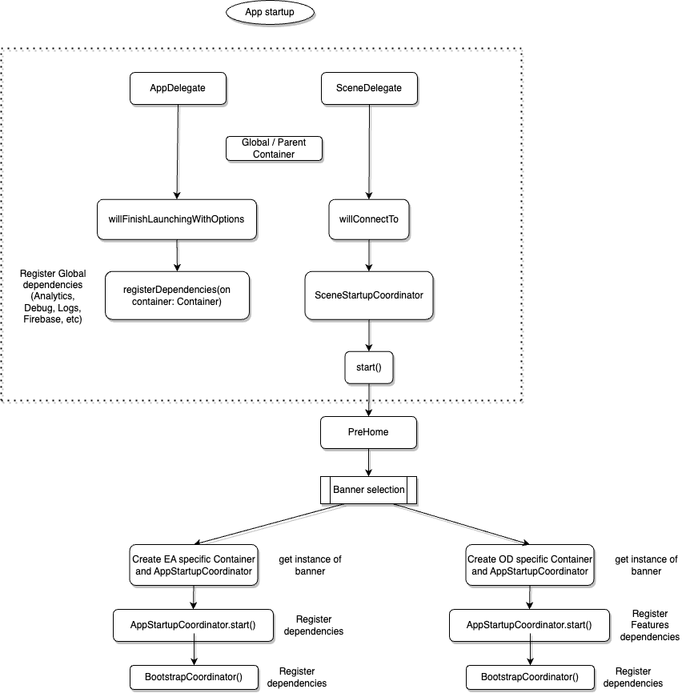
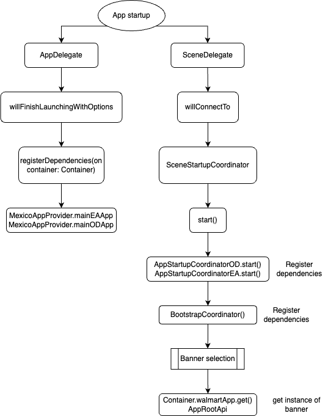
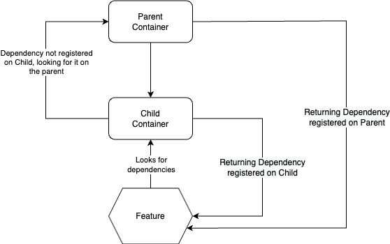

# Multi Container App

- Authors: [Moises Hernandez](https://gecgithub01.walmart.com/vn52you), [Daniel Reyes Sanchez](https://gecgithub01.walmart.com/vn0e21f)
- Decision: Option 1

## Introduction
A solution for having multiple container instances under a market app.

## Motivation
Mexico has a upcoming migration for EA banner, we need to move out of the legacy binary to start leveraging from Glass but still keeping both experiences (OD, EA) separated.
In order to solve this challenge, we need 1 parent Container for global dependencies and 2 independent Containers so that we can use different set of Plugins, hosts and CCM values.

## Considered Options

### Option 1 
Create a parent container on app startup, registering here all the global dependencies such as log tools, firebase, analytics, etc. Then after the user selects a banner create a new instance of a Container that will only hold banner specific dependencies and features.

#### Pros:
- Better dependencies management.
- Banner specific features.
- Lower memory usage (creation of features/dependencies instances on demand).
- Faster App startup time.
- Easier to maintain and debug.

#### Cons:
- A lot of Plugins need to be registered on the Parent because of the Signin flow on the onboarding

### Option 2 
Have 2 containers using the current implementation and switching between them on banner selection.

#### Pros:
- No refactor needed for other markets.
- Faster Banner startup time.

#### Cons:
- Higher memory usage (creation of multiple instance of features/dependencies since the containers are not created on-demand).
- Same dependencies registered and this will lead to duplicated instances.
- Slower App startup time.
- Harder to debug since there will be multiple instances of the dependencies.

### Option 3 
Having only one container for the whole app and only modifing certain properties for the specific banner.

#### Pros:
- No refactor needed for other markets.

#### Cons:
- Slower banner switching time, since the init endpoints have to be called on every banner switch.
- Discovery needed to find entangled dependencies in order to mutate them when switching banner
- Refactor EnviromentPlatformAPI in order to update the enviroment in runtime.
- Refactor needed on most dependencies to make them mutable.
- Harder to maintain .
- Harder to debug since the dependencies are mutating dynamically.
- More complex to implement since there are few background operations like `AniviaBatchOperation` that run independently  from the user.

## Recommended Solution
Option 1

## Conclusion
After creating POC's for option 1 and 2 we found that the current `Container` implementation is ready to have parent and child containers, the implementations allows to register banner specific dependencies and also global dependencies, the parent will have all the shared dependencies and also the ones needed for the app startup and the onboarding flow. Both of the child container will share the same parent allowing the features to acces de global dependencies though the child.
Implementing this solution we won't need to refactor anything outside Mexico's market.

