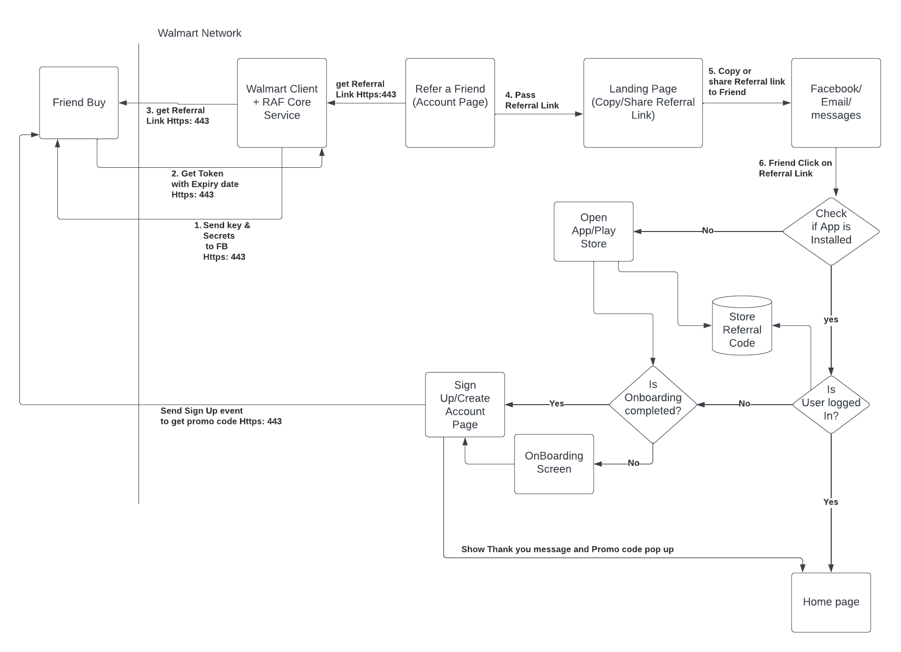

# Refer a Friend

- Authors: [Shubham Raj](https://gecgithub01.walmart.com/s0r0dnn)
- Status: Finalized
- Decision: Option 2

## Introduction

Solution for Integrating Refer a Friend feature on Account page which will let User to share the referral link with friends or Family to promote them to download the Walmart app and reward them with promo code.

## Motivation

Motivating existing users to share referral link with friends by awarding them with promo codes once their friend places his 1st order after completing the Sign up.

## Considered Option

### Option 1 - Use Friendbuy iFrame for Showing the RAf landing page screen

#### Pros:

- No Need to create the UI screen for Refer A Friend Landing page
- All the customisation can be done using Friendbuy Dashboard

#### Cons:

- Limitation on handling of Click functionality
- Dont fit into the Glass Design guidelines

### Option 2 - Use Friendbuy API approach
Create the RAF core service and make changes in  account, identity and cart OL layer to interact with friendbuy APIS. In Account OL we Will be fetching the referral link, in identity we will be getting the successful sign up event and then use that to distribute the promo code to friend.
In CXO, we will be getting the successful order placed event and then we will distribute the promo code to advocate.
We will use the Tempo approach for UI. We will create the new template and module in Tempo and will integrate the same
    in Account plugin with the help of TempoUI.

#### Pros:

- Can customise and configure the UI using Tempo
- Can reuse the RAF core service for other markets with minimal changes
- No need to add any SDK for the Friendbuy

#### Cons:

- Need to have the dependency on the OL layer of account, identity and cart
- Need to create the Tempo module to make the UI Configuarable

### Guiding Principles

- Allow Existing Users to share the referral link with friend and family
- Friendbuy API will be used for validating the User and rewarding the promo codes
- New user will also get promo code after completing the sign up successfully.
- The solution must be easy to understand for all levels of engineers.
- We will be using Account OL layer for existing functionality and writing our own RAF core service for interaction with Friendbuy

## Recommended solution

Option 2- Use the Friendbuy API for fetching the referral link and also for awarding the promo code to advocate and friend after successful validation.
Also make the UI configuarable using Tempo and can also configure the messages and strings shown on to the UI as per the business requirements.

### Reference Links

- [Confluence Link](https://confluence.walmart.com/pages/viewpage.action?spaceKey=OIT&title=Refer+A+Friend+-+Glass+App+-+Canada+-+Requirements)
- [Friendbuy Link](https://developers.friendbuy.com/#glossary)
- [SSP Link](https://walmartglobal.service-now.com/ssp?id=ssp_plan&table=x_wms_ssp_plan&sys_id=aedb8a88972e65540bd130771153af48)
