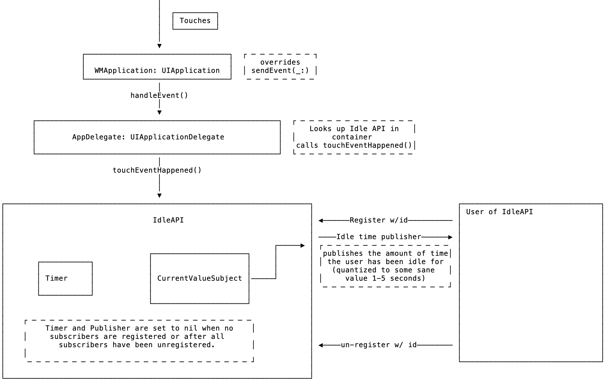
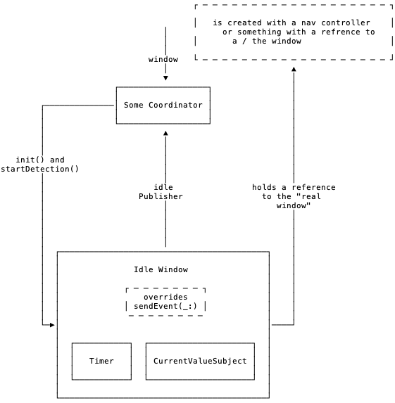

# User Idle State Notifying

- Authors: [John Regner](https://gecgithub01.walmart.com/j0r010l)
- Decision: Option 1, UIApplication subclass `sendEvent` handling

## Introduction

Teams need to know if the user has gone idle. This might happen for various
reasons. The impetus for us to investigate today is the need for a HIPAA
compliant time out to protect users pharmacy data.

## Motivation

This needs to be Platform team owned capability since it will hook into the
"event loop" of either the window or the UIApplication instance itself.

### Guiding Principles

- Performant
- Meets HIPAA needs today
- Flexible for future uses

## Considered Options

### Option 1: UIApplication `sendEvent` handling

We will create a custom subclass of `UIApplication` and intercept all `UIEvents`
sent to the app in order to detect when they stop coming, and thus deduce a
user idle state.

From the docs on `UIEvent`

> Apps can receive many different types of events, including touch events,
> motion events, remote-control events, and press events. Touch events are the
> most common

Also from the docs for `UIApplication`:

>If you require it, you can intercept incoming events by subclassing
>UIApplication and overriding this method. For every event you intercept, you
>must dispatch it by calling [super sendEvent:event] after handling the event
>in your implementation.

#### Pros:
- Common pattern among iOS applications, i.e. popular on stack overflow
- Easily understood by future maintainers. Apple's docs make it clear that this
  is expected and supported API.

#### Cons:
- Implementation is complex, multiple layers to pass the event through.
- One global instance for the app, we need to be more thoughtful about
  performance and lifecycle

#### Example:

```swift
// main.swift
UIApplicationMain(
    CommandLine.argc,
    CommandLine.unsafeArgv,
    NSStringFromClass(WalmartApplication.self),
    NSStringFromClass(AppDelegate.self)
)

class WalmartApplication: UIApplication {

    override func sendEvent(_ event: UIEvent) {
        eventOccurred() // notifies the IdleTimer object
        super.sendEvent(event)
    }
}

/// Handles Processing New UIEvents and updating subscribers
/// any Timers or math are internal implimentation details of this class.
public class IdleTimer {

    /// API to be called from UIApplication when new UIEvents come in
    @_spi(IdleTimerPlatformOnly)
    public func handleEvent() {
        resetTimer()
    }
}
```

#### Design Diagram



### Option 2: See and touch though UIWindow layer

A UIWindow can be created which intercepts touches to detect user interaction.
This window can then forward it's events and hit tests to the "real" window.

#### Pros:
- Lifecycle is simple, created by feature team in a Coordinator or
  UIViewController
- Reasoning is local, object is created and destroyed by feature teams.

#### Cons:
- Relys on a "real" window. Feature teams need to have a reference to the real
  window instance in order for the "magic to work"
- Not explicitly expected by the API docs. Might break in new interaction platforms, iPad, Mac, Glasses.
- Ripe for edge case bugs.

#### Example:

```swift
public class IdleWindow: UIWindow {

  // MARK: - Private Fields
  private let otherWindow: UIWindow

  /// NOTE: - Might fail if we are unable to find the window the `presenter` is attached to.
  public init?(presenter: UIViewController) {
  guard let window = presenter.view.window else { return nil }
  otherWindow = window
  super.init(frame: window.frame)
  }

  public func startDetection() -> AnyPublisher<TimeInterval, Never> {
    // return a timer or current value subject that we can publish values on.
  }

  // MARK: - UIWindow Overrides
  public override func sendEvent(_ event: UIEvent) {
    resetTimer()
    otherWindow.sendEvent(event)
  }

  /// DOC Comment explaining this
  public override func hitTest(_ point: CGPoint, with event: UIEvent?) -> UIView? {
    return otherWindow.hitTest(point, with: event)
  }

  // Private implementation details
  // more code to create and reset the timer
  // push values out to the publisher on timer fire.
}
```
#### Design Diagram



## Recommended Solution

Option 1, as it is is common in the industry, explicitly expected by the docs,
and has less potential for future bugs.
