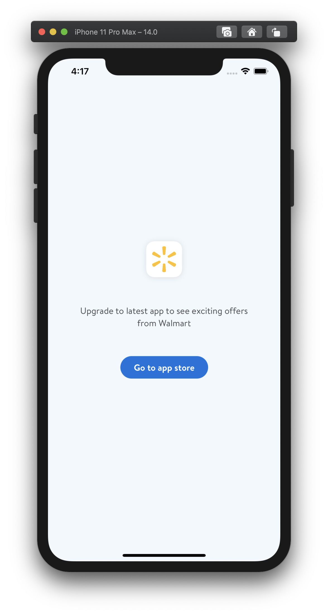

# App-wide Force Update

Provides capability to prompt the customer to upgrade the app on launch. The
customers will be blocked from using all the services in the app. The following
CCM flags can be used to prompt app level force upgrade for customers.

- **platform.app.forceUpgrade.enabled** - Uses the VersionedValue form to enable
  and disable force upgrade for a range of app versions. `enabled` with a value
  of true indicates that we would show the screen for any apps matching the
  version spec. For example, if `enabled` is set to
  `{ "value": true, "maxVersion": "21.1"}`
  all the versions of the app below and up to but not
  including `21.1` will prompt for force upgrade on launch.
  
- **platform.app.forceUpgrade.messageText.versioned** -Uses the VersionedValue from a range of app or iOS versions. For example,  
`"platform.app.forceUpgrade.messageText.versioned": {
    "value": "New Message from json",
    "maxVersion": "21.1",
    "minOSVersion": "14.0"}`
    The custom message that will be
  shown to the user. Note that if custom message is not provided, the following
  [default](https://gecgithub01.walmart.com/walmart-ios/glass-app/blob/development/Walmart/Walmart.strings#L9)
  text will be displayed. 

  ***You’re using a version of the Walmart app that is no longer supported. 
  Please update your app to continue your shopping experience.***

- **platform.app.forceUpgrade.okText.versioned**- The CTA title that will be shown to the
  user. Uses the VersionedValue from a range of app or iOS versions. For example, 
  `"platform.app.forceUpgrade.okText.versioned": {
  "value": "Update Now",
  "maxVersion": "21.1",
  "maxOSVersion": "14.0"}` 
  Note that if CTA title is not provided, the following text will be
  displayed

  ***Update app***


Example:

```json
{
  "platform.app.forceUpgrade.enabled": {
    "value": true,
    "maxVersion": "21.1"
  },
  "platform.app.forceUpgrade.messageText.versioned": {
    value = "Upgrade to latest app to see exciting offers from Walmart",
    maxVersion": "21.1",
    "minOSVersion": "14.0"
  }
  "platform.app.forceUpgrade.okText.versioned": {
    "value" = "Go to App store",
    "minVersion": "21.1",
    "minOSVersion": 14.0
}
```

***deprecated***
- **platform.app.forceUpgrade.messageText** - please use `platform.app.forceUpgrade.messageText.versioned`
- **platform.app.forceUpgrade.okText** - please use `platform.app.forceUpgrade.okText.versioned`



## For the more curious

We are using an asynchronous CCM system with an on disk cache. We are not
blocking app launch to see if force upgrade should be shown.  In practice this
means that users might not see force upgrade until quimby publishes a new value,
or on second launch after the ccm is downloaded.
