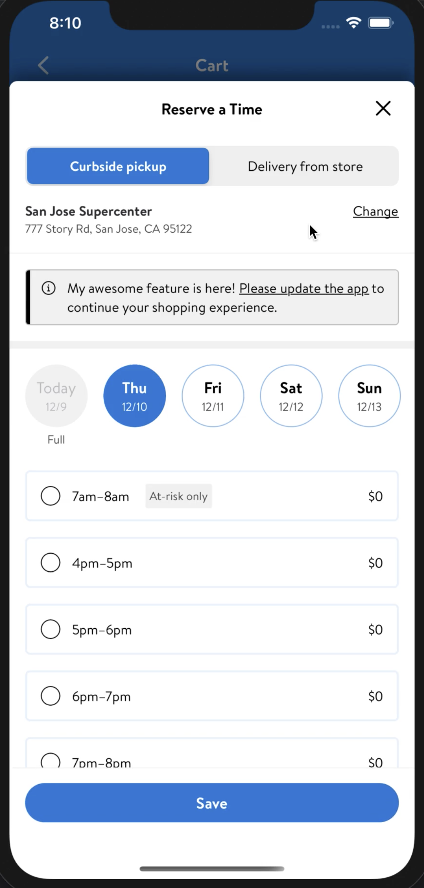

# Feature-level Nudge Update

Allows each feature to add nudge update view as a message component in a screen. The feature level nudge update view, [GlassFeatureUpdateView](https://gecgithub01.walmart.com/walmart-ios/glass-platform/blob/development/GlassUI/GlassUI/FeatureUpdate/GlassFeatureUpdateView.swift), is implemented as a platform component.

- Each feature has to define and maintain it's feature level CCM to show/hide the nudge update.

Note that ***maxVersion*** should be used.

For example, If *MyAwesomeFeature* wants to add a nudge update, a new CCM should be created in [stage](https://admin.ccm.stg.walmart.com/) (and [production](https://admin.ccm.prod.walmart.com/) when feature development is complete) as shown below

  ```json
  "myAwesomeFeature.nudgeUpdate.enabled": {
  	"value": true,
  	"maxVersion": "20.12.1"
  }
  ```

The parsing of CCM and logic to display feature update should be handled by *MyAwesomeFeature*.

**NOTE**: `maxVersion` is range exclusive of its endpoint. In the example above the feature
update would be true for all app versions below and including `20.12.0` but
**would not show** on app version `20.12.1`

- Based of the CCM enabled state,  [GlassFeatureUpdateView](https://gecgithub01.walmart.com/walmart-ios/glass-platform/blob/development/GlassUI/GlassUI/FeatureUpdate/GlassFeatureUpdateView.swift) can be added in any feature using this snippet.

```swift
// Add your custom message
let nudgeView = GlassFeatureUpdateView(featureMessage: "My awesome feature is here!")

// Add nudgeView part of your view hierarchy
override func constructSubviewHierarchy() {
    super.constructSubviewHierarchy()
    view.addAutoLayoutSubview(nudgeView)
}
```

Download [this](./images/feature-nudge-video.mov) video to see this feature in action.



