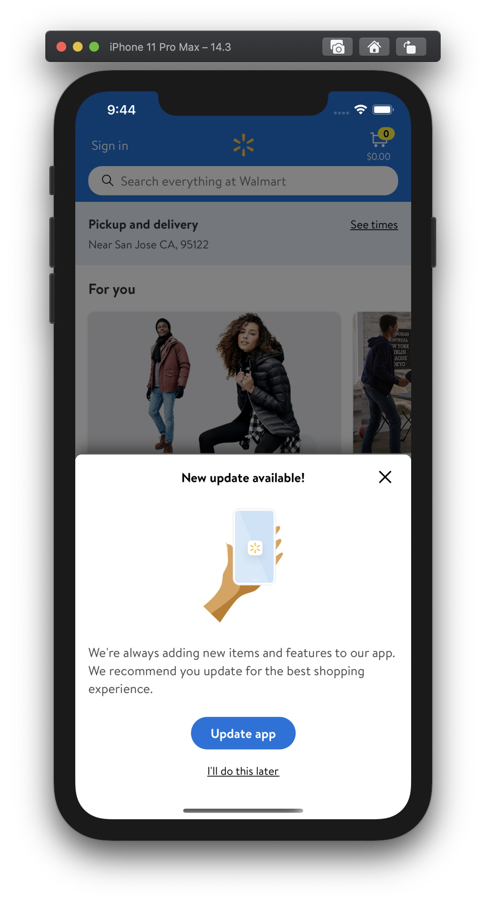

# Platform-level Nudge Update

Allows nudge update prompt(bottom sheet) to upgrade the app on launch. The following CCM flags can be used to prompt nudge update for customers

- **platform.app.nudgeUpdate.enabled** - Enable nudge update for versions up to
  but not including ***maxVersion***

  For example, if nudge update has to be shown for all app versions below but
  not including *20.12.1*, CCM should be set as given below

  ```json
  "platform.app.nudgeUpdate.enabled": {
  	"value": true,
  	"maxVersion": "20.12.1"
  }
  ```

Also, custom text can be set using following CCM flags under **platform.app.nudgeUpdate.model**

  ***New update available!***

  ***You’re using a version of the Walmart app that is no longer supported. Please update your app to continue your shopping experience.***

  ***Update app***

  ***Not now***


- **platform.app.nudgeUpdate.model.waitDurations** - Delay time in hours. For ex: If the waitDuration is set as *0, 24, 168*, the interval in which the nudge update is shown is *now*, *1 day*, *1 week* respectively
  By default it is set to: ***0, 24, 168***

Please use the following versioned values for future CCM.
```json
"platform.app.nudgeUpdate.model.waitDurations": {
   "value": "0,24,168",
   "minVersion": "21.1",
   "minOSVersion": 14.0
}
```
***deprecated***
```json
"platform.app.nudgeUpdate.model": {
    "waitDurations": "0,24,168"
}
```


