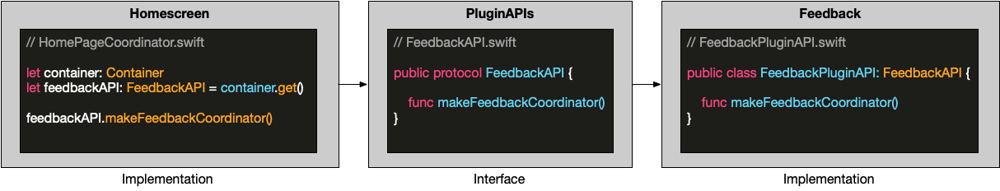
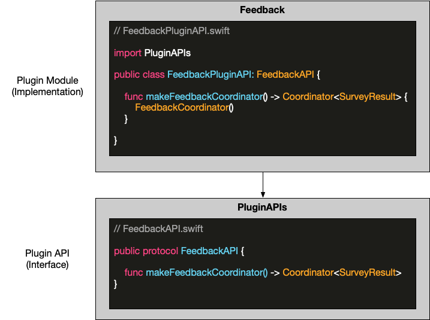

[« Architecture Documentation - Table of Contents](index.md)

# Plugin API

Note: This document details a component of [Plugin Module](plugin-modules.md).

- [What Is A "Plugin API"?](#what-is-a-plugin-api)
- [Implementing a Plugin API](#implementing-a-plugin-api)
- [Dependency Considerations](#dependency-considerations)
- [Registering a Plugin](#registering-a-plugin)
- [Plugin Initialization](#plugin-initialization)

## What Is A "Plugin API?"

A Plugin API is a public interface for a given plugin module. A Plugin API is generally composed of:

- One or more protocols that define an interface for interacting with the corresponding plugin module
- Public data models in the form of structs and enums

A Plugin API enables your plugin module to interact with other plugin modules without directly importing the other plugin modules. All Plugin APIs are contained within the [PluginAPIs framework](https://gecgithub01.walmart.com/walmart-ios/glass-app/tree/development/Plugins).

### A Plugin API Example

Let's consider the Feedback plugin as an example.  Feedback enables features to navigate to a survey form to collect customer feedback. The diagram below illustrates how a feature such as Homescreen interacts with the Feedback plugin.  Homescreen does not directly reference the Feedback plugin module's code and instead uses the `FeedbackAPI` protocol defined in the [PluginAPIs framework](https://gecgithub01.walmart.com/walmart-ios/glass-app/tree/development/Plugins).




The code in homescreen that navigates to the feedback survey may look something like this:

```swift
//
//  HomePageCoordinator.swift
//  Home
//

import PluginAPIs

let viewController: UIViewController
let feedbackAPI: FeedbackAPI

let coordinator = feedbackAPI.makeFeedbackCoordinator(
    presenter: viewController, 
    request: .init(pageType: "Home", zone: "HomeZone")
)

coordinator.start()
```

Notice in the above code sample that Homescreen does not import the Feedback framework and instead imports the PluginAPIs framework. Homescreen is able to interact with the Feedback module indirectly through the PluginAPIs framework.

Below is a sample of the Feedback Plugin API that consists of a `FeedbackAPI` protocol and a `SurveyRequest` struct.

```swift
//
//  FeedbackAPI.swift
//  PluginAPIs
//

import WalmartPlatform

public protocol FeedbackAPI {
    /// Returns a coordinator for a Feedback Survey flow.
    ///
    /// - Parameter presenter: The view controller that the Feedback Survey should use to present itself.
    /// - Parameter request: Parameters used to fetch survey data from tempo.
    func makeFeedbackCoordinator(presenter: UIViewController, request: SurveyRequest) -> Coordinator<SurveyResult>
}

/// A request for creating a customer satisfaction survey.
public struct SurveyRequest {
    /// The logical identifier of the page the survey appears on. e.g. itempage, homepage, etc.
    public let pageType: String

    /// Logical identifier of a questionnaire within a page. e.g. topQuestion, step1Question etc.
    public let zone: String
}
```

## Implementing a Plugin API

The implementation of a Plugin API lives in a plugin module as a class the conforms to the Plugin API's protocol. 

Looking at Feedback again as an example

- The **interface**,`FeedbackAPI` protocol, lives in the PluginAPIs framework
- The **implementation**, `FeedbackPluginAPI` class, lives in the Feedback framework (plugin module)

The diagram below illustrates this separation between frameworks and the dependency relationship between them.



The code below lives in `FeedbackPluginAPI.swift` in the Feedback module. To reference the `FeedbackAPI` the Feedback framework must import the PluginAPIs framework.

```swift
//
// FeedbackPluginAPI.swift
// Feedback
//

import PluginAPIs
import WalmartPlatform

class FeedbackPluginAPI: FeedbackAPI {
    func makeFeedbackCoordinator(presenter: UIViewController, request: SurveyRequest) -> Coordinator<SurveyResult>
        FeedbackCoordinator(presenter: presenter, request: request)
    }
}
```

Plugin modules should never directly import other plugin modules. 

### Dependency Considerations

- Plugin modules never import other plugin modules
- Plugin modules import the PluginAPIs framework to interact with other plugin modules
- Code in PluginAPIs cannot import plugin modules

### Registering a Plugin

To register a plugin the app's container, open [`BootstrapCoordinator.swift`](https://gecgithub01.walmart.com/walmart-ios/glass-app/blob/ba25f077d6b26d486956dd5e664dfec20d55e34e/Walmart/Startup/BootstrapCoordinator.swift) and add you plugin in the `start` function.

```swift
override func start() {
    container.register(FeedbackAPI.self, FeedbackPluginAPI.init)
}
```

Now your plugin can be accessed through the app's container by other plugins.

### Plugin Initialization

Plugins can get a reference to the [`Container`](containers.md) instance that they are registered in as a initializer parameter. This enables plugins to use the container to get instances of other plugin and platform APIs.

```swift
public class FeedbackPluginAPI: FeedbackAPI {
    private let container: Container
    
    public init(container: Container) {
        self.container = container
    }

    public func makeFeedbackCoordinator(presenter: UIViewController, request: SurveyRequest) -> Coordinator<SurveyResult>
        FeedbackCoordinator(coordinator: presenter, request: request, container: container)
    }
}
```

Plugins should avoid referencing the main WalmartApp's container and `Container.mock` directly and instead use the container instance passed to the plugin's initializer.
