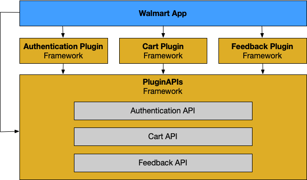

[« Architecture Documentation - Table of Contents](index.md)

# The Plugin System

- [What Is "The Plugin System"?](#what-is-the-plugin-system)
- [How Does It Work?](#how-does-it-work)
- [Creating A New Plugin](#creating-a-new-plugin)

## What Is "The Plugin System"?

The Plugin system is a managed network of frameworks, referred to as **Plugin Module**s, where each framework is dedicated to a separate Feature of an app.

It consists of the following components:

- **Walmart App** - The parent "shell" app that handles plugin integration.

- **Container** - A `Container` is a [Container class object](https://gecgithub01.walmart.com/pages/walmart-ios/glass-platform/Classes/Container.html) that lazily creates and maintains references to other objects which have been previously registered for a given associated public protocol.  It returns those references generically, based on the Type that the reference is being set or passed into. See [Container documentation](containers.md) for more info.

- **Plugins** - A [Plugin](plugin.md) is an Xcode Project which contains the following components:
  - **[Plugin Module](plugin-modules.md#what-is-a-plugin-module)**
  - **[Plugin API(s)](plugin-api.md#what-is-a-plugin-api)**
  - **Unit Testing target(s)**
  - **UI Testing target(s)**

- **PluginAPIs** - A framework that contains a [Plugin API](plugin-api.md) for every plugin in the app. The purpose of this [framework](https://gecgithub01.walmart.com/walmart-ios/glass-app/tree/development/Plugins/PluginAPIs/) is to allow [Plugins](plugin.md) to inter-operate without the need for inter-dependency.  It contains all the interfaces (protocols) and data model objects (structs, enums, etc) that one [Plugin](plugin.md) may wish to share with all others.



## How Does It Work?

[Plugins](plugin.md#what-is-a-plugin) are created and added to the Plugins directory at the root of the Walmart App project.

Once authored and configured, each [Plugin Module](plugin-modules.md#what-is-a-plugin-module) has its initializer and a matching public interface to which it conforms (added first to the [PluginAPIs framework](https://gecgithub01.walmart.com/walmart-ios/glass-app/tree/development/Plugins/PluginAPIs.xcodeproj/)) registered together through the static `walmartApp` [Container](containers.md#what-is-a-container).  This generally happens within the `start()` function call of the `BootstrapCoordinator` class:

```swift
final class BootstrapCoordinator: Coordinator<Void> {
    private let container: Container
    ...
    override func start() {
        ...
        container.registerProvidingChild(CheckInAPI.self, CheckInPluginAPI.init)
        ...
    }
    ...
}
```

From that point on anywhere a given [Plugin Module](plugin-modules.md#what-is-a-plugin-module) is needed, so long as the [Container](containers.md#what-is-a-container) instance is provided, you can call its `get()` function and cast its result into a reference or parameter whose type matches the public interface that the desired module had been registered with:

```swift
let checkInAPI: CheckInAPI = container.get()
```

## Creating A New Plugin

Plugins are generated automatically while following the process for creating a [Plugin Module](plugin-modules.md).  See: [Creating A Plugin Module](plugin-modules.md#creating-a-plugin-module) for more details.

