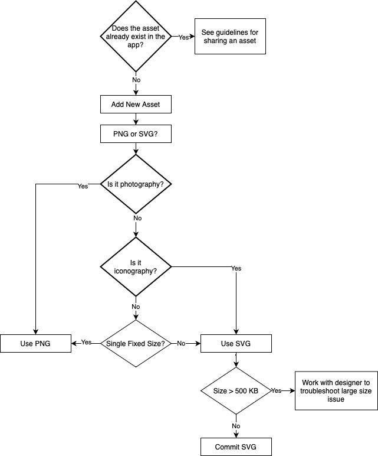
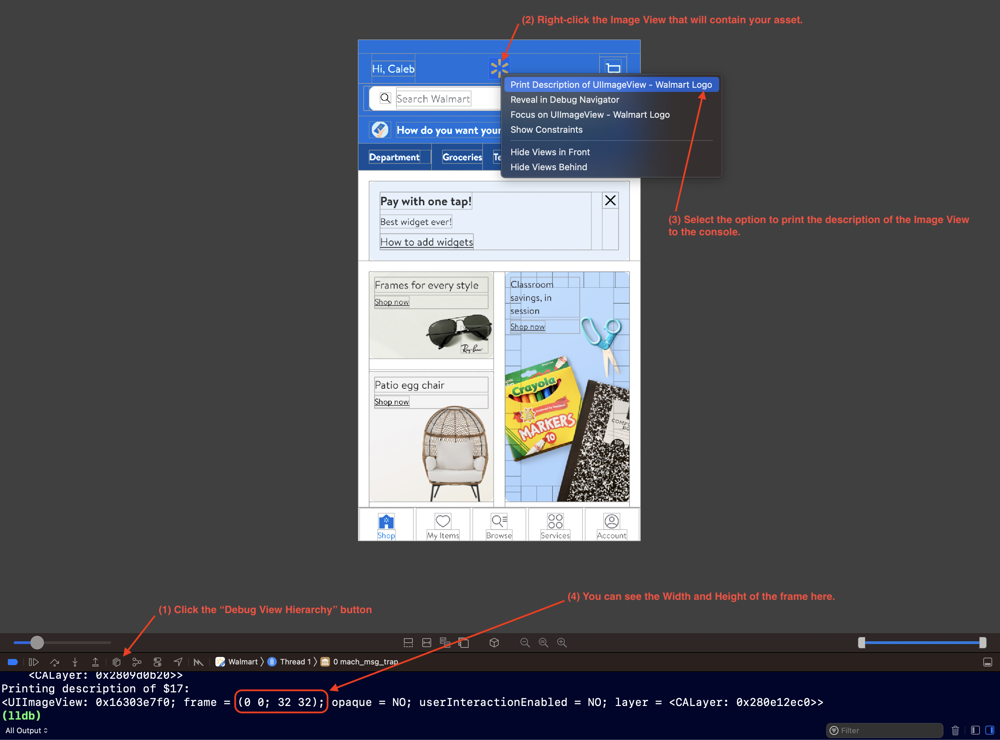

# Image Asset Guidelines

A set of guidelines to follow when adding a new image asset to the project.

## Adding a New Image Asset

Follow this process when deciding how to add a new image asset to the project.

### Does the asset already exist in the app?

If the asset is something common such as a graphic related to Walmart branding, then it is likely that it already exists in the project, and it would be best to reuse an existing asset. Otherwise, a quick search of the asset name can turn up possible duplicates.

Platform team is working on adding some functionality to the GlassCLI tool that can generate a hash from your new asset and compare that to a hash table of other assets already in the project, and will tell you if it is a duplicate or not. This will be the easiest and most reliable way to check for duplicate assets in the future.

If you find a pre-existing asset that is the same as your new one, there is a chance that it may be added to a separate feature from your own, and if so, you won't be able to use it in your feature. In this case, it would be an opportunity to move this asset into a shared library. Once done, you can reach out to the feature team that is already using this asset privately and see if they can use the new shared version instead.

See the [shared asset guidelines](../assets/shared-asset-guidelines.md) for information on how to share an asset across features.

### Preferred Vector Format

SVG is the preferred vector format as they tend to be smaller in size than PDFs (smaller on disk in the codebase, not what ships in the app bundle).

### PNG or SVG?

For mosts cases you will want to export an optimized PNG but there are a few cases that SVG is preferred.

### Is it Photography?

Use PNG to render photographic images.

### Is it Iconography?

Use SVG to render iconographic images.

### Is it Single Fixed Size?

Use PNG if you know ahead of time that you will be rendering your asset at a single fixed size. Use SVG if you need to scale at runtime (with Preserve Vector Data enabled) though be aware that this can incur a runtime performance cost.

### SVG Over 500 KB?

Most SVG files should be under 500 KB. If your file is over 500 KB, there's a good chance that it's not correctly exported or is a type of asset, like photography, that should be exported as a PNG instead. Please work with the designer that you got the asset file from to ensure that it was exported correctly.

### Is the image asset sized correctly?

Make sure the image asset is sized correctly to match the size that it will be rendered on screen.

#### Calculating the optimal size for a raster graphic

1. Get the size of your UIImageView (width and height).
2. These dimensions will directly translate to the width and height of your 1x asset.
3. Multiply those dimensions by 2 to get the dimensions for your 2x asset.
4. Multiply the 1x dimensons by 3 to get the dimensions for your 3x asset.

Where things can get a little more complicated is when using auto-layout and programmatic constraints for defining the layout of your feature's UI. Since you won't typically be defining your UIImageView's frame size statically, you'll have to use other means to get an accurate dimension for your asset.

There are many methods to accomplish this, but one of the easier ways to do this is using the "Debug View Hierarchy" tool:

1. When debugging your view in the simulator or on device, select the "Debug View Hierarchy" button in the debug bar
2. Right-click on your Image View.
3. Select the "Print Description of UIImageView" option.
4. Note the frame dimensions in the LLDB console.

The image below illustrates the steps above:

Using the above example, we can see that the image view width and height are 32 x 32.
From that, we can calculate the 1x, 2x and 3x image dimensions:
1x = 32 x 32
2x = 64 x 64
3x = 96 x 96
