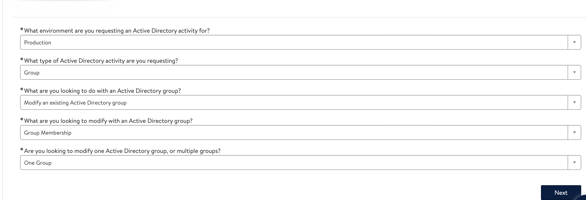
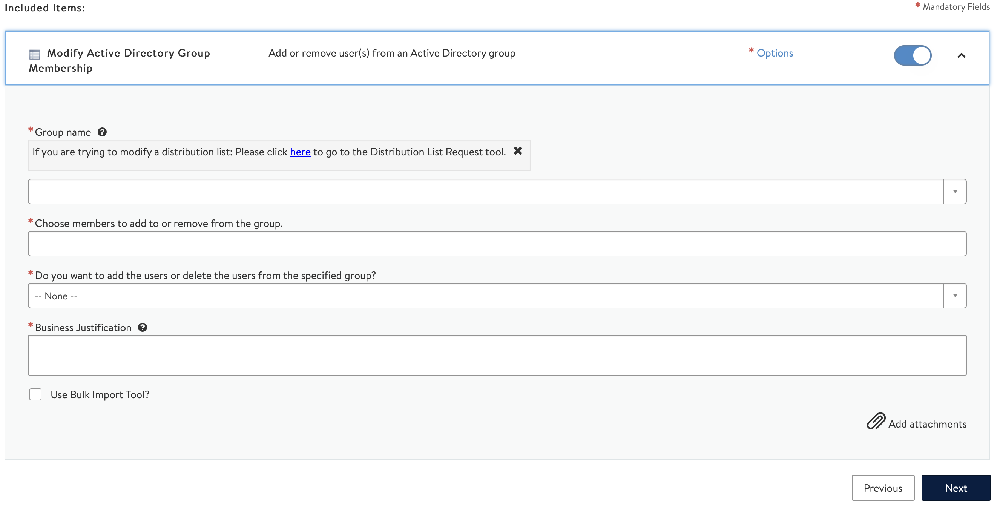
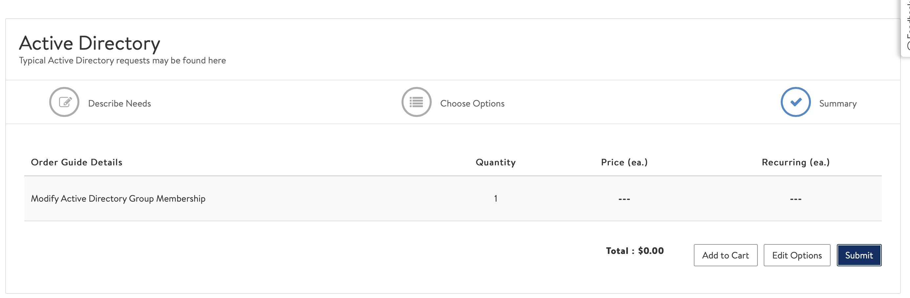

# Crash Reporting
Our crashes are handled by firebase.
You can view the crashes [here][crash-dashboard]

[crash-dashboard]:
https://console.firebase.google.com/project/walmart-glass/crashlytics/app/ios:com.walmart.glass/issues?state=open&time=last-seven-days&type=crash&tag=all

# Access

Firebase access is managed through Active Directory. To gain access, submit a service desk ticket to [service now](https://walmartglobal.service-now.com/wm_sp?id=sc_cat_item_guide&sys_id=b3234c3b4fab8700e4cd49cf0310c7d7) and ask your manager to approve the ticket. 

Developers should request to be added to the `gcp-wcp-native-eng` group, or `gcp-wcp-native-admin` if you are a Platform engineer requiring admin access.

Refer the Steps:

1. What environment are you requesting an Active Directory activity for?

        Choose "Production"

2. What type of Active Directory activity are you requesting?

        Choose "Group"

3. What are you looking to do with an Active Directory group?

        Choose "Modify existing Active Directory Group"

4. What are you looking to modify with an Active Directory group?

        Choose "Group Membership"

  

5. Are you looking to modify one Active Directory group, or multiple groups?

        Choose "One Group"

6. Group Name

        Choose "gcp-wcp-native-eng"

7. Choose members to add to or remove from the group.

        Search and choose your userID (ex: a0m06gr)

8. Do you want to add the users or delete the users from the specified group?

        Choose "Add Users"

9. Business Justification

        Monitor the stability of feature X in the Walmart e-commerce app.

 

10. Submit the request

