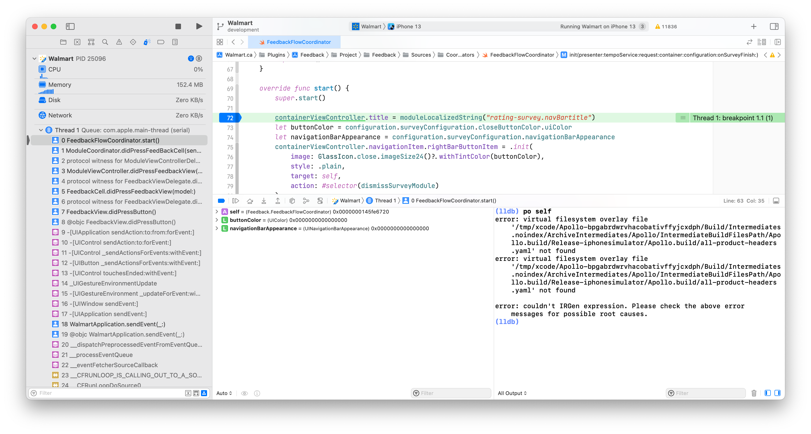
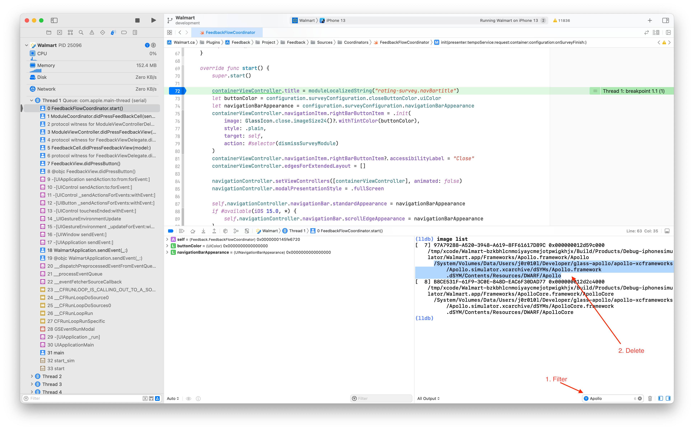

# FAQs

## Are we using SwiftUI?

No. We believe that SwiftUI has many risks and limitations that make it impractical to use in the near-term.

## How do I access the debug panel? 

1) Hit the letter `control + d` on the keyboard (simulator only).
2) Swipe left from the right edge of the screen (device and simulator). 

## How do I run the app on a device with a higher OS version?

> This operation can fail if the version of the OS on the device is newer than the version of Xcode that is running.

The Walmart project is often on an older version of Xcode meaning the Device Support files for the latest iOS version are not included; this prevents installing the app from Xcode an a device with a newer iOS version. Fortunately, you can download the Device Support files from [GitHub](https://github.com/iGhibli/iOS-DeviceSupport) and copy them to your local Xcode's DeviceSupport directory. 

You can either use the script in the GitHub repository or manually download the support files and unzip them to:

```
// replace xx.x with the actual iOS version
/Applications/Xcode.app/Contents/Developer/Platforms/iPhoneOS.platform/DeviceSupport/xx.x
```

After adding the Device Support files, you may need to perform the following:

1. Restart Xcode.
2. Restart your iOS device.

## Why can't we use Interface Builder?

- Poor support for theming (common colors, spacing constants, and font references)
- Difficult to code review in pull requests
- Difficult to unit test. A view or view controller that needs to be instantiated from a xib will have more difficulty dependency injecting into the `required init(coder: )` call
- Unable to leverage common view construction patterns
- Difficult to globally refactor class names and other code references
- Merge conflicts are difficult to resolve
- Lack of compile-time safety

## How do I get Admin Access on my Machine
You can request admin permissions through your manager by following
this service desk:
https://walmartglobal.service-now.com/wm_sp/?id=sc_cat_item&sys_id=25fb392bdbb267801711568bdc961974

## How do I get QuantumMetrics access?
You can request a QuantumMetrics account by posting in the #quantum-product-feedback channel on Slack.

## Can I use `WKWebView` to load web content?
The guidelines to use webview and load web contents can be referred [here](https://gecgithub01.walmart.com/walmart-ios/glass-app/tree/development/docs/webview/index.md)


## My Debugger is broken? 

If you are seeing the dreaded `Couldn't IRGen
Expression` then you'll need to figure out where lldb is loading a broken image
from.



From the lldb console run `image list` the use the filter in the bottom right
to search for Apollo (or whatever lib is reported as broken in the output). In
my case there were two places on disk where old archives of Apollo/ApolloCore
were loaded into the current lldb context. Take note of the location on the
second line of the `image list` output. This is the location where spotlight
has found the dsym that it's trying to load. Navigate to that location on your
computer and delete the old archive. 



