# Adding localization to plugins

We will cover adding localization support in English and Spanish to a plugin that is consumed by both a Demo App and the Walmart target app in Glass.

# Project setup

A the time of writing this article we will create a new branch from the following commit (latest `development`):

```
commit 86597aa95efcb42286753cfe178956e23696d9f6 (HEAD -> tristian/articles/plugin-localization, origin/development, origin/HEAD, development)
Author: Ian Bradley Rust - vn51hvk <Ian.Bradley.Rust@walmart.com>
Date:   Fri Aug 6 12:43:57 2021 -0500
```

## Prepare the Plugin module

We will modify the `DiscoveryUIShared` module to have a new view that shows static and pluralized localized text. 

This view will be used by the `HomeApp` target that is part of the `Home.xcodeproj`, as an overview we have to perform the following:

  1. Create a `Localizable.strings` file
  2. Create a `Localizable.stringsdict` file to support pluralization
  3. Create the `LocalizedString.swift` file that enumerates our well-known localized string keys
  4. Create/add support extensions to properly load the localized strings
  5. Create the new view class that makes use of the localization strings
  6. Add the localized assets to the resources bundle `DiscoveryUISharedResources.bundle`
  7. Update the `HomeApp` target to include `DiscoveryUISharedResources.bundle`
  8. Make use of the view in a module
  9. Add another language to the module `DiscoveryUISharedResources`
  10. Add another language to the demo app `HomeApp`

### 1. Create `Localizable.strings` file

This file will contain strings that don't have dynamic content, a simple one would be:

**Localizable.strings:**

```
"localizedViewTitle" = "Item Count";
```

### 2. Create a `Localizable.stringsdict` file

This file contains strings that have format placeholders such as `%d items` and in which some words
may change based on plural or singular:

**Localizable.stringsdict:**

```xml
<?xml version="1.0" encoding="UTF-8"?>
<!DOCTYPE plist PUBLIC "-//Apple//DTD PLIST 1.0//EN" "http://www.apple.com/DTDs/PropertyList-1.0.dtd">
<plist version="1.0">
<dict>
	<key>localizedViewItemCount</key>
	<dict>
		<key>NSStringLocalizedFormatKey</key>
		<string>%#@count@</string>
		<key>count</key>
		<dict>
			<key>NSStringFormatSpecTypeKey</key>
			<string>NSStringPluralRuleType</string>
			<key>NSStringFormatValueTypeKey</key>
			<string>u</string>
			<key>zero</key>
			<string>0 items</string>
			<key>one</key>
			<string>1 item</string>
			<key>two</key>
			<string>%u items</string>
			<key>few</key>
			<string>%u items</string>
			<key>many</key>
			<string>%u items</string>
			<key>other</key>
			<string>%u items</string>
		</dict>
	</dict>
</dict>
</plist>
```

### 3. Create a `LocalizedString.swift` file

This file contains an enumeration of the localized static and dynamic strings, it is used to
unambiguously refer to keys defined in `Localizable.strings` and `Localizable.stringsdict`

```swift
enum LocalizedString: String {
   case localizedViewTitle
   case localizedViewItemCount
}
```

The `rawValue` property of the enum should match the contents of `*.strings` and `*.stringsdict` files.

### 4. Create support functions and classes to load localized content

We will create 2 files; one to add convenience methods to get a localized string and another to properly load the `Localizable` files from the bundle:

**String+Localizable.swift**

```swift
extension String {
    /// Load a static localized string
    static func localized(_ key: LocalizedString) -> String {
        NSLocalizedString(key.rawValue, bundle: .discoveryUIShared, comment: "")
    }

    /// Load a dynamic localized string, e.g. plurals
    static func localizedWithFormat(_ key: LocalizedString, _ argument: CVarArg) -> String {
        let l10nKey = String.localized(key)
        return .localizedStringWithFormat(l10nKey, argument)
    }
}
```

**Bundle+Module.swift**

```swift
private class DiscoveryUIShared {}

extension Bundle {
    static var discoveryUIShared: Bundle {
        moduleBundle(for: DiscoveryUIShared.self)
    }
}
```

### 5.  Create the new view class

We will create a simple view that has 2 labels, one with a static string and another with a dynamic component:

```swift
import UIKit
import GlassUI

public class LocalizedView: BaseView {
    let stackView = UIStackView()
    let titleLabel = GlassLabel(style: .heading)
    let countLabel = GlassLabel(style: .subheading1)

    public struct Model {
        public let count: Int
        public init(count: Int) { self.count = count }
    }

    public var model: Model? { didSet { applyModel() } }

    public override func constructView() {
        stackView.axis = .vertical
        stackView.spacing = LDSpacing.space8

        titleLabel.text = .localized(.localizedViewTitle)
    }

    public override func constructSubviewHierarchy() {
        addAutoLayoutSubview(stackView)

        stackView.addArrangedSubview(titleLabel)
        stackView.addArrangedSubview(countLabel)
    }

    public override func constructSubviewLayoutConstraints() {
        NSLayoutConstraint.activate([
            stackView.constraints(pinningTo: self)
        ])
    }

    private func applyModel() {
        guard let model = model else { return }
        countLabel.text = .localizedWithFormat(.localizedViewItemCount, model.count)
    }
}
```

In the previous snippet, the static string is retrieved like so:

```swift
String.localized(.localizedViewTitle) // Yields "Item Count"
```

and the dynamic string like so:

```swift
String.localizedWithFormat(.localizedViewItemCount, 1) // Yields "1 item"
String.localizedWithFormat(.localizedViewItemCount, 2) // Yields "2 items"
```

### 6. Add the localized assets to the resources bundle

Here we make sure that the `Localizable.strings` and `Localizable.stringsdict` files are part of the
`FeatureUI.xcodeproj`'s `DiscoveryUISharedResources.bundle` target, the assets don't have to be part of the `DiscoveyUIShared.framework` target.

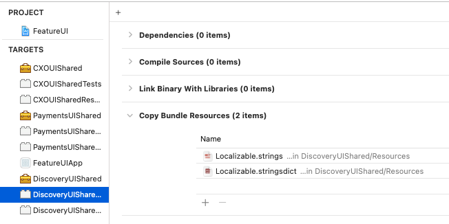

> **NOTE:** The assets (strings files) don't need to be part of `DiscoveryUIShared.framework`

### 7. Update the `HomeApp` target to copy `DiscoveryUISharedResources.bundle`

> **NOTE:** This step is easy to get wrong as using the "+" sign in the phase 
> does not add it properly, so make sure to drag it.

Next ensure that the `HomeApp` target, which is part of the `Home.xcodeproj` project includes the `DiscoveryUIShared.framework` dependency and that it copies the `DiscoveryUISharedResources.bundle` when building.

To add it expand the `FeatureUI.xcodeproj` product directory and drag the `DiscoveryUISharedResources.bundle` product to the `Copy Bundle Resources` phase of the `HomeApp`, see screenshot for reference:

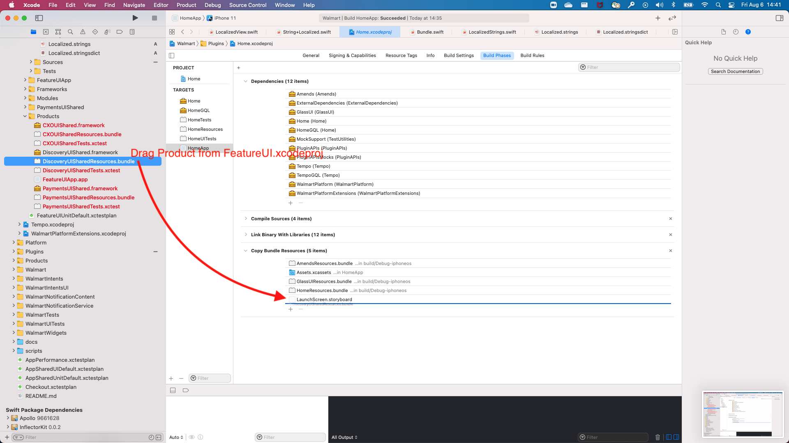


### 8. Make use of the view

To make use of the view and show the result we'll hijack the `HeadingBannerCell` class, and hardcode our view, I won't include the source because its a total hack but the result should be this, the code will automatically select the plural word when using formatting.

Result Singular | Result Plural
---- | ----
|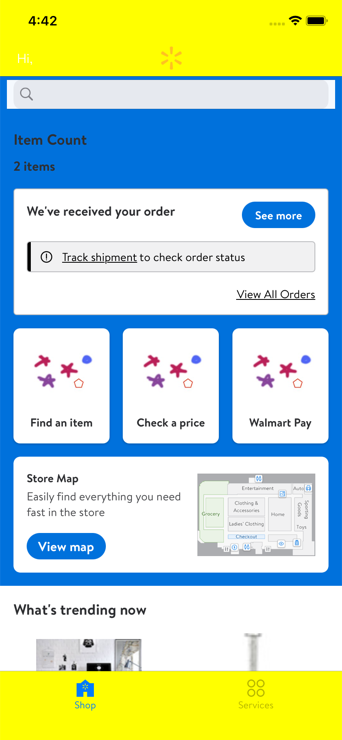

### 9. Adding another language to the module (`DiscoveryUISharedResources`)

Finally if we wanted to add another language to our localizable view we'd first add the locale specific
file to our module.

First we have localize our existing `*.strings` and `*.stringsdict`, you can do that by selecting each file and clicking the "Localize..." button as shown in the image:

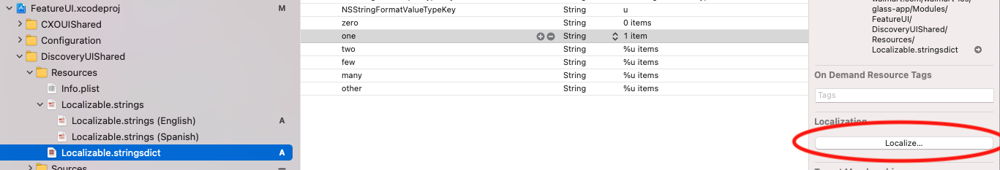

After the strings files have been localized next we have to add a new language to the `FeatureUI.xcodeproject`, you can do so by selecting the option as shown in the image:

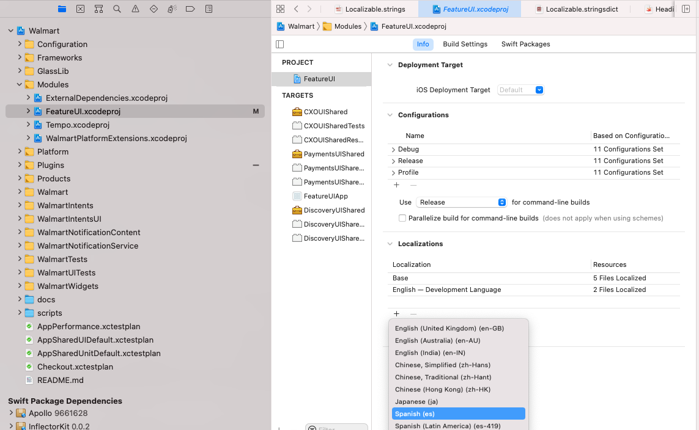

After selecting the language you'll be presented with a checklist of files, be sure to include the strings files as shown in the image:

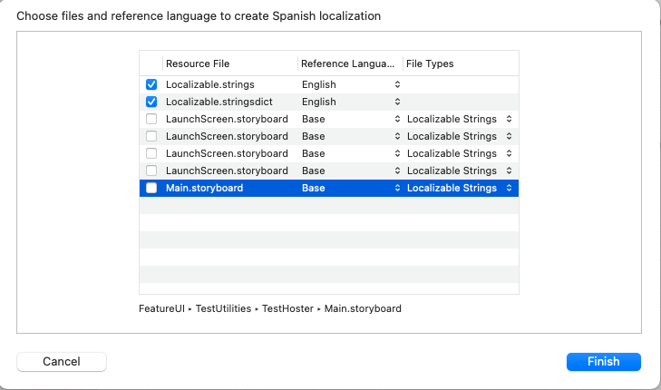

In the end you should have a "group" of localizable strings files (see image):

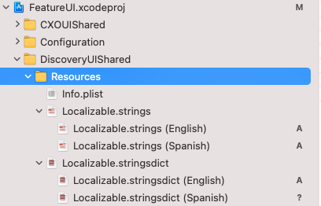

The content in spanish for the Localizeble files is the following.

**Localizable.strings (ES)**

```
"localizedViewTitle" = "Número de Artículos";
```

**Localizable.stringsdict (ES)**

```
<?xml version="1.0" encoding="UTF-8"?>
<!DOCTYPE plist PUBLIC "-//Apple//DTD PLIST 1.0//EN" "http://www.apple.com/DTDs/PropertyList-1.0.dtd">
<plist version="1.0">
<dict>
	<key>localizedViewItemCount</key>
	<dict>	
		<key>NSStringLocalizedFormatKey</key>
		<string>%#@count@</string>
		<key>count</key>
		<dict>
			<key>NSStringFormatSpecTypeKey</key>
			<string>NSStringPluralRuleType</string>
			<key>NSStringFormatValueTypeKey</key>
			<string>u</string>
			<key>zero</key>
			<string>0 artículos</string>
			<key>one</key>
			<string>1 artículo</string>
			<key>two</key>
			<string>%u artículos</string>
			<key>few</key>
			<string>%u artículos</string>
			<key>many</key>
			<string>%u artículos</string>
			<key>other</key>
			<string>%u artículos</string>
		</dict>
	</dict>
</dict>
</plist>
```

### 10. Adding another language to the demo app `HomeApp`

After adding the language to our module dependency (DiscoveryUIShared) we have to also add localization support to our target app; in this case `HomeApp`.

We have to add the same language in order to be able to load the languages supported by the module, add the Spanish language as shown in the image:

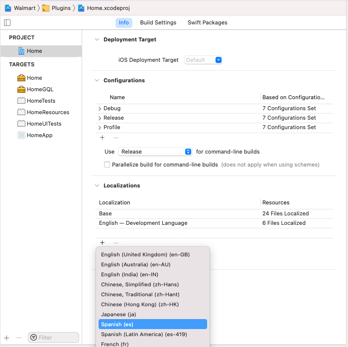

Select at least the main storyboard of the `HomeApp` target:

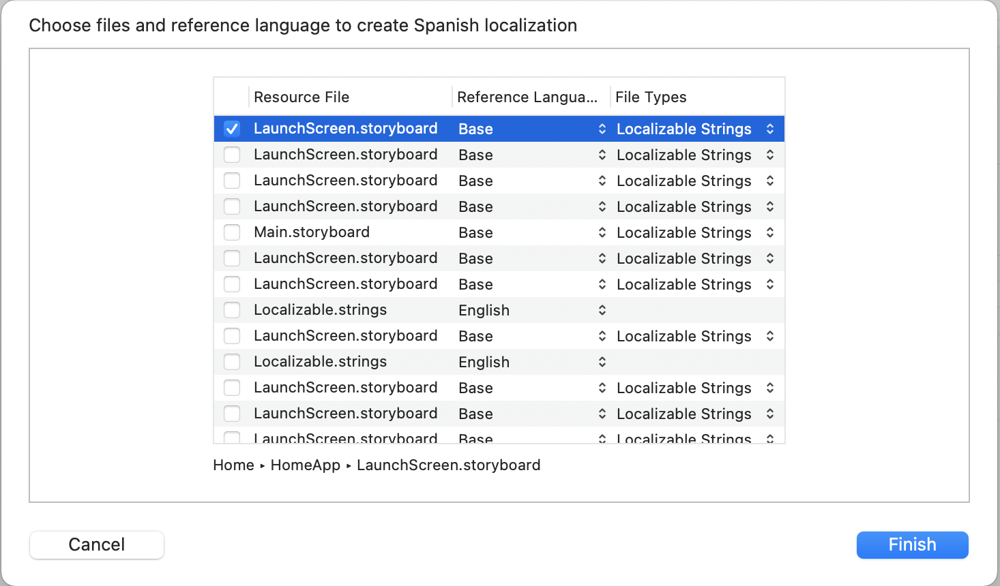

At this point you should be ready to run the application to see the localized and pluralized, to do so use `cmd + alt + R`and select the app language under the "Options" tab as shown in the picture:

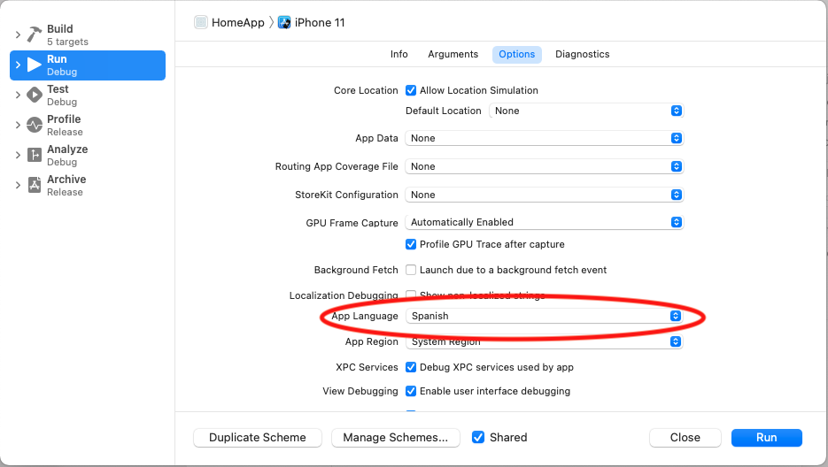

You should see the following result:

Singular ES | Plural ES
---- | ----
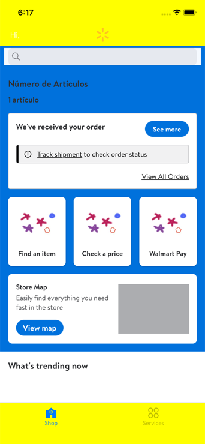 | 
