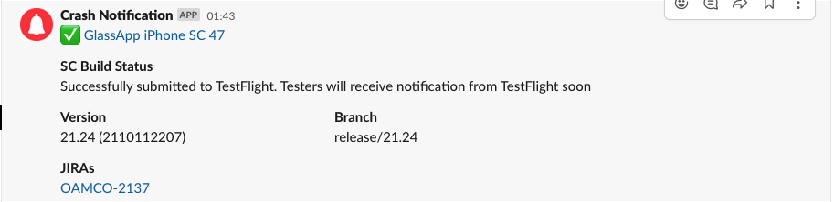
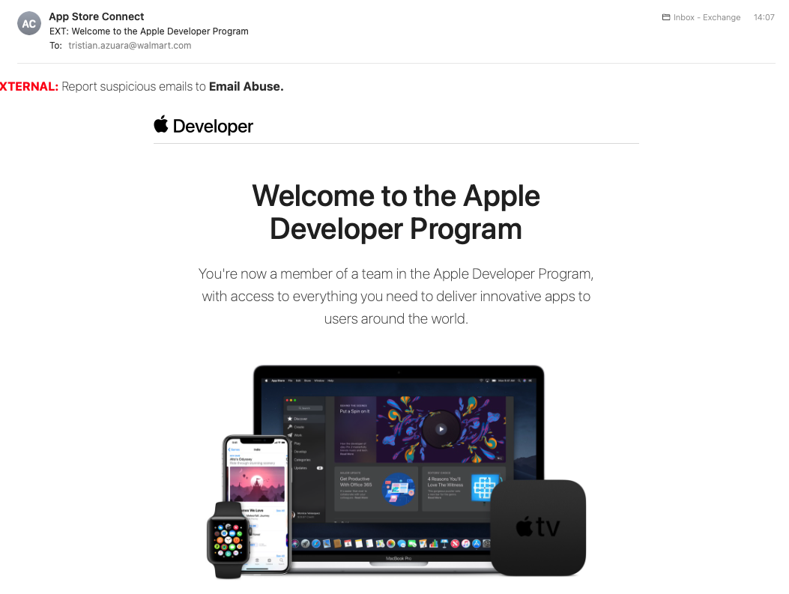
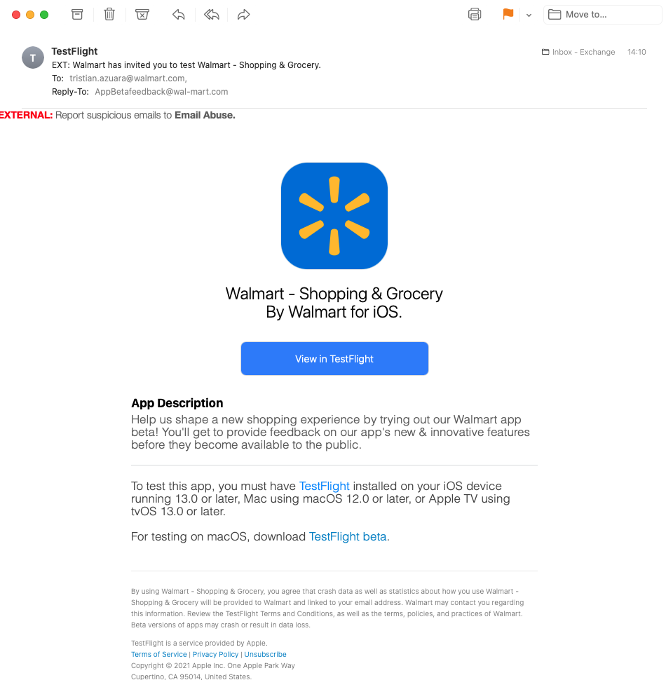
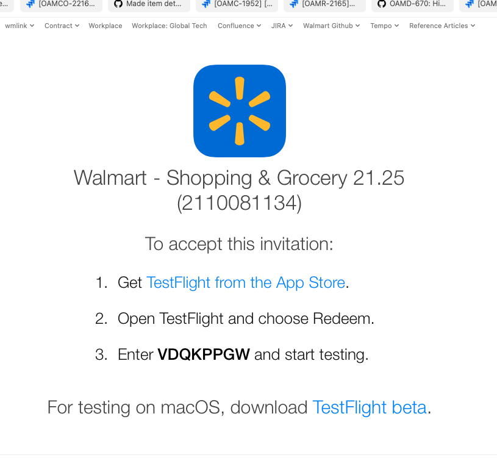
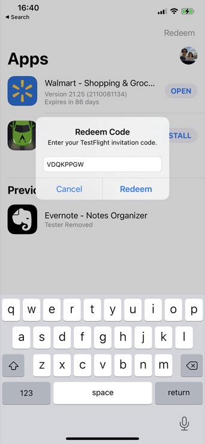

# TestFlight

After a release build is created it may be distributed through TestFlight. If you need access a build in TestFlight 
follow the steps below.

   * **NOTE**: These steps also apply if you're a Vendor and don't have a Walmart provided iPhone for testing, the 
     code should be redeemable with your personal apple ID.

## 1. Ensure that you are registered on App Store Connect

Reach out to the slack channel `#glass-ios` or `#mobile-release-eng` and ask for access to a TestFlight build, be sure 
to link the build that you want to access and to provide your Walmart Email Address.

Builds are usually published in `#builds-glass-ios` and look like this (notification format may change):

You can also check your membership in the following links:

  * [Developer Overview](https://developer.apple.com/account/#!/overview/74G6H8XY8B)
  * [App Store Connect: Access/Users](https://appstoreconnect.apple.com/access/users)

A `@glass-platform-ios` or a `@mobile-rel-eng` team member should reach out and add you as a "Developer" on App Store 
Connect.

## 2. Get added to "App Store Connect" users group

The same teammate that is helping you join the developer program should also add you to the
App Store Connect group (listed under "Internal Testers") and to test the `Walmart` app, you should get an email invite 
that looks like this:

In your computer, click the "View in Testflight" button and it should open a web page that has a redeemable code:

## 3. Install the TestFlight app and redeem the code

Finally, in the device that you plan to test be sure to install the iOS TestFlight App.

Then open the TestFlight app and redeem the code from the previous email as shown in the image:

## 4. Install the app and test

After redeeming the code, you should be able to install the application and open it after it finishes.

