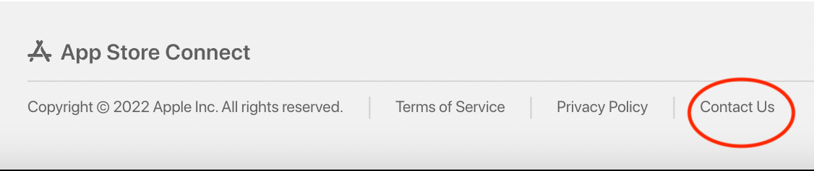
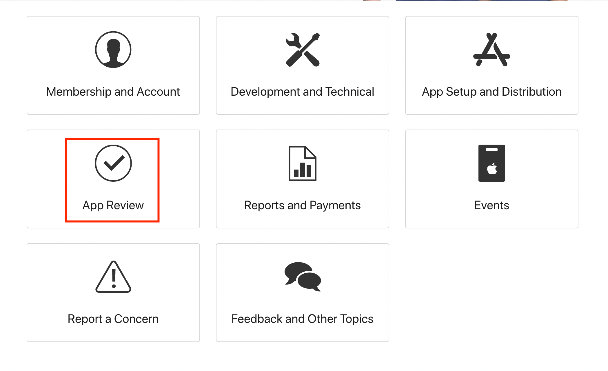
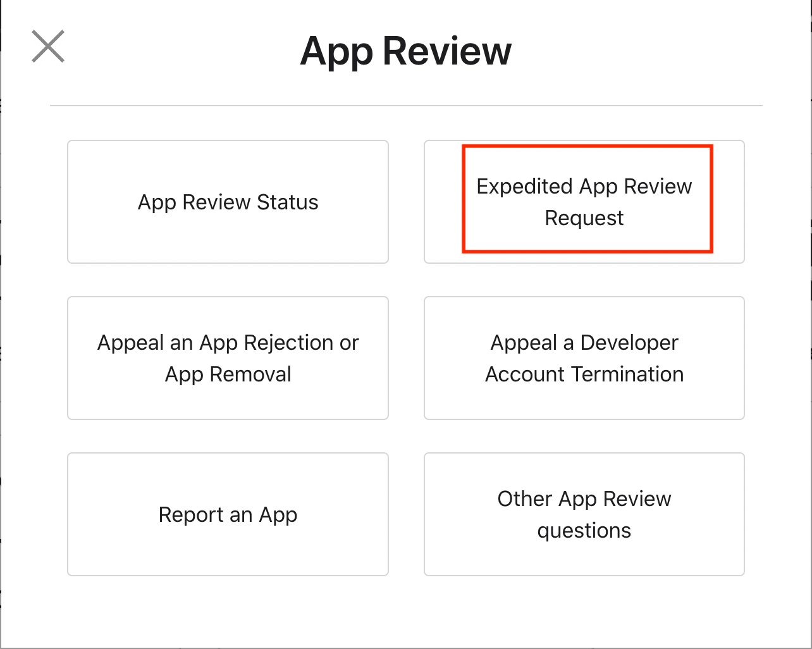
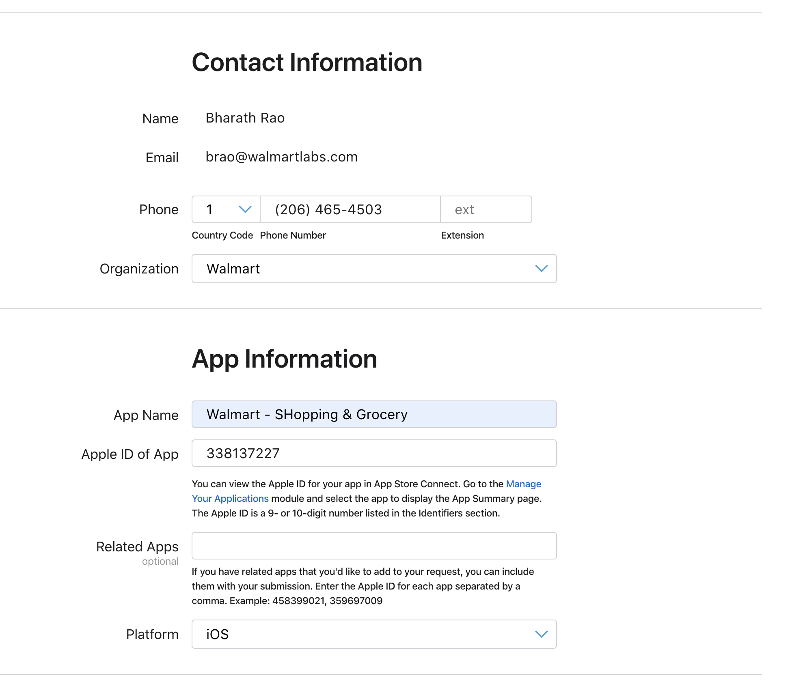
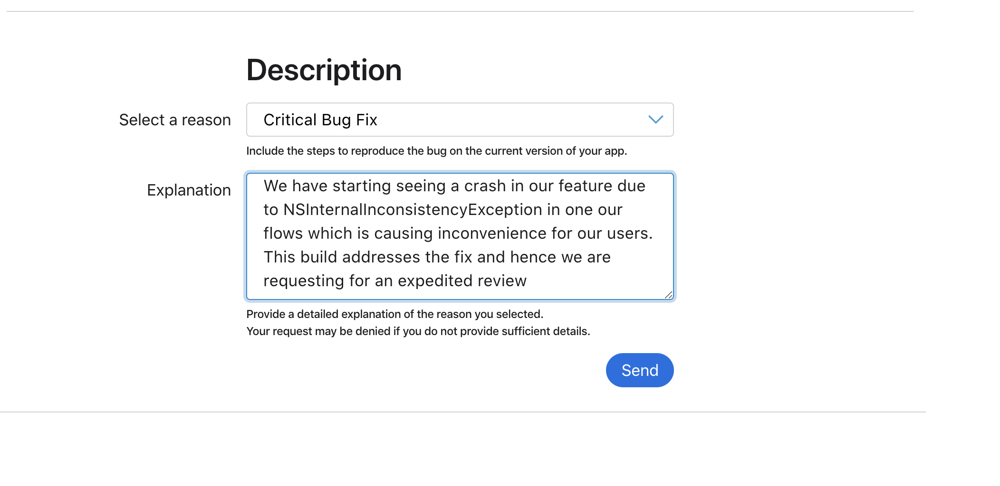
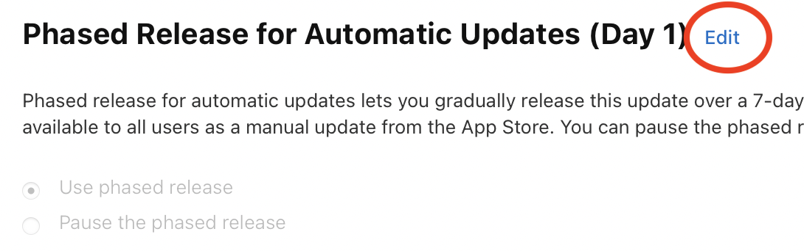
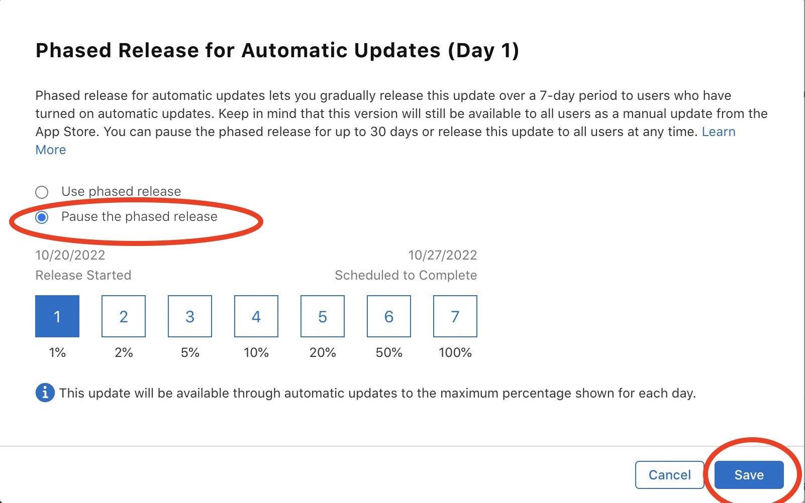
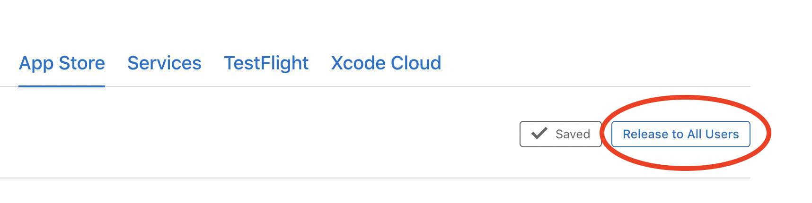

# Appstore submission for US market

- [Pre-requisite](#pre-requisite)

- [Submission Process](#submission-process)

- [Expedited App Review Request](#expedited-app-review-request)

- [Pause Phased Release](#pause-phased-release)

- [Release to All Users](#release-to-all-users) 


The following steps explains the steps that needs to be followed to submit iOS app of US market to AppStore

## Pre-requisite

Ensure that you have access to [App Store Connect](https://appstoreconnect.apple.com/apps/338137227/appstore/ios/) with a role of [App manager](https://developer.apple.com/support/roles/) or above. Reach out to Account holder or #mobile-release-eng for the right access.

## Submission Process

1. Login to [App Store Connect](https://appstoreconnect.apple.com/apps/338137227/appstore/ios/) with your account

2. On the top left corner, beside the text iOS App, click ✚ button and enter the new version. The version should match the [MARKETING_VERSION](https://gecgithub01.walmart.com/walmart-ios/glass-app/blob/development/Configuration/Platform.xcconfig#L29) or the version of the approved test flight build

3. Most of the fields will be auto filled with the contents of previous version number. However, ensure that it matches with the one provider below

   - App Previews and Screenshots 

     iPhone 6.5 Display - 9 of 10 Screenshots

     iPhone 5.5 Display - 9 of 10 Screenshots

     iPad Pro (3rd Gen) 12.9" Display - 6 of 10 Screenshots

     iPad Pro (2nd Gen) 12.9" Display - 6 of 10 Screenshots

     Reach out to #appstore-optimization for any queries related to the images

   - Promotional Text
     Normally this will be kept empty. If there are any recommendations by product, it should be communicated to @glass-release-cap-ios in #glass-release-ios 

   -  Description
     ```
     Save money. Live better.
     
     
     The Walmart app is the easiest way to shop for everything on your list, including fresh groceries, household essentials, the latest tech and a lot more. Plus, our convenient pickup, delivery and shipping options make it a breeze to get your order exactly when you want it, whether you’re shopping in-store or on the go.
     
     
     
     Convenient ways to get your items:
     
     
     Pickup
     
     Swing by the store to collect your order curbside—we’ll even load your car.
     
     
     Delivery
     
     From a local store straight to your door. For those need-it-now moments, choose Express delivery to get your order in as little as one hour.*
     
     *Restrictions and fees apply.
     
     
     Shipping
     
     Fast two-day shipping, dropped off by FedEx or UPS. Eligible orders over $35 ship free!
     
     
     
     
     Even more time-saving features you’ll love:
     
     
     Store maps
     
     When you’re in-store, open the app to find items fast.
     
     
     Real-time order tracking
     
     Get live order updates sent straight to your phone and track order status any time from the homepage.
     
     
     Reorder your essentials
     Quickly and easily fill your cart with frequently purchased items.
     
     
     Shopping lists
     
     Create, share and add to lists to prepare for any occasion.
     
     
     Walmart Pay
     
     Easily check out using all your payment methods. Just tap "Pay” and we’ll recommend how to split your total to make the most of your cards and balances.
     
     
     Curbside check-in
     
     Check in with the app when you’re ready to pick up your order and we’ll bring it out to you.
     
     
     Barcode scanner
     
     Scan items to check prices and build lists.
     
     
     Pharmacy
     
     Refill, transfer, manage and pick up your family’s prescriptions. Plus, schedule vaccinations, locate testing sites and more.
     
     
     
     Walmart+ members—our app is the easiest way to get the most out of your membership. App-exclusive features for Walmart+ include:
     
     
     
     Scan & go
     
     Use your phone to shop in-store and check out contact-free.
     
     
     Member prices on fuel
     
     Get up to 10¢ off every gallon at 14,000+ locations nationwide**—including Exxon and Mobil stations! 
     
     **Fuel discount varies by location and station, subject to change
     
     
     
     
     Do Not Sell My Personal Information 
     Please scroll down to the footer of our Privacy Policy below to find the "Do Not Sell My Personal Information" link. 
     https://corporate.walmart.com/privacy-security 
     
     
     ```

     

   - What's New in This Version
     
     Normally this will follow the same text as mentioned in the previous version of the release. However, if there is any change in the text, it should be communicated to @glass-release-cap-ios in #glass-release-ios 
     Standard text that is used for all releases
     
     ```
     Thank you for using the Walmart app! We've made a few enhancements to provide a seamless experience, so you can save time and money.


     We appreciate your feedback: https://survey.walmart.com/app
     ```
     
   - Keywords
     ```
     groceries,dollar,family,general,prime,door,dash,sprouts,home,shop,store,scan,list,food,coupon,market
     ```
     
   - Support URL
     ```
     http://www.walmart.com/help/app/home/incidents.c$client_source/iosappstore
     ```

   - Marketing URL
     ```
     http://www.walmart.com/cp/Walmart-Mobile-App/1087865#appleiOS
     ```

   - Version
     
     The version should be same as the one entered earlier in step 2 
     
   -  ✅ Sign-in required
   
     walmartios2017@gmail.com		WalTest2017
   
   - Contact Information
     
     Eric Reedy
     Mobile - 818-458-1519
     Email - eric.reedy@walmart.com
     
   - Notes
     ```
     To test Siri Shortcuts:
     
     After login to the app.
     Tap on Accounts tab
     Tap 'Voice Shopping` option
     Scroll through available Siri shortcuts and tap 'Add to Siri' button.
     ```
     
   - Version Release
     
     ⚠️ Ensure the following option is selected 
   
     🔵 Manually release this version
     
   - Phased Release for Automatic Updates
     
     ⚠️ Ensure the following option is selected 
     
     🔵 Release update over 7-day period using phased release
     
   - Reset iOS Summary Rating
   
     ⚠️ Ensure the following option is selected 
     
     🔵 Keep existing rating
   
4. Click on ✚ under the Build section and choose the build number (Ex: 2207221151) which has been approved for submission by E2E team. The approval is usually communicated in #glass-release-ios 

5. Once the build is chose, click on `Done`

6. Scoll to the top of the page and click on `Save` . Once the page refreshes and shows  `Add for Review` , click that to submit the app for review.
   

## Expedited App Review Request

Apple has provision to request the review of our app to be expedited during extenuating circumstances, such as fixing a critical bug in the app or releasing app to coincide with an important event. Following process helps the [App manager](https://developer.apple.com/support/roles/) or those with higher privileges to request for an expedited review.

- Login to [App Store Connect](https://appstoreconnect.apple.com/apps/338137227/appstore/ios/) with your account

- Scroll to the bottom of the page and click on `Contact Us` to open a new window
  

  

- Among those tiles displayed, select `App Review`
  
  
  

  
  
- And then select `Expedited App Review Request`
  


  

- Select `Contact App Review`

- Ensure `request an expedited app review` is chosed 

- Under the section which captures `Contact Inforamtion` , provide the following details
   - Phone
		 Country Code - 1	
     Phone Number - 818-458-1519
     Organization - Walmart
   
- Under the section which captures `App Inforamtion` , provide the following details
   - App Name
		 `Walmart - Shopping & Grocery`
   	
	- Apple ID of App
   	 `338137227`
		
   - Platform
		 `iOS`
   	
		  
   	
	- Select a reason
		
		 `Critical Bug Fix` (Select suitable choice if the reason is different)
		
	- Explanation
		
		`<Provide-the-details-of-the-fix/reason>`
		
		
		 
	
- Click `Send` to submit the request

## Pause Phased Release

The phased released can be paused at any given point of time before the current app version reaches 100%. Inorder to pause the automatic updates, scroll to the section `Phased Release for Automatic Updates` in [this](https://appstoreconnect.apple.com/apps/338137227/appstore/ios/version/deliverable) link.

- Click on Edit button as shown below

  

- Select `Pause the phased release` and click `Save`

  

## Release To All Users

Inorder to release the current version to all the users, click on `Release to All Users` in [this](https://appstoreconnect.apple.com/apps/338137227/appstore/ios/version/deliverable) link and confirm.


