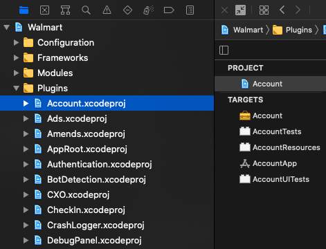
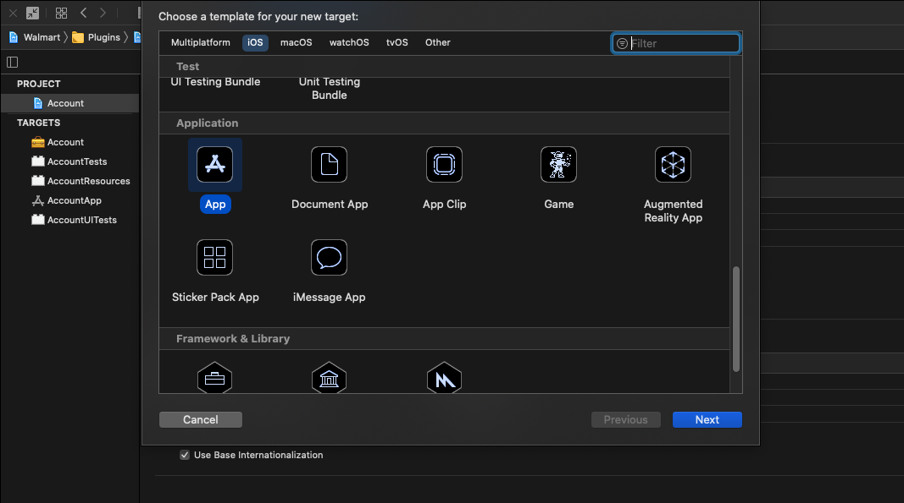
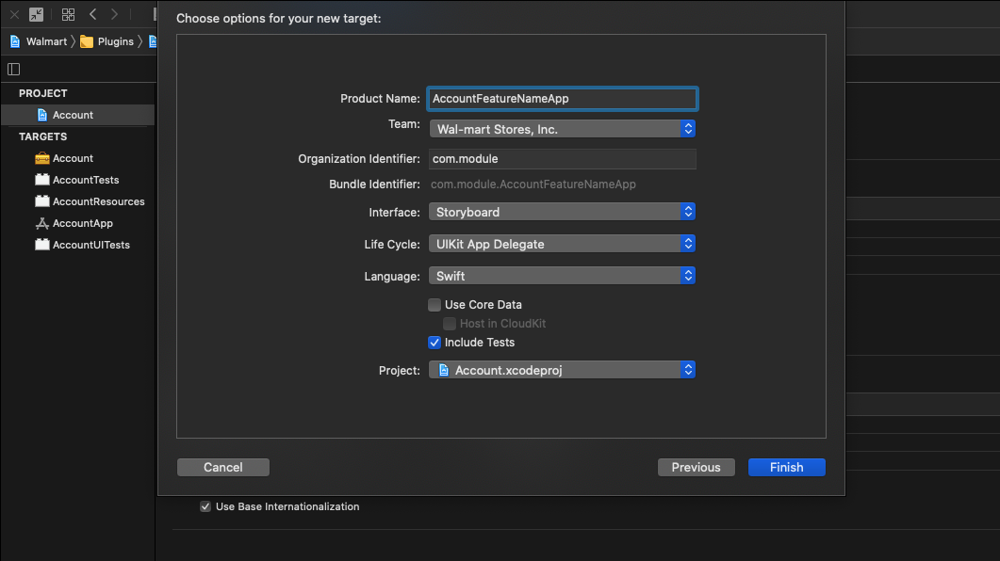
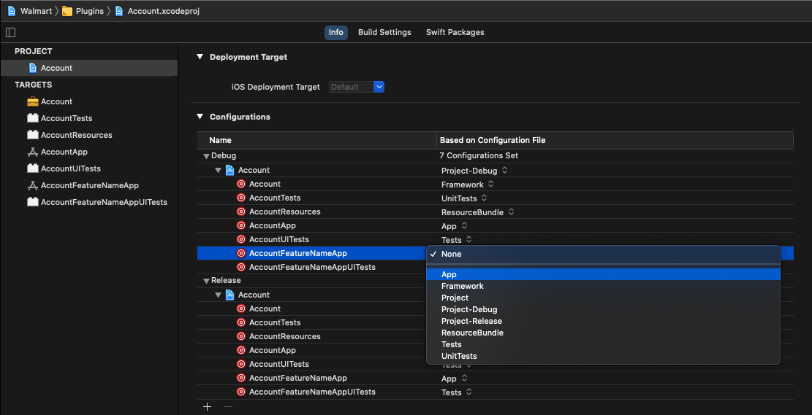
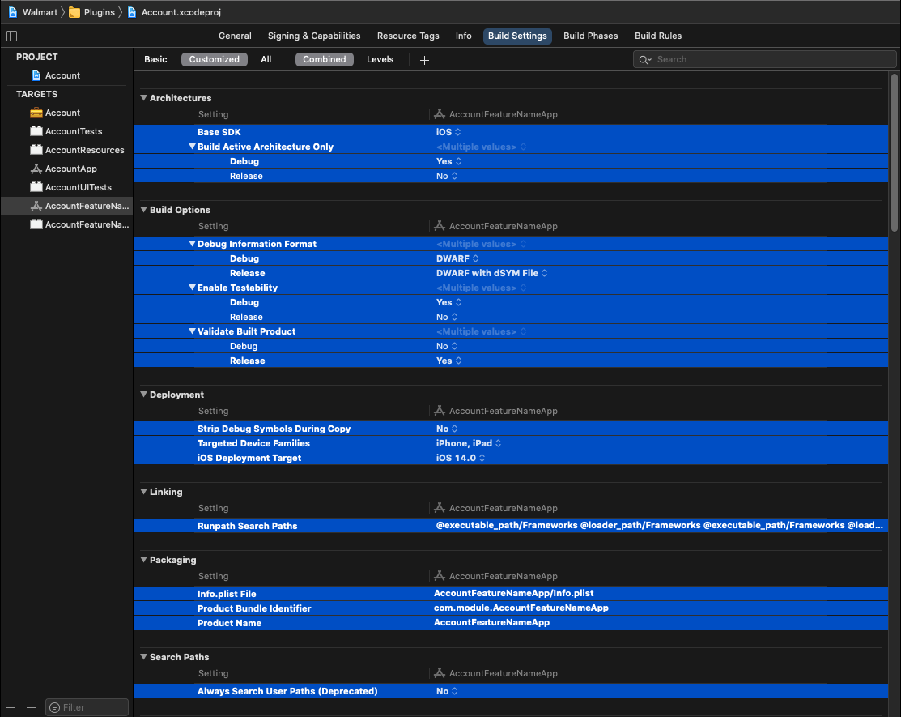
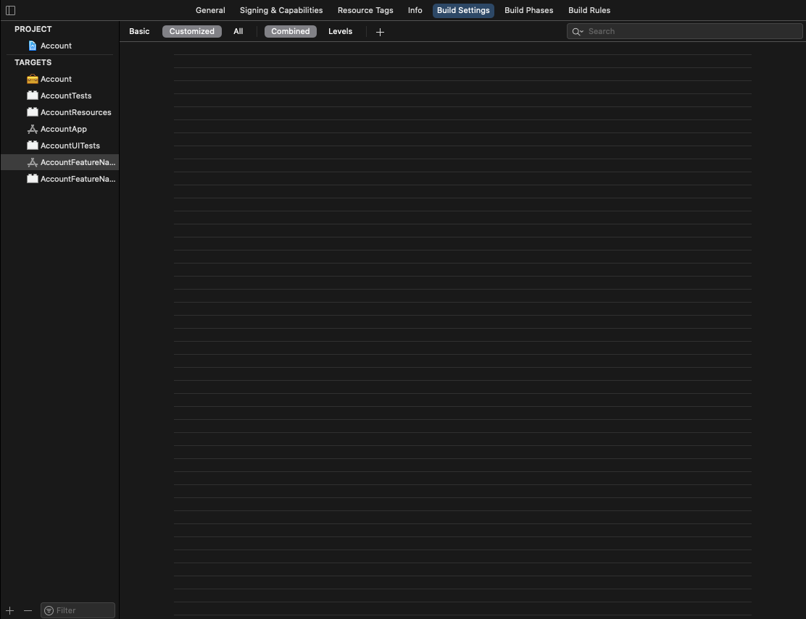

# Sample Apps

Note: This document details a component of [Plugin](../architecture/plugin.md).

- [What Is A "Plugin App"](#what-is-a-plugin-app)
- [Creating A Plugin App](#creating-a-plugin-app)
- [Configuring A Container For A Plugin App](#configuring-a-container-for-a-plugin-app)
- [Using A Plugin App For UI Tests](#using-a-plugin-app-for-ui-tests)

## What Is A "Plugin App"?

A Plugin App (sometimes referred to as a "Mini App", a "Demo App", or a "Sample App") is an app that is built to showcase and test the features and behaviors of a matching Plugin Module.  While some modules may include a single App, others may include several, each focusing on a separate feature within.

Plugin Apps are expected to incorporate only the absolute bare minimum necessary to achieve their goal.  In cases where other, external features, are necessary to do so, those features should be mocked to avoid adding any unnecessary integration.

A Plugin App should also include an accompanying UI Testing target, allowing tests to be written that verify the visual and interactive components of a given feature independent of the primary App.

### Plugin App Examples

When authoring a new Plugin App, much like any new component of a heavily-modularized project, it's good practice to first look over how other teams have authored their own.  This will likely answer most questions that could arise throughout the process, and will help to inform you overall of any patterns that are being employed that you may have otherwise missed.

Looking through the Walmart App, here are a few examples of Plugin Apps which are currently in use, each residing within their respective modules' xcode projects:

- [`AuthenticationApp`  module](https://gecgithub01.walmart.com/walmart-ios/glass-app/tree/development/Plugins/Authentication/AuthenticationApp/) for the [`Authentication` module](https://gecgithub01.walmart.com/walmart-ios/glass-app/tree/development/Plugins/Authentication/Authentication/)
- [`CXOApp`](https://gecgithub01.walmart.com/walmart-ios/glass-app/tree/development/Plugins/CXO/CXOApp/) for the [`CXO` module](https://gecgithub01.walmart.com/walmart-ios/glass-app/tree/development/Plugins/CXO/CXO/Sources/)
- [`HomeApp`](https://gecgithub01.walmart.com/walmart-ios/glass-app/tree/development/Plugins/Home/HomeApp/) for the [`Home` module](https://gecgithub01.walmart.com/walmart-ios/glass-app/tree/development/Plugins/Home/Home/Sources/)
- [`CancellationApp`](https://gecgithub01.walmart.com/walmart-ios/glass-app/tree/development/Plugins/PurchaseHistory/Applications/CancellationApp/) for the [`PurchaseHistory` module](https://gecgithub01.walmart.com/walmart-ios/glass-app/tree/development/Plugins/PurchaseHistory/PurchaseHistory/Sources/)
- [`OrderDetailsApp`](https://gecgithub01.walmart.com/walmart-ios/glass-app/tree/development/Plugins/PurchaseHistory/Applications/OrderDetailsApp/) for the [`PurchaseHistory` module](https://gecgithub01.walmart.com/walmart-ios/glass-app/tree/development/Plugins/PurchaseHistory/PurchaseHistory/Sources/)
- [`PurchaseHistoryApp`](https://gecgithub01.walmart.com/walmart-ios/glass-app/tree/development/Plugins/PurchaseHistory/Applications/PurchaseHistoryApp/) for the [`PurchaseHistory` module](https://gecgithub01.walmart.com/walmart-ios/glass-app/tree/development/Plugins/PurchaseHistory/PurchaseHistory/Sources/)
- [`SearchApp`](https://gecgithub01.walmart.com/walmart-ios/glass-app/tree/development/Plugins/Search/SearchApp/) for the [`Search`  module](https://gecgithub01.walmart.com/walmart-ios/glass-app/tree/development/Plugins/Search/Search/Sources/)
- [`SearchLandingApp`](https://gecgithub01.walmart.com/walmart-ios/glass-app/tree/development/Plugins/Search/SearchLandingApp/) for the [`Search`  module](https://gecgithub01.walmart.com/walmart-ios/glass-app/tree/development/Plugins/Search/Search/Sources/)
- [`TypeaheadApp`](https://gecgithub01.walmart.com/walmart-ios/glass-app/tree/development/Plugins/Search/TypeaheadApp/) for the [`Search`  module](https://gecgithub01.walmart.com/walmart-ios/glass-app/tree/development/Plugins/Search/Search/Sources/)

## Creating A Plugin App

The plugin should already have a associated sample app(`<PluginName>App`) target when created the plugin, if its not created you can create manually.

1. **Locate your Plugin Module's Xcode Project.** It should be located in the Plugins directory of the Walmart App.




2. **Add a new App Target.** 

- With the Project selected, click the **"+"** button along the bottom edge of the Project / Targets panel.  Select **App** and press **Next**.



- Enter a name in the **Product Name** field that describes the feature (or feature set) it is expected to contain.  If it isn't unique to any specific feature, name it after the module instead.



- Click the **Finish** button to finish adding the new App Target.

3. **Update configuration of app to be based off of App configuration file.**

In this step, you will be setting the configuration file for each of the targets you've just created.

An assortment of target configurations have been pre-configured and included in the Walmart project.  These are used to configure various target types, including Frameworks, Apps, UnitTests, and ResourceBundles.

- Start by selecting the module's project and fully expanding the **Configurations** section.  
- Listed within the **Configurations** section you should see your new targets with their file-based configurations set to **None**.  Change these values to **App** (for the App) and to **Tests** (for the UI Tests) in each of the two subsections, and you should be good.




4. **Update the Build Settings.** 

- To fully utilize the Configuration Files we just set, you will need to enter the Build Settings of your new App target.  
- In the Build Settings, select **Customized** on the top, and you should see a long list of auto-configured settings.  
- Select them all (yes, all of them) and hit the **Delete** key on your keyboard.

 

For the Unit Test target, you will need to do the same.  However, before hitting the delete key, first deselect the **info.plist** file and **TEST_TARGET_NAME** settings, as those two are required.

The file-based build settings should now be in effect.


## Configuring A Container For A Plugin App

The default container object in the WalmartApp's AppDelegate will not be available to use in your Plugin App as that instance is only available from within the Walmart App itself.

This means that your App needs to define its own instance of a [`Container`](../architecture/containers.md) to be used.  This [`Container`](../architecture/containers.md) should be set up with any relevant plugin mocks, networking instances, preference instances, etc, that your plugin will require.

### Example

This is derived from the Onboarding Plugin App.  (Note:  Comments are for documentation purposes.)

```swift
private let container: Container = {
    // initialize container
    let container = Container()
    
    // set up the needed dependencies
    container.register(LegacyEnvironment.self) { .staging }
    // swiftlint:disable:next only_walmart_instance
    container.setupNetworking()
    container.setupPreferencesStorage()
    container.setupRemoteImageSource()
    container.setupMockAnalytics(for: .consoleLogger(logIdentifier: "My Awsome Demo App")))
    container.setupPermissions()
    container.setupAppProcessInfo()
    return container
}()
```

## Using A Plugin App For UI Tests

UI Testing benefits greatly from modularized architectures like this, as they allow tests to be written that verify the visual and interactive components of a given feature independent of their primary App.  It helps our tests remain focused and reduces the amount of potential fragility caused by outside forces.
