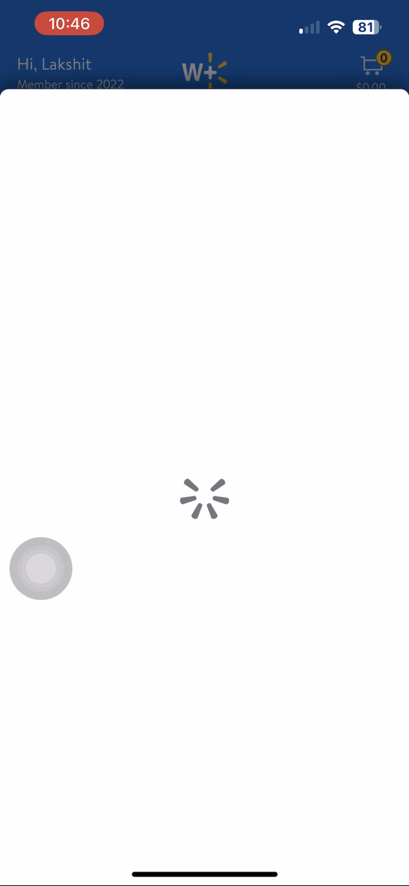
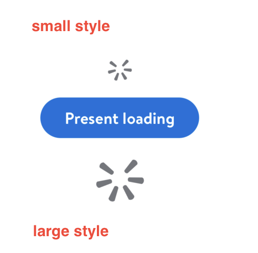
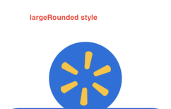

#  ActivityIndicator

## Description:

ActivityIndicator is a simple view that displays an active and centered `LoadingIndicatorView`. Particularly useful for "view swapping".

*Example from Walmart App: `GlassLoadingView` is used here to swap views when user clicks on "select address"*.

## Overview

This type of view can be used when we want to visually indicate the users that a process is taking place for an indeterminate amount of time.

We use `LDSpinner` as the indicator view for `GlassLoadingView`.

##### Parameters for `GlassLoadingViewController`:
- `style` - The preferred style of the loading indicator.
  - Defaults to `small`
- `delay` - An optional delay before the loading indicator is displayed.
  - Defaults to `nil`
- `backgroundColor` - The background color of the loading view.
  - Defaults to `clear`.

###### Available styles for GlassLoadingView:
- small
- large
- largeRounded

> ##### Example:
> `let loadingView1 = GlassLoadingView(style: .small)`
>
> `let loadingView2 = GlassLoadingView(style: .large)`

*small and large styled `GlassLoadingView`*

*largeRounded styled `GlassLoadingView`*

###### Delay:

This value can be changed if we want a delay before `GlassLoadingView` is displayed. Feature teams can configure this value according to their use case.  

Available values for delay(in seconds):
- standard: 0.3
- custom: up to the feature teams
