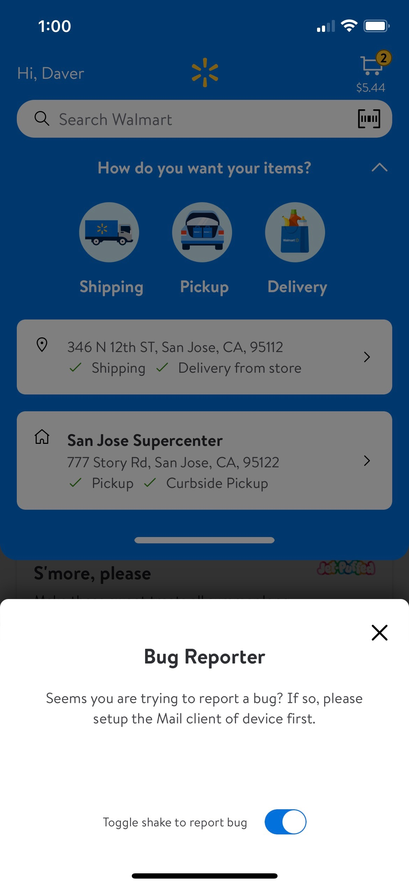
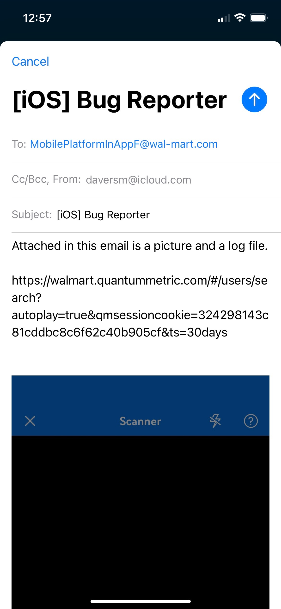
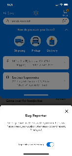
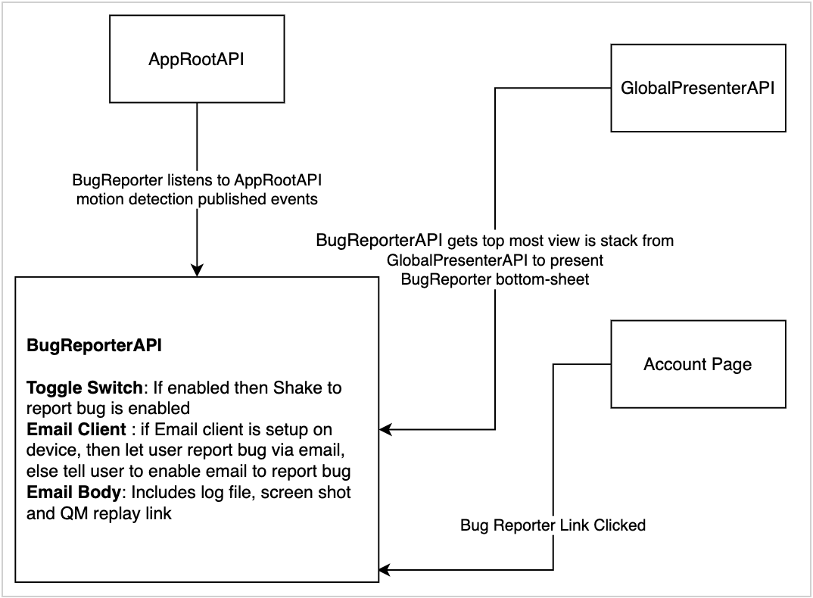

#  AssociateFeedback

Also known as **"Bug Reporter"**. 


## Overview

- It is an associate only feature, which will allow users to report issues seen while using Glass Walmart Android and iOS.
- The current version of **Shake-to-feedback** has been disabled via CCM. 
- Version 2 coming soon...


### How to use this feature:

- Under account menu, click Bug Reporter link and enable shake to toggle switch
- Sign-in using associate account
- If CCM is enabled, on shake of device the BugReporter bottom-sheet will appear.


### Current Possible states:

- Toggled off (Default):


- Toggled on:


- Email not setup:


- Email body:


- Email sent:


- Email/Draft saved:



### Key flows:

- The link under account page is only visible if feature CCM is enabled and signed-in with an associate account.
- Clicking the "Bug Reporter" will always open a BugReporter bottom-sheet
- By default the shake for feedback toggle switch is off in the bottom-sheet. This also means that shaking the device should not open BugReport bottom-sheet
- If the shake to feedback is enabled via toggle switch, then shaking the device should cause BugReporter bottom-sheet too open any place in the app. Even over other bottom-sheets.
- If user kills and opens the app, their preference for the toggle switch should remain the same.
- If user clicks "Report Bug" any place in the app. Then an email view should be shown to user.
- The email receiver field should be auto populated
- In the email view there should be a few things attached.
    - Screen shot
    - QM link 
    - A log file with some user data 


### Architecture:




### AssociateFeedback (BugReporter) CCMModel:

```swift
struct BugReporterCCMModel: Decodable, CCMModel {

    let isBugReporterEnabled: Bool
    let bugReporterEmail: String

    private enum CodingKeys: String, CodingKey {
        case bugReporterEnabled = "platform.bugReporter.enabled"
        case bugReporterEmail = "platform.bugReporter.email"
    }
}
```


### AssociateFeedback (BugReporter) EmailComposer:

Possible cases in EmailComposer:
- cancelled
- failed
- sent
- saved
- default (feature disabled)

```swift
private func buildEmailComposer() -> MFMailComposeViewController {
    let composer = MFMailComposeViewController()
    composer.mailComposeDelegate = self
    composer.setToRecipients([ccmModel.bugReporterEmail])
    composer.setSubject(String.localized(.email_title))
    composer.setMessageBody(buildEmailBody(), isHTML: false)

    if let screenShot = currentScreenShot,
        let jpeg = screenShot.jpegData(compressionQuality: CGFloat(0.7)) {
        composer.addAttachmentData(jpeg, mimeType: "image/jpeg", fileName:  "screen.jpeg")
    }

    if let jsonData = buildUserInfoJson() {
        composer.addAttachmentData(jsonData, mimeType: "application/json", fileName: "log.json")
    }

    return composer
}
```
