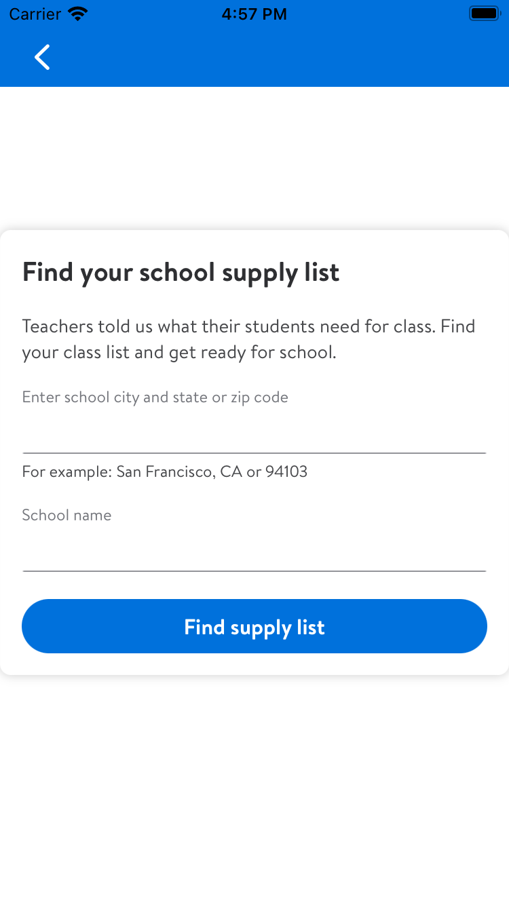
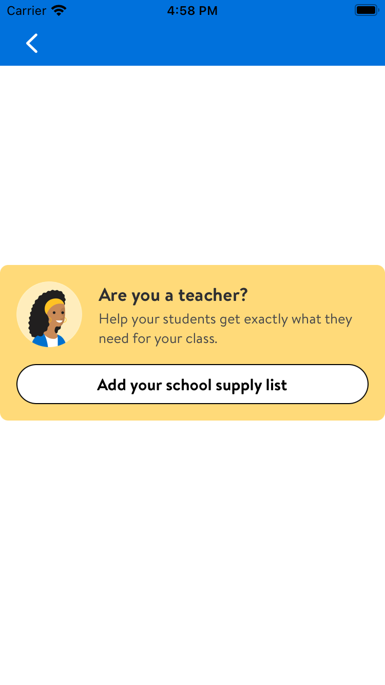

# Back To School

## Overview

This is a API with two views inside of it giving teachers the tools they need to find supplies for their classroom.
There is a **BTSFormView** which is used as a form to help the teacher find which supplies they need by typing in
their school name, city and zip code. The other view is the **BTSTeacherView** which is a view with a button that when
pressed navigates to their add supply list. There is also a **BTSTeacherConfirmationViewController** which has a button
with a link embedded inside it of *https://www.teacherlists.com/powerloader/walmart* which redirects the teacher outside
to the safari app and visits the teacherlists website.

### BTSFormView

```swift
    func addBTSFormView() {
        let btsFormView = BTSFormView()
        /// `btsFormView` has an LDLinkButton which takes an onTap closure when pressed
        /// Assign it to what ever you like and it will be triggered when the button is
        /// pressed.
        btsFormView.searchButton.onTap = {
           //Do stuff
        }
        addAutoLayoutSubview(btsFormView)
    }
```



### BTSTeacherView

    - Delegate Conformance
    
```swift
/// The `BTSTeacherView` takes in a `BTSTeacherViewDelegate` as a delegate
/// property. Use this to conform to any view so that view can use the
/// `navigateToAddYourList()` method and the customer can navigate to thier
/// teachers supply list.
public protocol BTSTeacherViewDelegate: AnyObject {
    func navigateToAddYourList()
}
```
    - Adding the BTSTeacherView

```swift
    func addBTSTeacherView) {
        let btsTeacherView = BTSFormView()
        btsTeacherView.searchButton.onTap = {
           //Do stuff
        }
        addAutoLayoutSubview(btsTeacherView)
    }
```



### BTSTeacherConfirmationViewController

    - Delegate Conformance

```swift
/// The `BTSTeacherConfirmationViewController` takes in a `BTSTeacherViewConfirmationDelegate`
/// as a delegate property. Use this to conform to any view so that view can use the
/// `didConfirmTeacherViewConfirmation()` method and the customer can navigate to the
/// teachers list website.
public protocol BTSTeacherViewConfirmationDelegate: AnyObject {
    func didConfirmTeacherViewConfirmation()
}
```

    - Adding the BTSTeacherConfirmationViewController

```swift
    func addBTSTeacherConfirmationVC() {
        let vc = BTSTeacherConfirmationViewController()
        viewController.delegate = self
        let bottomNav = BottomSheetNavigationController(rootBottomSheet: viewController)
        navigationController?.present(bottomSheet: bottomNav,
                                     as: .modal,
                                     animated: true)
    }
```


