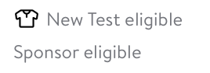
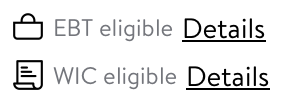
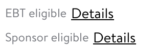

# BadgeView

## Overview

This is a subview shown on the GlassProductTile. It displays BadgeView details for product
e.g EBT and Sponsor badge. It is configured as a list of an optional Icon on the left side 
and a primary text label on the right side. The list doesn't have a limit to how many views 
can be added to it but the limit typically is 3.


### Model Properties 

```swift 
    struct GlassProductTile.BadgeView.SubviewModel {

        /// Typically accessed as an LDIcon's image property
        fileprivate let icon: UIImage?
        /// an optional value to be given to the icons accessibility label
        fileprivate let iconAccessibilityLabel: String?
        /// The primary title used for the badge view
        fileprivate let primaryTitle: String
        /// The primary color used for the badge view
        fileprivate let primaryTitleColor: LDColor
        /// An optional value given to the details button
        fileprivate let detailsTitle: String?
        /// an optional callback given to the detail's button
        fileprivate let detailsAction: (() -> Void)?
    }
```

### Example One 

 ```swift 
      func addBadgeViewExampleOne() {
          let badgeViewModel: [GlassProductTile.BadgeView.SubviewModel] = [.init(icon: GlassIcon.apparel.image,
                                                                                 iconAccessibilityLabel: "apparel",
                                                                                 primaryTitle: "New Test eligible"),
                                                                           .init(primaryTitle: "Sponsor eligible")]
          let badgeView: GlassProductTile.BadgeView = .init(model: badgeViewModel)
          addAutoLayoutSubview(badgeView)
      }
 ```
 


### Example Two 

 ```swift 
      func addBadgeViewExampleTwo() {
          let badgeViewModel: [GlassProductTile.BadgeView.SubviewModel] = [.init(icon: GlassIcon.bag.image,
                                                                                 iconAccessibilityLabel: "bag",
                                                                                 primaryTitle: "EBT eligible",
                                                                                 detailsTitle: "Details"),
                                                                           .init(icon: GlassIcon.article.image,
                                                                                 iconAccessibilityLabel: "article",
                                                                                 primaryTitle: "WIC eligible",
                                                                                 detailsTitle: "Details")]
          let badgeView: GlassProductTile.BadgeView = .init(model: badgeViewModel)
          addAutoLayoutSubview(badgeView)
      }
 ```
 


### Example Three 

 ```swift 
      func addBadgeViewExampleThree() {
          let badgeViewModel: [GlassProductTile.BadgeView.SubviewModel] = [.init(primaryTitle: "EBT eligible",
                                                                                 detailsTitle: "Details"),
                                                                           .init(primaryTitle: "WIC eligible",
                                                                                 detailsTitle: "Details")]
          let badgeView: GlassProductTile.BadgeView = .init(model: badgeViewModel)
          addAutoLayoutSubview(badgeView)
      }
 ```


