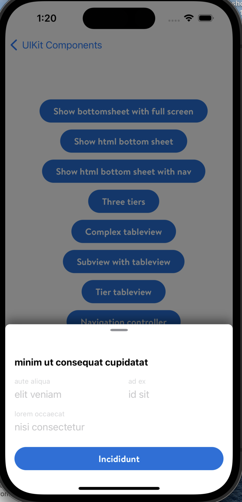

#  BottomSheet

## Description

This type of view appears on top of main view. BottomSheet view can cover the screen fully or partially depending on the type.

Users can close this view either by close button or sliding down.


## Overview

- Bottom Sheets provide room for additional items, longer descriptions, and the completion of sub-tasks.
- They appear as a result of user interaction and must be dismissed by the user.
- When activated, a Bottom Sheet blocks the user from accessing the main content on the screen until dismissed.

- **The UI for BottomSheet is handled by LD team.**

- **Shared-components team** is responsible for control of BottomSheet like `navigation` and `popover` functionality.


*Example from Walmart app*

## Topics

### BottomSheetNavigationController

A container view controller that adopts the `BottomSheetable` Protocol and defines a stack-based scheme for navigating hierarchical content for View Controllers that also adopt the BottomSheetable Protocol

The root BottomSheetable View Controller sets the initial values for laying out the bottomSheet view.

```swift
let rootViewController = BottomSheetableViewController()
let nav = BottomSheetNavigationController(rootBottomSheet: rootViewController)
presentingViewController.present(bottomSheet: nav, as: .modal)
```
Additional ViewControllers that adopt BottomSheetable replace the current bottomSheet parameters as controllers are pushed and removed from the stack.

It is not advised to use controllers with varying content heights as it can result in unexpected effects.


```swift
public override func navigationController(
    _ navigationController: UINavigationController,
    didShow viewController: UIViewController, animated: Bool) {
    defer {
        super.navigationController(navigationController, didShow: viewController, animated: animated)
    }

    update(viewController: viewController)
    guard let bottomSheetNavigationController = navigationController as? BottomSheetNavigationController else {
        return
    }
    bottomSheetNavigationController.didViewPushedToStack = false
}
```


Setting animation depending on the `transition` of bottomSheet,
- presenting
- dismissing

```swift
public func navigationController(_ navigationController: UINavigationController,
                                 animationControllerFor operation: UINavigationController.Operation,
                                 from fromVC: UIViewController,
                                 to toVC: UIViewController) ->
     UIViewControllerAnimatedTransitioning? {
     if let bottomSheetable = toVC as? BottomSheetable, bottomSheetable.tiersType == .oneTierAutomatic {
         switch operation {
         case .push:
             return TransitionAnimator(for: .presenting)
         case .pop:
             return TransitionAnimator(for: .dismissing)
         default:
             return nil
         }
     } else {
         return nil
     }
 }
```


### PopoverContainerViewController

- Popover functionality for BottomSheet is managed here.
- Show Popovers with BottomSheet content on iPads

- `Keyboard` for popover

```swift
func keyboardWillShow(_ notification: Notification) {
    guard popover.tiersType == .oneTierAutomatic,
                              popover.isKeyboardObserver,
                              let rect = notification.userInfo?[UIResponder.keyboardFrameEndUserInfoKey] as? CGRect, !isKeyboardShowing
    else { return }

    isKeyboardShowing = true
    let currentKeyboardHeight = rect.height
    let orientationMaxHeight = isLandscape ? PopoverLayout.landscapeHeight : PopoverLayout.portraitHeight
    popoverAutoHeightConstraint?.constant = orientationMaxHeight - currentKeyboardHeight
    view.setNeedsLayout()
    view.layoutIfNeeded()
}
```



*Example: BottomSheet covers screen partially*


- Popover `presentation`
  - center
  - bottomCenter

```swift
func popoverPresentationController(_ popoverPresentationController: UIPopoverPresentationController,
                                   willRepositionPopoverTo rect: UnsafeMutablePointer<CGRect>,
                                   in view: AutoreleasingUnsafeMutablePointer<UIView>) {
     switch popoverAlignment {
     case .center:
         rect.pointee = CGRect(origin: .init(x: view.pointee.frame.width / 2,
                                             y: view.pointee.frame.height / 2),
                               size: .zero)
     case .bottomCenter:
         rect.pointee = CGRect(origin: .init(x: view.pointee.frame.width / 2,
                                             y: view.pointee.frame.height - Self.popoverBottomAlignmentConstant),
                               size: .zero)
     }
     setPopoverPreferredContentSize()
 }
```

- `Dismiss` popover 

```swift
func triggerDismiss(_ sender: BottomSheetable) {
    popover.shouldDismiss { [weak self] allowed in
        guard let self = self else { return }
        // Dismiss if allowed
        if allowed {
            self.view.endEditing(true)
            self.dismiss(animated: true) {
                self.popover.dismissCompletion()
            }
        }
    }
}
```

### Tests

**BottomSheetNavigationControllerTests**

- This test checks if `popToViewController` function is working as expected.

```swift
func test_popToVewController_isEqual() {
    let secondItem = BottomSheetableNoOverridesMock()
    let thirdItem = BottomSheetableNoOverridesMock()
    bottomSheetNav.pushViewController(secondItem, animated: false)
    bottomSheetNav.pushViewController(thirdItem, animated: false)
    _ = bottomSheetNav.popToViewController(rootSheet, animated: false)
    testNavValues(areEqualTo: rootSheet)
    }
```

- This test checks for NavigationController `delegates`.

```swift
func testNavDelegate() {
    let viewController = BottomSheetableMock()
    let bottomSheetNav = BottomSheetNavigationController(rootBottomSheet: BottomSheetableMock())
    let bottomSheetActionDelegateMock = BottomSheetActionDelegateMock()
    bottomSheetNav.bottomSheetableActionDelegate = bottomSheetActionDelegateMock
    bottomSheetNav.navigationController(bottomSheetNav,
                                        didShow: viewController,
                                        animated: false)
    XCTAssertEqual(bottomSheetActionDelegateMock.triggerViewUpdate, 1)
}
```

**PopoverContainerViewControllerTests**

- This test checks if the `popover` functionality works as expected.

```swift
func test_popoverPresentation() {
    rootVC.presentBottomSheetAsPopoverOnIpad(sheet: sheetMock,
                                             alignment: .center,
                                             animated: false)
    guard let presentedVC = rootVC.presentedViewController else {
        XCTFail("presented VC should exist")
        return
    }
    guard let containerVC = presentedVC as? PopoverContainerViewController else {
        XCTFail("presened VC should be PopoverContainerViewController")
        return
    }
    XCTAssertEqual(containerVC.modalPresentationStyle, .popover)
    XCTAssertEqual(containerVC.testHooks.popoverAlignment, .center)
    XCTAssertEqual(containerVC.popoverPresentationController?.permittedArrowDirections, [])
    XCTAssertEqual(containerVC.testHooks.popOverFixedWidth, 504)
}
```

- This test checks if the `popover dismiss` functionality works as expected.

```swift
func test_popoverDismiss() throws {
    rootVC.presentBottomSheetAsPopoverOnIpad(sheet: sheetMock,
                                             alignment: .center,
                                             animated: false)
    let presentedVC = try XCTUnwrap(rootVC.presentedViewController, "presented VC should exist")
    let containerVC = try XCTUnwrap(presentedVC as? PopoverContainerViewController,
                                    "presented VC should be PopoverContainerViewController")
    let presentationVC = try XCTUnwrap(rootVC.presentationController, "presentation VC should exist")

    containerVC.presentationControllerDidDismiss(presentationVC)

    try waitForCondition(self.sheetMock.isDismissCompletionCalled)
    XCTAssertTrue(sheetMock.isDismissCompletionCalled)
    }
```
