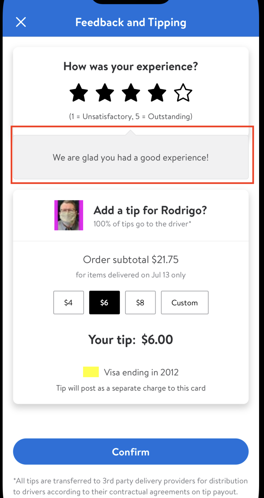

#  Bubble

## Description:

`GlassBubbleView` is used to display a bubble shaped view with an arrow pointing towards another view.

It is currently being used on TippingAndFeedback view.



## Overview

#### GlassBubbleView Model

##### Parameters:

- `arrowTipXPosition:` Int
  - the X Position for arrow tip to show (default value is `100`)
- `cornerRadius:` CGFloat
  - Corner radius of the bubble (default value is `LDSpacing.space8`)
- `arrowHeight`: CGFloat
  - Height of the arrow (default value is `LDSpacing.space8`)
- `arrowWidth:` CGFloat
  - Width of the arrow (default value is `1.5 * LDSpacing.space8`)
- `backgroundColor:` UIColor
  - Background color of the bubble (default value is `LDColor.gray10.uiColor`)
- `borderWidth:` CGFloat
  - Border Width of the bubble (default value is `2`)
- `borderColor:` UIColor
  - Border Color of the bubble (default value is `LDColor.gray30.uiColor`)


##### Example:

- This is how `GlassBubbleView` is used in TippingAndFeedback view.

```swift
var view = GlassBubbleView(model: .init(arrowTipXPosition: Constants.arrowTipPosition,
                                        cornerRadius: LDSpacing.space4,
                                        arrowHeight: Constants.arrowHeight,
                                        arrowWidth: LDSpacing.space16,
                                        backgroundColor: LDColor.gray10.uiColor,
                                        borderWidth: Constants.borderWidth,
                                        borderColor: LDColor.gray30.uiColor))
```
