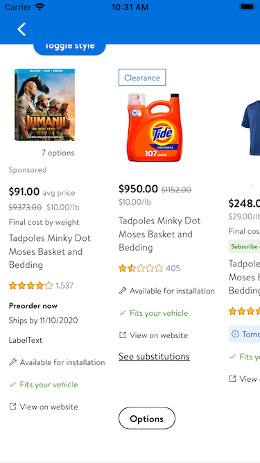
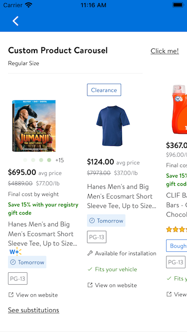
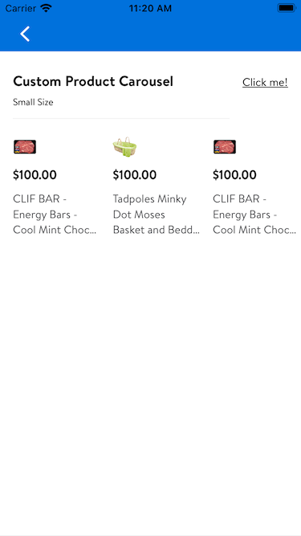

#  CarouselView

## Description

    A view that displays a set of products in a horizontal carousel.

## Overview

It is recommended to create your own *UICollectionView* and use the carousel layout factory methods found in
*GlassProductCarouselLayout* for more granular control of the data source and layout.
**This is for demonstration purposes only.**

### Screen Shot:


### Example Usage

### *Object Overview*

```swift
/// This protocol has already been declared
/// An item that is displayable in a product carousel.
public protocol GlassProductCarouselItem: Hashable {

    /// The view model for configuring a `GlassProductTile`.
    var productModel: GlassProductTile.GridModel { get }
}

/// *This enum has already been declared*
enum GlassProductCarouselLayout {

    /// An enumeration for the various styles of the carousel.
    enum Style {
    /// A carousel that displays two full items and a peek of the third.
    case small

    /// A carousel that display two full items and most of a third item.
    case medium

    /// A carousel that displays three full items and a peek of the fourth.
    case regular
    }
}

/// *This struct has already been declared*
extension GlassProductCarouselView {
    /// The view model of the product carousel.
    struct Model {

        /// The desired style of the carousel.
        var style: GlassProductCarouselLayout.Style

        /// The product items to display in the carousel.
        var items: [Item]

        /// An optional header to display in the carousel.
        var header: GlassResultsBarView.Model?

        /// init method for constructing GlassProductCarouselView.
        /// - Parameters:
        ///   - style: Carousel layout style
        ///   - items: array of item
        ///   - header: carousel header view model
        init(
            style: GlassProductCarouselLayout.Style = .regular,
            items: [Item] = [],
            header: GlassResultsBarView.Model? = nil
        ) {
            self.style = style
            self.items = items
            self.header = header
        }
    }
}
```
### Configure A *Regular Size* Carousel View

```swift
func configureRegularCarouselView() {
    // initialize the CarouselView
    var carouselView = GlassProductCarouselView<GlassProductCarouselItem>()
    
    addAutoLayoutSubview(carouselView)
    NSLayoutConstraint.activate(carouselView.constraints(pinningTo: self))
    let style: GlassProductCarouselLayout.Style = .regular
    let items: GlassProductCarouselItem = (0...20).map { _ in .init(productModel: GlassProductTile.GridModel.random()) }
    carouselView.model = .init(
            style: style,
            items: items,
            header: .init(
                title: "Custom Product Carousel",
                subtitle: "Regular Size",
                linkTitle: "Click me!"
            )
        )
}
```

### Screen Shot:



### Configure A *Small Size* Carousel View

```swift
func configureSmallCarouselView() {
    // initialize the CarouselView
    var carouselView = GlassProductCarouselView<GlassProductCarouselItem>()

    addAutoLayoutSubview(carouselView)
    NSLayoutConstraint.activate(carouselView.constraints(pinningTo: self))
    let style: GlassProductCarouselLayout.Style = .small
    let items: GlassProductCarouselItem = (0...20).map { _ in .init(productModel: GlassProductTile.GridModel.random()) }
    carouselView.model = .init(
            style: style,
            items: items,
            header: .init(
                title: "Custom Product Carousel",
                subtitle: "Small Size",
                linkTitle: "Click me!"
            )
        )
}
```

### Screen Shot:


