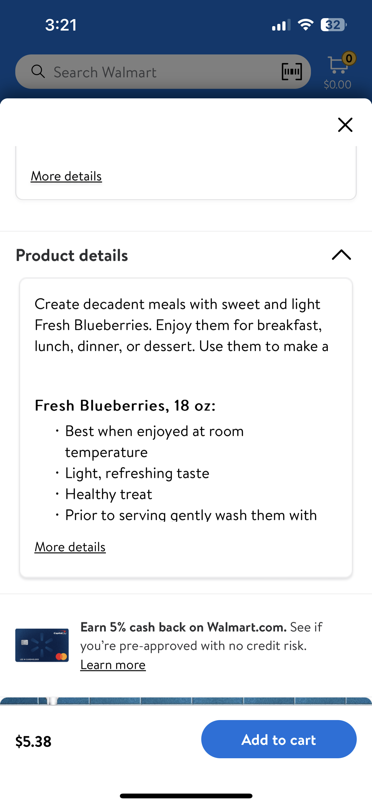

# CollapseView

## Description

CollapseView gives the ability to add a container view that supports collapsing and expanding its contentView in any direction via animatable layout constraints.

## Overview

- The default state of CollapseView is expanded.
- Collapsing and expanding is done with the `isCollapsed` property
- It will be up to the feature teams on what they want to display on CollapseView by modifying the ContentView

- *Expanded Sate:*


- *Collapsed State*


## Topics

### Parameters for CollapseView:

- contentView: The content to display inside the collapse view.
- collapseToEdge: The edge to which the view should collapse.
- isCollapsed: The initial collapsed/expanded state of the view.
- layoutMargins: The space between the view's edges and those of its content view


### Example in Walmart app:

- Expanded View



- Collapsed view


### CollapseToEdge:

- 4 edges available: top, leading, trailing, bottom
- Default edge for collapseToEdge is `.top`
  - View will collapse upwards (top)
- edge to which the view should collapse

```swift
switch collapseToEdge {
        case .top:
            topConstraint.priority = .defaultLow
        case .leading:
            leadingConstraint.priority = .defaultLow
        case .trailing:
            trailingConstraint.priority = .defaultLow
        case .bottom:
            bottomConstraint.priority = .defaultLow
        }
```
- Axis based on edge:
````swift
public enum Edge {
        case top, leading, trailing, bottom

        public var axis: NSLayoutConstraint.Axis {
            switch self {
            case .leading, .trailing:
                return .horizontal
            case .top, .bottom:
                return .vertical
            }
        }
```

## Default values:

- contentView: ContentView,
- collapseToEdge: Edge = .top,
- isCollapsed: Bool = false, (`Expanded`)
- layoutMargins: UIEdgeInsets = .zero
