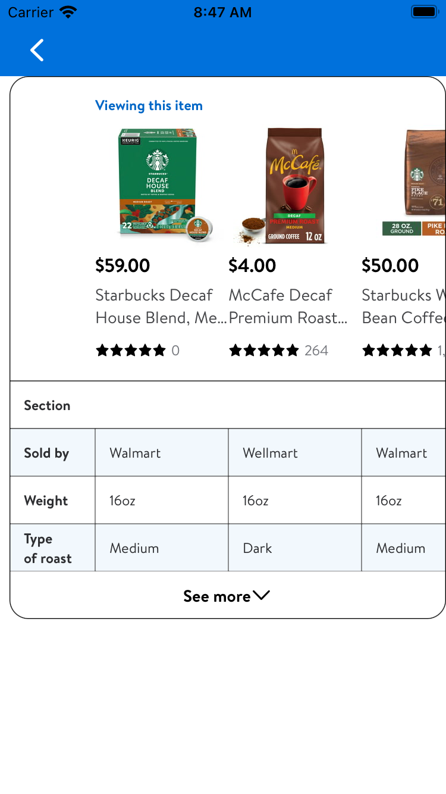
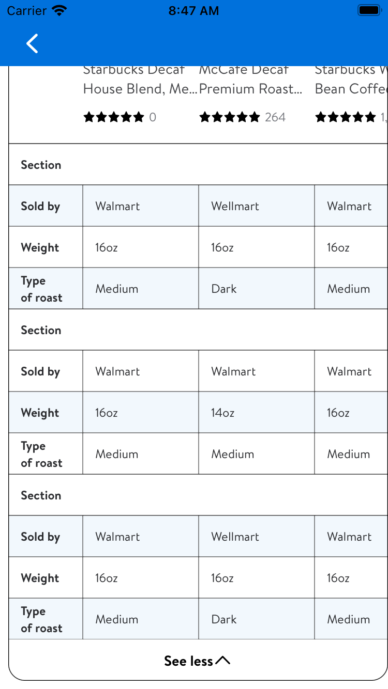
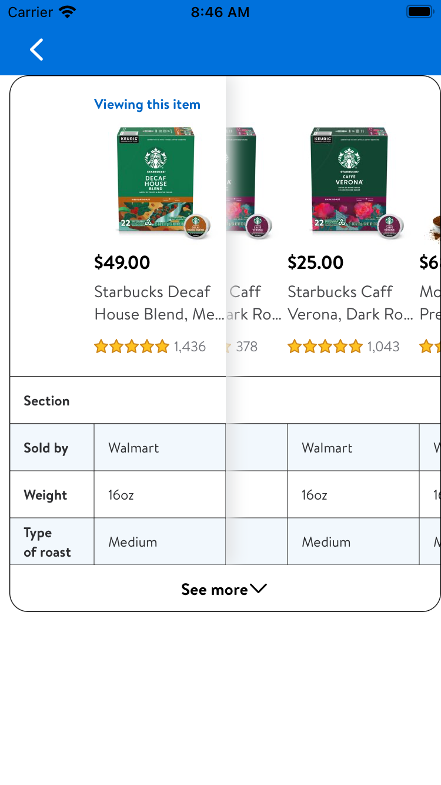

#  ComparisonChart

## Description:

The **Comparison Chart** is a grid of **Product Tiles, sections, rows and description items**. The Layout is set to help the customer better understand and compare differences between a **description items**. An example of this is if I have a **row** or **product subject** that is called fruit type and I have a basket of apples and a bushel of oranges as the **products** I am comparing, then the fruit type **description items** will be apple and orange. 

## Overview

The Purpose of having a **comparison chart** inside the **item page** is to help the customer understand that **product** by comparing it's similarities and differences with other **products** of a similar **product type**. One feature of this is if any **description items** are different from the **product** that is being compared, then that **description item's row** will be highlighted. Another feature of the **chart** is the **item** or **product** that the customer is currently viewing will always be visible while *scrolling horizontally* on other **products** or **items** in the **chart**. This gives clarity for the customer to compare what features they are looking for when deciding on a purchase. The **comparison chart** is compact when first launching on an **item page**. It has a *See more* button to expand the **chart** when *pressed* and *compressed* back to it's original *position* when *pressed again*. As the customer, you can easily add **products** to your **cart**, *navigate* and *compare* different **description items** with ease in an engaging visual laid out from this **chart**.  

### Example Usage 

- Step one 
    - *Configure the Pruduct Tile*
```swift
import DiscoveryUIShared
import GlassUI
import LivingDesign
import UIKit
import WalmartPlatform

    let starbucksWholeBean = (URL(
        string: "https://i5.walmartimages.com/asr/eed07e9d-1606-4115-b18c-930fd59db4ec.37938906fe6268d953a8a38bb517527a"
            + ".jpeg?odnWidth=104&odnHeight=104&odnBg=ffffff"
    )!,
    "Starbucks Whole Bean Coffee—Medium Roast Coffee—Pike Place Roast—100%")

    func buildGridModel() -> GlassProductTile.GridModel {
        let urlWithDescription = Self.randomURLWithDescription()

        let price: GlassProductTile.PriceModel = .init(price: "$\(Int.random(in: 0...100)).00")

        let rating: GlassStarRatingView.Model? = .init(rating: 5,
                                                       numberOfReviews: Int.random(in: 0..<2000))
        let buttonType: GlassProductTile.GridModel.CartButton = .addToCart

        return GlassProductTile.GridModel(
            image: GlassProductTile.ImageModel(
                imageConfigurator: { imageView in
                    imageView.setImageURL(starbucksWholeBean.0, animated: true)
                }
            ),
            name: starbucksWholeBean.1,
            price: price,
            rating: rating,
            numberOfLinesForName: 2,
            cartButton: buttonType,
            isOptionsButtonHidden: true
        )
    }
```

- Step Two 
    - *Build the Comparison Chart*
```swift 
     func makeModelForComparisonChartView() -> ComparisonChartView.Model {
        let productTileList = [.productTile(model: buildGridModel()),
                               .productTile(model: buildGridModel()),
                               .productTile(model: buildGridModel()),
                               .productTile(model: buildGridModel())]
        let comparisonChartList = [
            ComparisonChartView.Model.SectionModel(
                title: "Section",
                comparisonChart: [["Sold by",
                                   "Walmart",
                                   "Wellmart",
                                   "Walmart",
                                   "Walmart"],
                                  ["Weight",
                                   "16oz",
                                   "14oz",
                                   "16oz",
                                   "16oz"],
                                  ["Type of roast",
                                   "Medium",
                                   "Dark",
                                   "Medium",
                                   "Medium"]]
            ),
            ComparisonChartView.Model.SectionModel(
                title: "Section",
                comparisonChart: [["Sold by",
                                   "Walmart",
                                   "Wellmart",
                                   "Walmart",
                                   "Walmart"],
                                  ["Weight",
                                   "16oz",
                                   "14oz",
                                   "16oz",
                                   "16oz"],
                                  ["Type of roast",
                                   "Medium",
                                   "Dark",
                                   "Medium",
                                   "Medium"]]
            ),
            ComparisonChartView.Model.SectionModel(
                title: "Section",
                comparisonChart: [["Sold by",
                                   "Walmart",
                                   "Wellmart",
                                   "Walmart",
                                   "Walmart"],
                                  ["Weight",
                                   "16oz",
                                   "14oz",
                                   "16oz",
                                   "16oz"],
                                  ["Type of roast",
                                   "Medium",
                                   "Dark",
                                   "Medium",
                                   "Medium"]]
            )] 
        return .init(with: productTileList,
                     comparisonChart: comparisonChartList)
```

- Step Three 
    - *Make the Comparison Chart*
```swift
    let comparisonChartView: ComparisonChartView = {
        let view = ComparisonChartView()
        view.translatesAutoresizingMaskIntoConstraints = false
        return view
    }()
    
    comparisonChartView.model = makeModelForComparisonChartView()
```

### Screen Shot

- *On First Launch*


- *When See more button is pressed*


- *Scrolling to the bottom*


- *Shadow appearing when scrolling horizontally*
 

