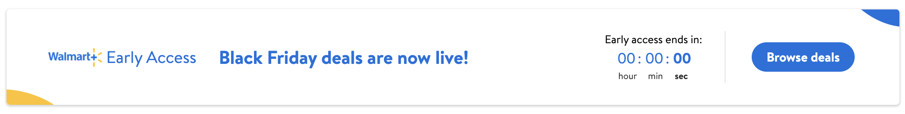
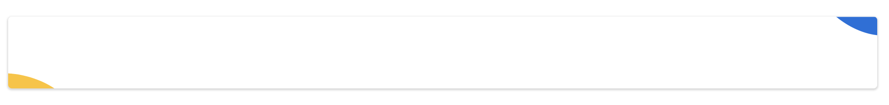
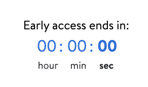

#  EarlyAccess

## Description:

- EarlyAccess is used to display a banner when there is any special event happening on Walmart App.
- Banner may contain:
  - "Early access" logo,
  - timer,
  - buttons,
  - links




## Overview:

Whenever Walmart hosts a special event, W+ members gets a head start and can buy products with the help of **EarlyAccess.**

This makes it convenient for members to buy product as there is less traffic.

If user is not a member then they will have an option to join W+ membership and use EarlyAccess deals.

The EarlyAccess banner is made of different components:

- EarlyAccess logo:


- EarlyAccess buttons layout:


- EarlyAccess banner background:


- Timer:



## Topics

### EarlyAccessBannerView+Model

- This part is the model for *EarlyAccessBannerView*.
- Here we set different parameters for our EarlyAccess banner view
- Feature teams can configure the banner based on there use case

```swift
// Type of banner
// .card -> show shadow and rounded corners
// .view -> plain view
public let bannerType: BannerType

// Banner Title
public let heading: String?

// Label for logo image
public let logoLabel: String?

// primary button cta
public let primaryCtaButton: CtaButton?

// secondary button cta
public let secondaryCtaButton: CtaButton?

// EarlyAccess Image
public let imageURL: URL?

//dealsPage

// Subtitle text for EarlyAccess banner
public let subText: String?

// Second Subtitle text for EarlyAccess banner
public let secondSubText: String?

// Disclaimer text for deals page
public let disclaimer: String?

// Background color
public let bannerBackground: String?
```


### EarlyAccessBannerView

- Here we setup/update view for EarlyAccess banner and deals page.
- This uses EarlyAccessBannerView.Model for configuration.

```swift
// Function to update banner UI based on type of Banner
func updateUIForBannerType(bannerType: BannerType) {
    switch bannerType {
    case .view:
        updateUIForBannerTypeView()
    case .card:
        updateUIForBannerTypeCard()
    }
}

// Function to update banner UI for .card type Banner
func updateUIForBannerTypeCard() {
    dealsLeftImageView.isHidden = true
    NSLayoutConstraint.activate([
    topRightImageView.constraints(sizingTo: Constant.cornerImageSize),
    logoStackView.topAnchor.constraint(equalTo: containerView.topAnchor,
                                       constant: LDSpacing.space8)])
}

// Function to update banner UI for .view type Banner
// Updating Deals page UI
func updateUIForBannerTypeView() {
    //update the imageviews
    bottomLeftImageView.isHidden = true
    dealsLeftImageView.isHidden = false
    containerView.addAutoLayoutSubview(dealsLeftImageView)
    topRightImageView.image = Constant.dealsViewTopRightImage

    NSLayoutConstraint.activate([
      logoStackView.topAnchor.constraint(equalTo: containerView.topAnchor,
                                         constant: LDSpacing.space32),
      topRightImageView.constraints(sizingTo: Constant.dealsTopCornerImageSize),
      dealsLeftImageView.constraints(sizingTo: Constant.dealsBottomCornerImageSize),
      dealsLeftImageView.leadingAnchor.constraint(equalTo: containerView.leadingAnchor,
                                                  constant: -Constant.dealsImageOffset),
      dealsLeftImageView.bottomAnchor.constraint(equalTo: containerView.bottomAnchor,
                                                 constant: -LDSpacing.space16)])
    }
```

### EarlyAccessTimerBannerView+Model

- This part is the model for *EarlyAccessTimerBannerView*.
- Here we set different parameters for our EarlyAccess timer view
- Feature teams can configure timer view based on their use case.

```swift
// .card -> show shadow and rounded corners
// .view -> plain view
public let bannerType: BannerType

// Banner Title
let heading: String?

// WalmartPlus Image
let imageURL: URL?

// Timer Title
let timerHeader: String?

// Timer start time in UTC
var startTime: Date?

// Timer end time in UTC
// Countdown timer will be showing between startTime and endTime
var endTime: Date?

// Time in UTC when the event timer component removes from screen
var sunsetTime: Date?

// public to expose below property to analytics
// Card message
public let message: String?

// public to expose below property to analytics
// Button title
public let buttonTitle: String?

// Background color
let backgroundColor: String?

/// Public to expose the URL for ```didSelectItemAt``` on the cell
// Deeplink that will be called on click
public let buttonCTA: URL?

// Title for link type button
let linkButtonTitle: String?

// Deeplink for link button action
let linkButtonCTA: URL?
```


### EarlyAccessTimerBannerView

- UI component for EarlyAccess with TimerBanner view
- Uses EarlyAccessTimerBannerView.Model for configuration.

- CountdownTimer states:
```swift
public func didChangedCountdownTimerState(_ state: CountdownTimerState) {
    switch state {
    case .started, .anHourRemaining:
        didStartedTimer()
    case .expired:
        delegate?.eventTimerDidExpired()
    default:
        break
    }
}
```


### EarlyAccessEnums

- Different banner types for EarlyAccess:
  - .card: shows shadow and rounded corners
  - .view: plain view


### Tests

- **EarlyAccessBannerModel Test**
  - This test checks if the EarlyAccessBanner model is working as expected

```swift
func testEarlyAccessBannerModel() {
    let primaryCtaButton = CtaButton(title: "How it works", clickThrough: ClickThrough(type: "", value: nil))
    let secondaryCtaButton = CtaButton(title: "Browse all deals", clickThrough: ClickThrough(type: "", value: nil))
    let model: Model = .init(heading: "You get a 4-hour head start to Black Friday",
                             logoLabel: "Early access",
                             primaryCtaButton: primaryCtaButton,
                             secondaryCtaButton: secondaryCtaButton,
                             imageURL: nil)

    XCTAssertEqual(model.logoLabel, "Early access")
    XCTAssertEqual(model.heading, "You get a 4-hour head start to Black Friday")
    XCTAssertEqual(model.primaryCtaButton?.title, "How it works")
    XCTAssertEqual(model.secondaryCtaButton?.title, "Browse all deals")
}
```

- **EarlyAccessBannerView Test**
  - This test checks if the EarlyAccessBanner view is working as expected

```swift
// Setup for test
override func setUp() {
    super.setUp()
    earlyAccessBannerView = EarlyAccessBannerView()
    let primaryClickThrough = ClickThrough(type: "url", value: URL(string: "walmart://account"))
    let primaryButton = CtaButton(title: "How it works", clickThrough: primaryClickThrough)
    let secondaryClickThrough = ClickThrough(type: "url", value: URL(string: "walmart://account"))
    let secondaryButton = CtaButton(title: "Browse all deals", clickThrough: secondaryClickThrough)
    earlyAccessBannerViewModel = .init(heading: "You get a 4-hour head start to Black Friday",
                                       logoLabel: "Early access",
                                       primaryCtaButton: primaryButton,
                                       secondaryCtaButton: secondaryButton,
                                       imageURL: nil)
}

// Check if `applyModel` for EarlyAccessBannerView is working as expected
func testApplyModel() {
    let primaryClickThrough = ClickThrough(type: "url",
                                           value: URL(string: "walmart://account"))
    let primaryButton = CtaButton(title: "How it works",
                                  clickThrough: primaryClickThrough)
    let secondaryClickThrough = ClickThrough(type: "url", value: URL(string: "walmart://account"))
    let secondaryButton = CtaButton(title: "Browse all deals", clickThrough: secondaryClickThrough)
    let newModel = EarlyAccessBannerView.Model(heading: "You get a 4-hour head start to Black Friday",
                                               logoLabel: "Early access",
                                               primaryCtaButton: primaryButton,
                                               secondaryCtaButton: secondaryButton,
                                               imageURL: nil)

    XCTAssertNil(earlyAccessBannerView.testHooks.model)
    earlyAccessBannerView.testHooks.updateModel(model: newModel)
    XCTAssertNotNil(earlyAccessBannerView.testHooks.model)
    let model = earlyAccessBannerView.testHooks.model
    XCTAssertEqual(model?.logoLabel, "Early access")
    XCTAssertEqual(model?.heading, "You get a 4-hour head start to Black Friday")
    XCTAssertEqual(model?.logoLabel, "Early access")
    XCTAssertEqual(model?.primaryCtaButton?.title, "How it works")
    XCTAssertEqual(model?.secondaryCtaButton?.title, "Browse all deals")
    XCTAssert(earlyAccessBannerView.testHooks.disclaimerLabel.isHidden)
    XCTAssert(earlyAccessBannerView.testHooks.subHeadingLabel.isHidden)
}
```
