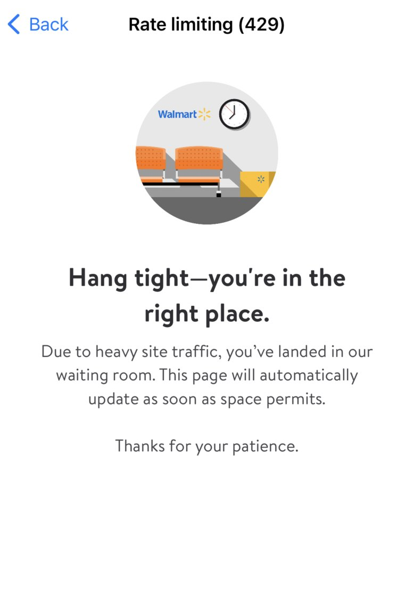
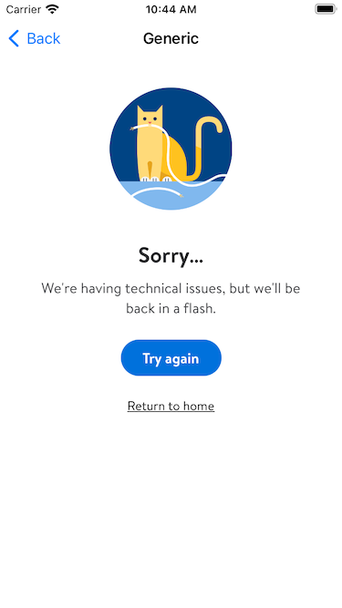
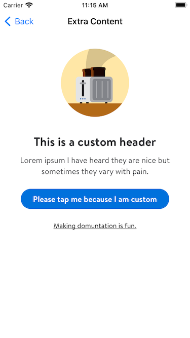
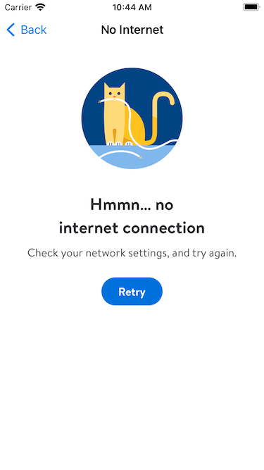
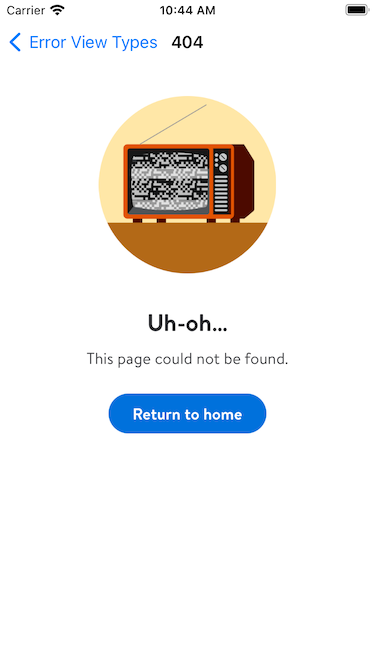

# ErrorViewController

## Discription:

A view controller for displaying various error states.

There are three predefined kinds of errors generic, pageNotFound, and noInternet though you could really use this view for any type of error with a primary and optional secondary cta.

## Usage:

```swift
private lazy var errorViewController: ErrorViewController = {
  var model = ErrorViewController.Model.defaultPageNotFound()
  let controller = ErrorViewController(model)
  return controller
}()
```

```swift
// Four kinds of given models
var notFoundModel = ErrorViewController.Model.defaultPageNotFound()
var noInternetModel = ErrorViewController.Model.defaultNoInternet()
var genericModel = ErrorViewController.Model.defaultGeneric()
var rateLimiting = ErrorViewController.Model.defaultRateLimiting()
```
## Rate Limit Middleware:
Note that one element of the ErrorView is to allow a network response to set a default model for a rateLimited ErrorView.
This is done by having a network middleware which will intercept rateLimited network responses, decode the response and cache it for future use.
Please check class `TorbitRateLimitMiddleware` for more details

The below extension will give an idea of what data is cached if a network response sends a rateLimited error code with a payload:

```swift
extension ErrorViewController {
    public struct CachedRateLimitPayload: Decodable {
        let title: String
        let textArea: String
        let defaultImageURL: URL
    }

    public struct RateLimitNetworkResponse: Decodable {
        public let data: CachedRateLimitPayload
    }
}
```

## Screens:


### Example Usage

- *Configure and present the ErrorViewController*

```swift 
@objc
private func didPresentErrorMessage() {
    let model = ErrorViewController.Model.defaultGeneric()
    let controller = ErrorViewController(model)
    controller.primaryButtonHandler = { [weak self] in
        guard let self else { return }
        self.primaryButtonActionAfterError()
    }
    controller.viewWillAppearHandler = { [weak self] in
        guard let self else { return }
        self.viewWillAppearAction()
    }
    controller.dismissCompletionHandler = { [weak self] in
        guard let self else { return }
        self.didDismissErrorView()
    }
    /// Adding the `controller` to the `bottomSheet` will make the `controller's`
    /// bottomSheetableActionDelegate conform to the `bottomSheet` so we can get the 
    /// dismiss behavior that we desire.
    /// If you need to make the error view a bottom sheet simply delete
    /// the comment on the lines `let bottomSheet =` and `navigationController?.present(` 
    /// then comment out `present(controller)`
    // let bottomSheet = BottomSheetNavigationController(rootBottomSheet: controller)
    // navigationController?.present(bottomSheet: bottomSheet, as: .modal)
    present(controller)
}
```
### Screenshot:



- *A Custom Configuration of the ErrorViewController*

```swift 
@objc
private func didPresentCustomErrorMessage() {
    // Make it a var to get that var magic
    var model = ErrorViewController.Model.defaultGeneric()
    model.header = "This is a custom header"
    model.cta = "Please tap me because I am custom"
    model.body = "Lorem ipsum I have heard they are nice but sometimes they vary with pain."
    model.secondaryButtonCTA = "Making domuntation is fun."
    // Add the model to its controller
    let controller = ErrorViewController(model)
    // Present the controller 
    present(controller)
}
```

### Screenshot:



- *Present a NoInternet Model*

```swift 
// Simply do the same steps as before but substitute the model with 
let model = ErrorViewController.Model.defaultNoInternet()
```

### Screenshot:



- *Present a PageNotFound Model*

```swift 
// Simply do the same steps as before but substitute the model with 
let model = ErrorViewController.Model.defaultPageNotFound()
```

### Screenshot:




- *Present a RateLimiting Model*

```swift 
// Simply do the same steps as before but substitute the model with 
let model = ErrorViewController.Model.defaultRateLimiting()
```

### Screenshot:


