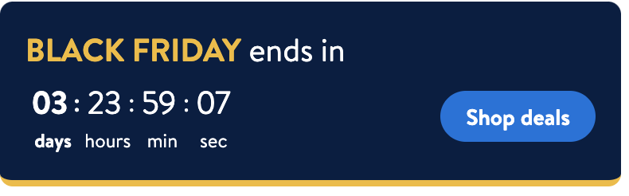
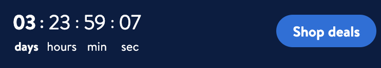

# EventTimer

## Description

- Event timer gives the ability to add a banner for an event
- The banner can have:
    - a timer for a promotional event
    - some "detail" label about the event
    - a link to the event or product details.





## Overview:

- Event Timer is used to display a banner timer for special events.
- The banner contains a timer which displays when an event is about to start/end.
- Above/below the timer there maybe a label which gives the user some basic information about the event.
- The banner may consist a link/button which takes the user to the event deals or promotional products


## Topics


### EventDetailsView:

- This part is responsible for displaying/adding a label to the banner.
- The label may display some details about the event.
- It will be up to feature teams to display details about event they want

```swift
    private lazy var eventDetailsLabel: LDLabel = {
        let label = LDLabel(labelStyle: .pageTitle)
        label.textAlignment = .left
        return label
    }()
```


### EventTimerDetails:

- This part is responsible for the model for **Event Timer.**
- Expected date string format : yyyy-MM-dd-HH-mm

- It contains the following information:
    - startTime : Timer start time in UTC
    - endTime : Timer end time in UTC  *(Countdown timer will be shown between startTime and endTime)*
    - sunsetTime : Time in UTC when the event timer component removes from screen
    - eventName: Name of event
    - preExpirationSubTextLong : User info text shows when time duration between currentTime and endTime is more than 1 hour
    - preExpirationSubTextShort : User info text shows when time duration between currentTime and endTime is less  than 1 hour
    - postExpirationSubText : User info text shows after the timer expiry
    - titleTextColor : Color used for eventName text
    - defaultTextColor : Color used for all other text in the view
    - backgroundColor :  Color for the view background
    - borderColor : Color for the bottom separator line
    - linkBeforeExpiry : Before expiry CTA details
    - linkAfterExpiry : After expiry CTA details

- Using the above data, feature teams can configure **EventTimer banner** according to their use case.

*Below function calculates height for banner depending on labels/timer*
```swift
    public func calculateHeight() -> CGFloat {
        let width = (UIScreen.main.bounds.width - LDSpacing.space32)
        let topSpacing = LDSpacing.space16
        let bottomSpacing = LDSpacing.space16

        let eventDetailsHeight = UILabel.heightForLabel(text: eventName,
                                                        font: LDFont.pageTitle().uiFont,
                                                        width: width,
                                                        multilineSupport: false)
        let height = topSpacing + eventDetailsHeight + bottomSpacing

        if isTimerEnabled {
            return height + Constant.timerDetailsHeight
        }

        return linkAfterExpiry == nil ? height : height + Constant.buttonContainerHeight
    }
```


### EventTimerView

- This part is responsible for UI component for EventTimer
- It uses **EventTimerViewModel** for configuration.
- Setting up containerView, cardView, timerView happens here
- We also set button actions here (didSelectCTA())

- Possible states for *CountdownTimer*:
```swift
        switch state {
        case .started, .anHourRemaining:
            didStartTimer()
        case .stopped:
            didStopTimer()
        case .expired:
            delegate?.eventTimerDidExpire()
        default:
            break
        }
```

- Delegates:
```swift
    public protocol EventTimerDelegate: AnyObject {

    /// Implement this method to reload the cell once the timer is stopped (Reload cell to update height)
    func eventTimerDidEnd()

    /// Implement this method to remove the cell once the timer is expired
    func eventTimerDidExpire()

    /// Method will invoked when the tap action happening on the CTA buttons
    func eventTimerCallToAction(with cta: EventTimerDetails.CTA?)
}
```

- Accessibility:
```swift
    struct AccessibilityConstants {
        static let accessibilityIdEventDetailsView = "EventTimerView.eventDetailsView"
        static let accessibilityIdPreExpiryCTAButton = "EventTimerView.preExpiryCTAButton"
        static let accessibilityIdPostExpiryCTAButton = "EventTimerView.postExpiryCTAButton"
    }
```




### EventTimerViewModel

- This part is the viewModel for EventTimerView
- Initialised with **EventTimerDetails** model.
- Public Methods
    1. startEventTimer()
    2. cancelEventTimer()
```swift
    public func startEventTimer() {
        countdownTimerViewModel?.startTimer()
    }

    public func cancelEventTimer() {
        countdownTimerViewModel?.cancelTimer()
    }
```

- Possible states for eventTimer details: Depending on the state, a label will be displayed
```swift
    private var eventInfo: String {
        switch countdownTimerState {
        case .started:
            return timerDetails.preExpirationSubTextLong
        case .anHourRemaining:
            return timerDetails.preExpirationSubTextShort
        case .stopped:
            return timerDetails.postExpirationSubText
        default:
            return ""
        }
```

- Initialization of eventTimer details:
```swift
    public init(timerDetails: EventTimerDetails) {
        self.timerDetails = timerDetails
        self.countdownTimerViewModel = .init(startTime: timerDetails.startTime,
                                             endTime: timerDetails.endTime,
                                             sunsetTime: timerDetails.sunsetTime,
                                             backgroundColor: backgroundColor,
                                             timerComponentTitleColor: defaultTextColor,
                                             timerComponentValueColor: defaultTextColor,
                                             timerComponentTitleFont: .captionRegular(),
                                             timerComponentValueFont: LDDynamicFont.regular(20).fontType,
                                             timerComponentTitleHighlightedFont: .captionBold(),
                                             timerComponentValueHighlightedFont: .heading())
    }
```
