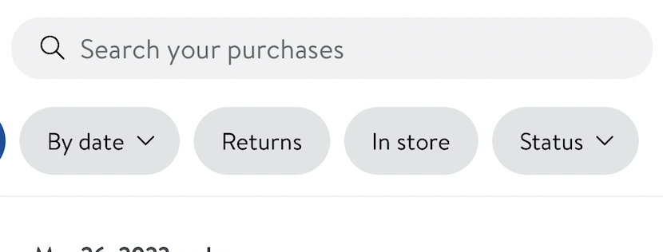
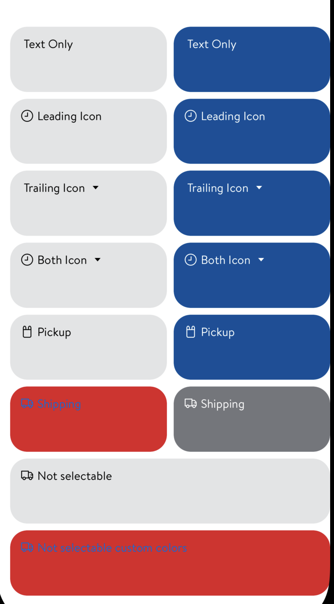
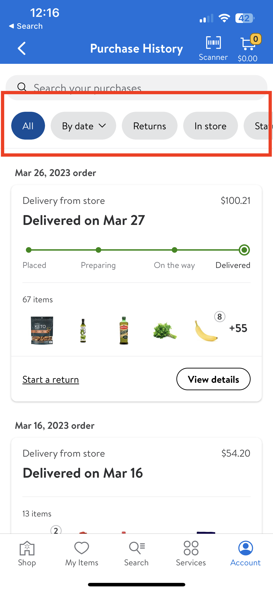
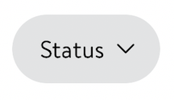
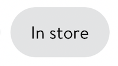

#  FilterChip

## Description:

`GlassFilterChip` are text content with an optional leading or trailing icon or both. It is used to trigger a selection for filtering.

It is being used on `MyItems` and `PurchaseHistory`.



## Overview

#### GlassFilterChip Model

##### Parameters:

- `title:` String
  - label title of the FilterChip
- `filterStyle:` FilterStyle
  - filter style of the FilterChip (default value is `.titleOnly`)
- `isSelected:` Bool
  - Determines if the chip is selected (default value is `false`)
- `isSelectable:` Bool
  - Determines if the chip retains its selected appearance after being tapped on (default value is `true`)
- `selectedContentForegroundColor:` LDColor
  - foreground color of the filter view when it is selected (default value is `.white`)
- `deselectedContentForegroundColor:` LDColor
  - foreground color of the filter view when it is deselected (default value is `.black`)
- `selectedContentBackgroundColor:` LDColor
  - background color of the filter view when it is selected (default value is `.blue130`)
- `deselectedContentBackgroundColor:` LDColor
  - background color of the filter view when it is deselected (default value is `.gray20`)


>`isSelectable` Determines if the chip retains its selected appearance after being tapped on or reverts back to its normal (deselected) appearance.

##### Available Filter styles:

- leftIcon(GlassIcon?)
  - Optional leading icon with text
- rightIcon(GlassIcon?)
  -  Optional trailing icon with text
- bothIcons(GlassIcon?, GlassIcon?)
  - Optional leading & trailing icon with text
- titleOnly
  - Only text



*Different filterStyles for `GlassFilterChip`*

- Updating UI depending on if the FilterChip is selected. If it is selected then we show selectedContentColor or else we show deselectedContentColor for foreground and background colors.

```swift
private func updateUI(isSelected: Bool) {
let contentForegroundColor: LDColor = isSelected ?
    model.selectedContentForegroundColor : model
    .deselectedContentForegroundColor
let contentBackgroundColor: LDColor = isSelected ?
    model.selectedContentBackgroundColor : model
    .deselectedContentBackgroundColor
}
```

- Here a configurable gesture recognizer is created that can inform the target of both the `.began` and `.ended` touches. This is unlike `UITapGestureRecognizer` which only provides the `.ended`.

```swift
private class ConfigurableTapGestureRecognizer: UIGestureRecognizer {
    enum StateBehaviorOption {
        case beganAndEnded
        case endedOnly
    }
}
```

#### Example from Walmart app:



*`GlassFilterChip` being used on PurchaseHistory*

```swift
let result = GlassFilterChip(model: .init(title: pill.title,
                                          filterStyle: pill.style,
                                          isSelected: pill.isSelected))
```

```swift
struct FilterPill: Hashable {
    var title: String
    var isSelected: Bool
    var buttonType: FilterButtonType

    var style: GlassFilterChip.Model.FilterStyle {
        switch buttonType {
        case .resetToAll, .toggle:
            return .titleOnly
        case .multipleChoice, .singleChoice:
            return .rightIcon(.chevronDown)
        }
    }
}

enum FilterButtonType: Hashable {
    case resetToAll
    case singleChoice(sheetTitle: String, choices: [FilterChoice])
    case multipleChoice(sheetTitle: String, choices: [FilterChoice])
    case toggle(choice: FilterChoice)
}
```



*GlassFilterChip with multipleChoice (case `.rightIcon`)*



*GlassFilterChip with resetToAll, usually has an "All" title (case `.titleOnly`)*
