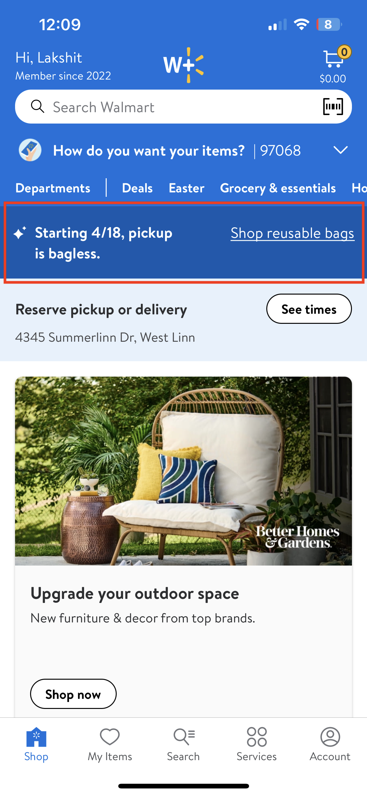
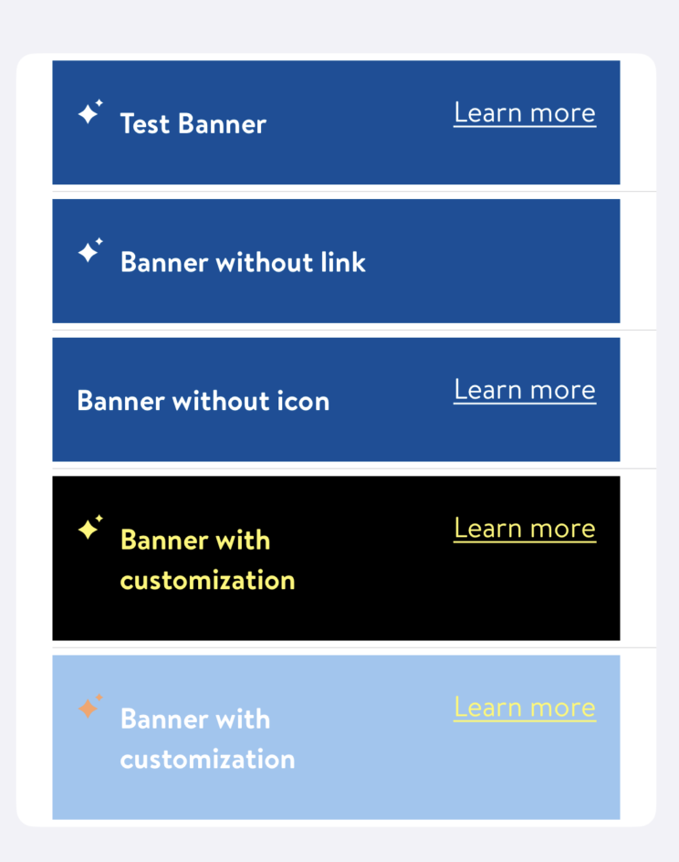

#  GlobalBanner

## Description:

GlobalBanner is a BannerView which displays an important, succinct message to broad user-groups. It may contain an icon, message, and an optional details button.

It is currently being used on Home page.



*`GlobalBanner` on HomePage*

## Overview

#### GlobalBannerModel

##### Parameters:

- `message:` NSAttributedString
  - message to display on the banner
- `icon:` GlassIcon?  
  - icon to display on the banner (default value is `.none`)
- `detailsButtonTitle:` String?
  - title of optional button (default value is `nil`)
- `isTappable:` Bool
  - Indicates whether the whole body of alert should respond to taps (default value is `false`)
- `viewDecorator:` ViewDecorator
  - styling (used to set up colors for title, icon, button, background)


##### struct ViewDecorator:

###### Parameters:

- `textColor:` UIColor
  - color of text label (default value is `white`)
- `iconColor:` UIColor
  - (Default value is `white`)
- `detailsButtonTitleColor:` UIColor
  - (default value is `white`)
- `backgroundColor:` UIColor
  -  (default value is `LDColor.blue130.uiColor`)


> **isTappable** Indicates whether the whole body of alert should respond to taps. If set to `true`, those taps are communicated via `GlobalBannerDelegate.didTabOnBanner()`.


##### GlobalBannerDelegate:

Available functions:
- `func didTapOnDetails(sender: GlobalBanner)`
  - tracks when user taps on **details** button
- `func didTapOnBanner(sender: GlobalBanner)`
  - tracks when user taps on the **banner**


###### Example:

- This is an example of how `GlobalBanner` is being used on HomePage to display a banner view with important information for customers.

```swift
let model = GlobalBanner.GlobalBannerModel(
            message: NSAttributedString(string: model.heading.title),
            icon: icon,
            detailsButtonTitle: model.linkButton?.title,
            isTappable: true,
            viewDecorator: .init(textColor: (model.heading.titleColor ?? .gray00).uiColor,
                                 iconColor: (model.heading.titleColor ?? .gray00).uiColor,
                                 detailsButtonTitleColor: (model.linkButton?.titleColor ?? .gray00).uiColor,
                                 backgroundColor: model.backGroundColor.uiColor))
```

##### Different configurations for GlobalBanner :


