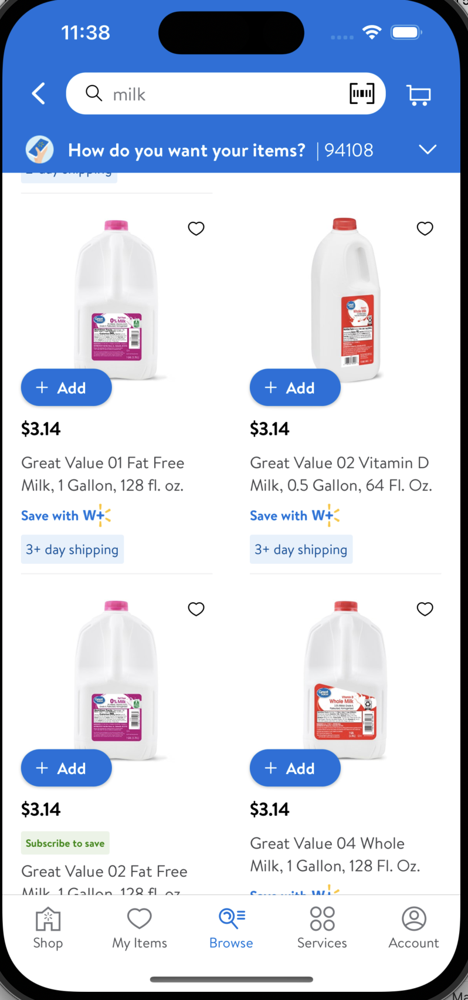
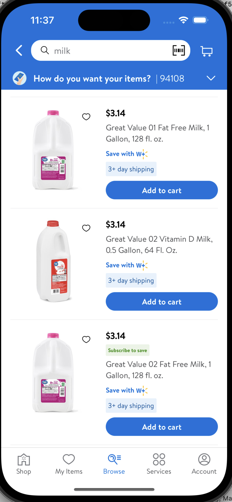
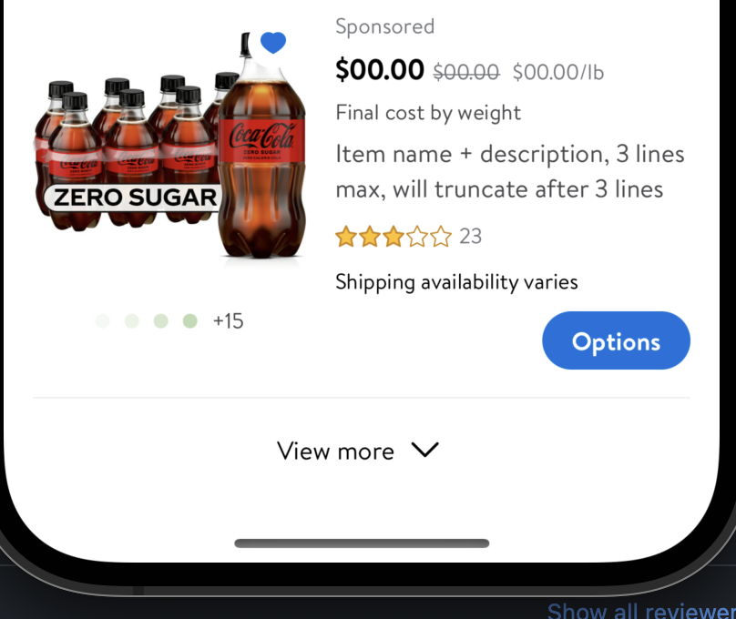

#  GridView+ListView

## Description:

**GridView:** Used to display Product tiles in `grid` format. Can be switched on/off by CCM.
- 

**ListView:** Used to display Product tiles in `list` format. Can be switched on/off by CCM
- 


## Overview

- `UICollectionView` is used to display productTiles in grid/list format
- There are 2 types of styles available for both GridView and ListView
  - infiniteScroll: User can keep scrolling as much as they want
  - fixedQuantity: User can keep scrolling till the end of last item

```swift
public var model: Model {
    didSet {
        switch model.style {
        case .infiniteScroll:
            totalItems += model.items.map { GridViewCell.product($0) }
            //totalItems += model.items.map { ListViewCell.product($0)
        case .fixedQuantity:
            totalItems = model.items.map { GridViewCell.product($0) }
            //totalItems = model.items.map { ListViewCell.product($0)
        }

        applyModel(items: totalItems)
    }
}
```

- Enum for `fixedQuantity` type
  - Case open:
    - View less button
  - Case close:
    - View more button

```swift
switch state {
case .open:
    seeMoreCell.stateOpen = true
case .closed:
    seeMoreCell.stateOpen = false
}
```




#### GridView Parameters
- `style`: GlassProductGridView style
- `items`: array of products of type GlassProductTile.GridModel
- `numRows`: number or rows in gridView
- `initalFixedItemCount`: used for style fixedQuantity to set initial rows shown

**It is a requirement that the below delegate be implemented by the consuming team:**

```swift
public protocol GlassProductGridViewDelegate: AnyObject {
    func productDequeue(cell: GlassProductTile.GridCell,
                        model: GlassProductTile.GridModel,
                        indexPath: IndexPath) -> GlassProductTile.GridCell

    /// Called when last product is visible
    func lastProductReached()

    /// Called when a cell is clicked
    func onItemClick(cell: GlassProductGridView.GridViewCell)

    /// Called when loadMore is clicked
    func onLoadMore()
}
```


#### ListView Parameters:
- `style`: GlassProductListView style
- `items`: array of products of type GlassProductTile.ListModel
- `initalFixedItemCount`: used for style fixedQuantity to set initial rows shown

**It is a requirement that the below delegate be implemented by the consuming team:**

```swift
public protocol GlassProductListViewDelegate: AnyObject {
    func productDequeue(cell: GlassProductTile.ListCell,
                        model: GlassProductTile.ListModel,
                        indexPath: IndexPath) -> GlassProductTile.ListCell

    /// Called when last product is visible
    func lastProductReached()

    /// Called when a cell is clicked
    func onItemClick(cell: GlassProductListView.ListViewCell)

    /// Called when loadMore is clicked
    func onLoadMore()
}
```
