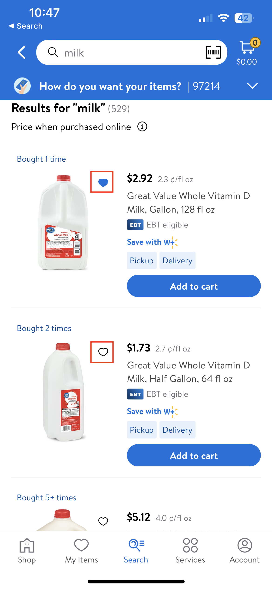
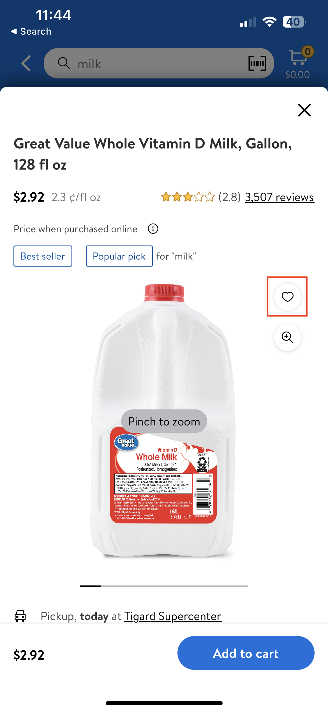
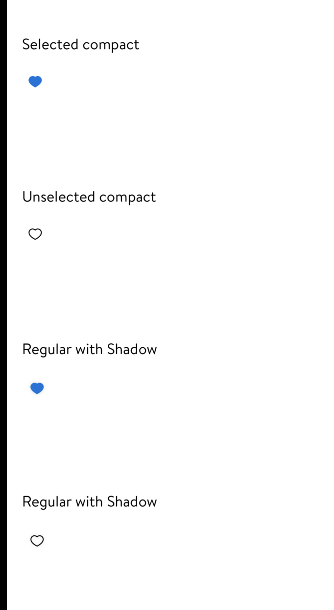

#  Hearting

## Description:

GlassHeartingView is a heart icon that can be seen on item tiles/item page.

It can be toggled between `hearted` and `unhearted`.

It is used by users to add any item to their `My Items` list.



## Overview

#### Model for GlassHeartingView:
- `isSelected`: Bool
  - A Boolean value indicating whether the heart button is in the selected state.
- `usItemId`: String?
  - USItemID for the associated item
- `publisher`: AnyPublisher<[String]?, Never>?
  - Publisher of user's hearted items (usItemId array)

#### GlassHeartingView styles:
- case `compact`
  - A compact button suitable for views like an item tile.
- case `regular`
  - A regular sized button suitable for views like an item page.



#### Actions:
```swift
@objc
private func didHeartTapped() {
    feedbackGenerator.impactOccurred()
    didTapOnHeart?()
}
```


#### Styling:
```swift
var color: UIColor {
    isSelected ? LDColor.blue100.uiColor : LDColor.black.uiColor
}

var icon: LDIcon {
    isSelected ? .heartFill : .heart
}

var iconImage: UIImage {
    icon.image(.small).withTintColor(color)
}
```



### Tests

Test to check if `unhearting` is working as expected
```swift
func testGlassHeartingView_unheart() throws {
    let model = GlassHeartingView.Model()
    let heartingView = GlassHeartingView(style: .compact, model: model)

    XCTAssertEqual(heartingView.model.color, LDColor.black.uiColor)
    XCTAssertEqual(heartingView.accessibilityTraits, [.button])
}
```

Test to check if `hearting` is working as expected
```swift
func testGlassHeartingView_heart() {
    let model = GlassHeartingView.Model(isSelected: true)
    let heartingView = GlassHeartingView(style: .compact, model: model)

    XCTAssertEqual(heartingView.model.color, LDColor.blue100.uiColor)
    XCTAssertEqual(heartingView.accessibilityTraits, [.button])
}
```
