# **Shared Components**

## **Overview**
Shared Components are reusable components used by feature teams to adopt on need basis. This way the whole app will align to design guidelines.
Each component is designed for commonn use purpose

### Components

| Component | Description | Appearance |
|---|---|---|
| [`Associate Feedback`](associateFeedback.md) | Also known as "Bug Reporter". It is an associate only feature, which will allow users to report issues seen while using Glass Walmart. If CCM is enabled, on shake of device, the BugReporter bottom-sheet will appear. | 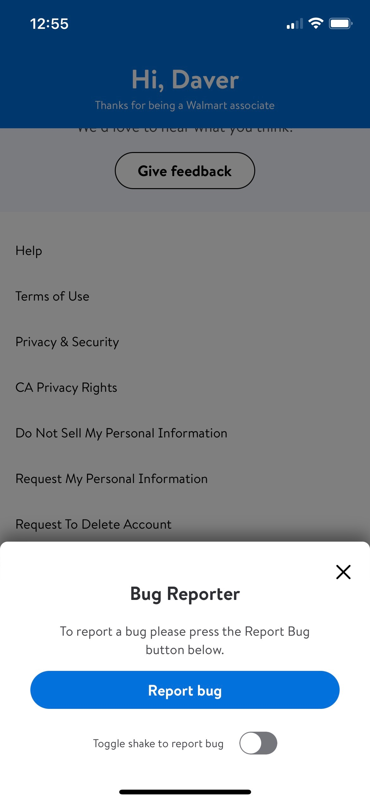 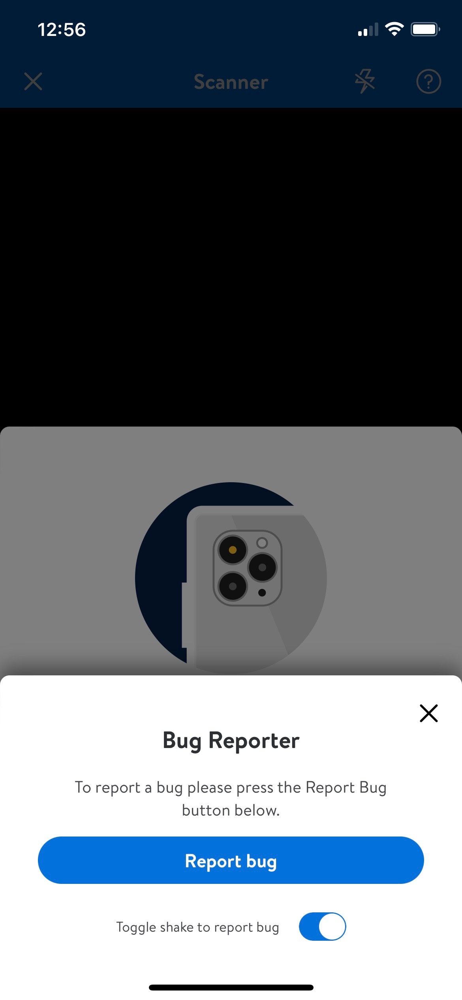 |
| [`BottomSheet`](bottomSheet.md) | This view appears on top of main view. BottomSheet view can cover the screen fully or partially depending on the type. User can close this view either by close button or sliding down. | [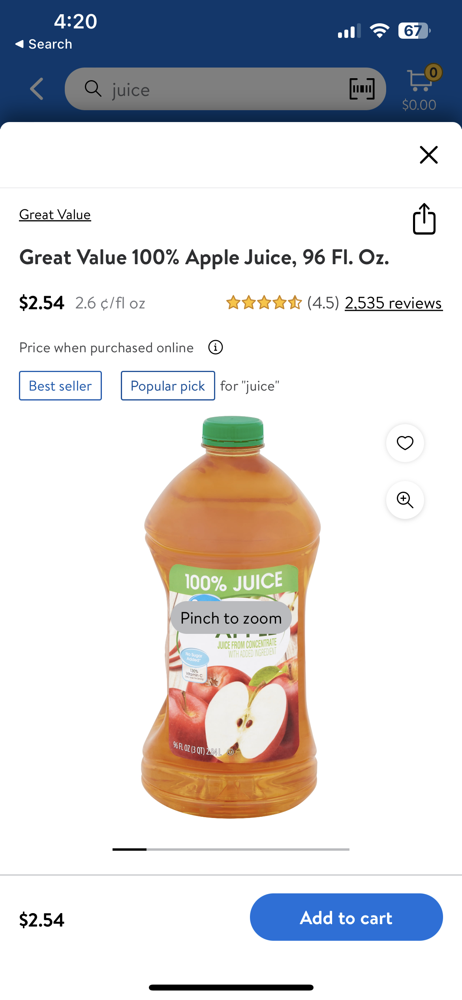](bottomSheet.md)|
| [`BadgeView`](badgeView.md) | It displays BadgeView details for product i.e. EBT, Sponsor badge or any detail in the product tile. This contains an icon image on the left or leading side. A description of what the detail is in the center in regular font. Finally a description that usually says "Eligible". This Badge View will be configured inside of a container with no limit to how many badges can be configured in the container. The usual limit of badges that are configured in this container is 3. | 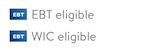 |
| [`CarouselView`](carouselView.md) | Used to display Product tiles in a carousel layout | 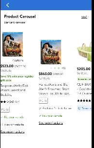 |
| [`CollapseView`](collapseView.md) | Used to display view that can expand/collapse. User will see limited content and more content will be displayed once the user expands the view | 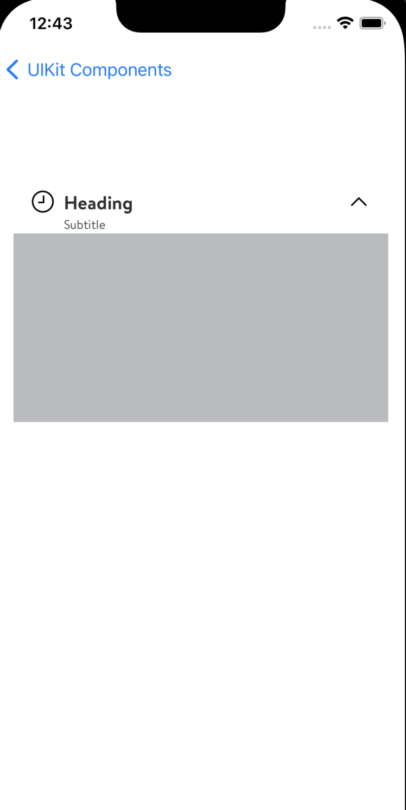 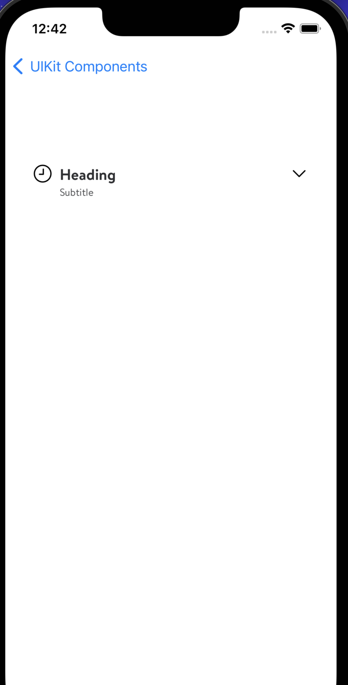 |
| [`ComparisonChart`](comparisonChart.md) | Used to display items to compare current item with. Displayed below the item description on item page |  |
| [`CountdownTimer`](countdownTimer.md) | This is used to display timer view. Up to the feature teams on how they want to display it. Option to enter: Days, hours, mins, secs | 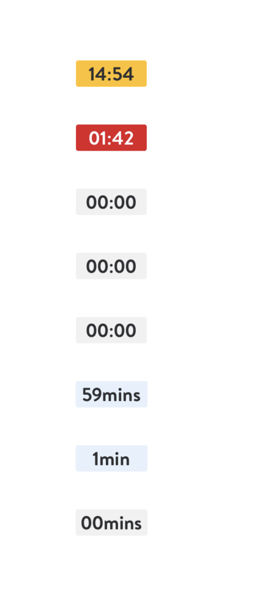 |
| [`EarlyAccess`](earlyAccess.md) | Used to display a banner with "Early access" logo, buttons, and links. |  |
| [`ErrorViewController`](error-view.md) | This is a view which can be used to show Errors during network issues | [`ErrorViewController`](error-view.md) |
| [`EventTimer`](eventTimer.md) | This is used as a time view with a banner to display additional information, action buttons. Teams can configure it according to their use case  |  |
| [`FulfillmentBadgeView`](Yet to upload to Github by Erik) | It displays Fulfillment details for product i.e. Pickup, Delivery, 1-day shipping, 2-day shipping, 3+ day shipping, Seller shipping. This badge contains an optional image on the left or leading side. A colored text in the center. and an optional colored bold text on the right or trailing side. This Badge View will be configured inside of a container with no limit to how many badges can be configured in the container. The usual limit of badges that are configured in this container is 3. | 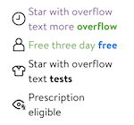 |
| [`GridView`](gridView%2BlistView.md) | Used to display Product tiles are in grid format. Can be switched on/off by CCM |  |
| [`Hearting`](hearting.md) | Used to add items to a user's favorite items list |  |
| [`ListView`](gridView%2BlistView.md) | Used to display Product tiles are in list format. Can be switched on/off by CCM | 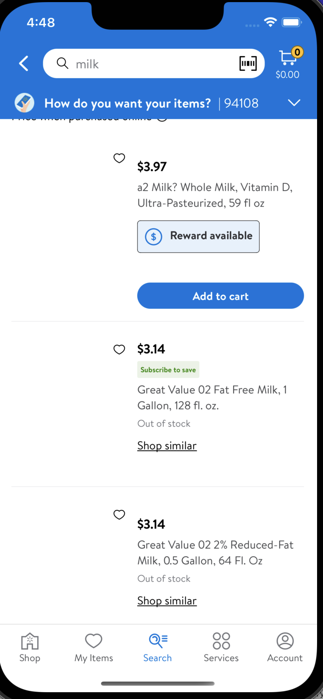 |
| [`ProductTile`] | This is a productTile which can be configured by different teams according to their use | 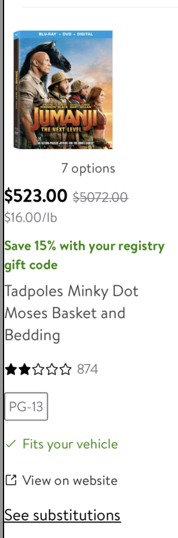 |
| [`RewardsView`](rewardsView.md) | Used to display different types of rewards on productTile or item page. | [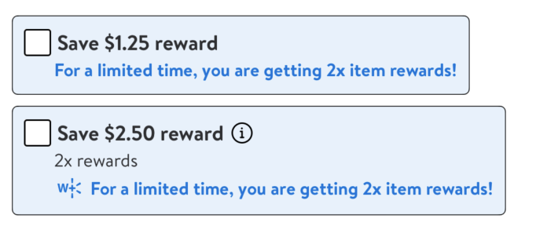 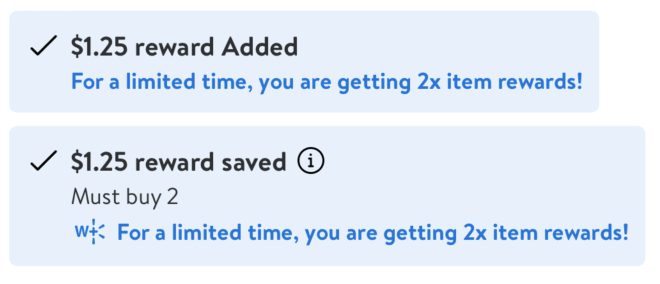 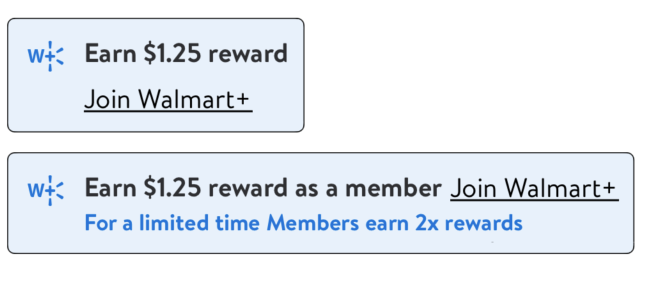 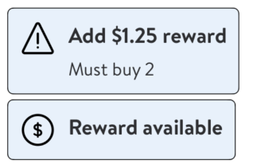 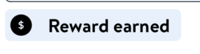 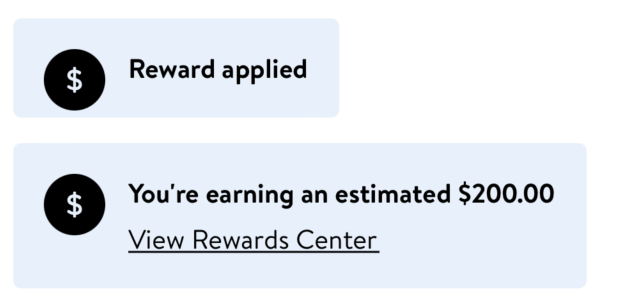 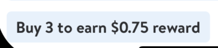](rewardsView.md) |
| [`PromoView`](promotionsView.md) | Similar to Rewards component, PromotionsView is used by different teams to display promotions on an item. |  |
| [`Snackbar`](snackbar.md) | A way to show multiple Snack bars at once. The Snack bar is used as a popover view to help alert the customer when a certain event has happened. An example of this would be if time is running out on a time and we set the logic for the snack bar to appear when the timer has reached 2 minutes and when there is 2 minutes left, the snack bar will appear and then disappear after 3.5 seconds. | 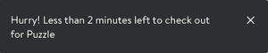 |
| [`Tooltip`](toolTip.md) | Represents a tooltip-type window that can be displayed "anywhere" on screen but which is typically anchored relative to an existing view. The tooltip is dismissed on first tap of the screen, whether on the tooltip or anywhere else. | 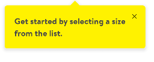 |
| [`WaitingRoom`](waitingRoom.md) | WaitingRoom also known as "Queueing" allows the customers to join the waiting room and buy the high demand items they want. It is used during holidays for EA/AE and high demand items. | [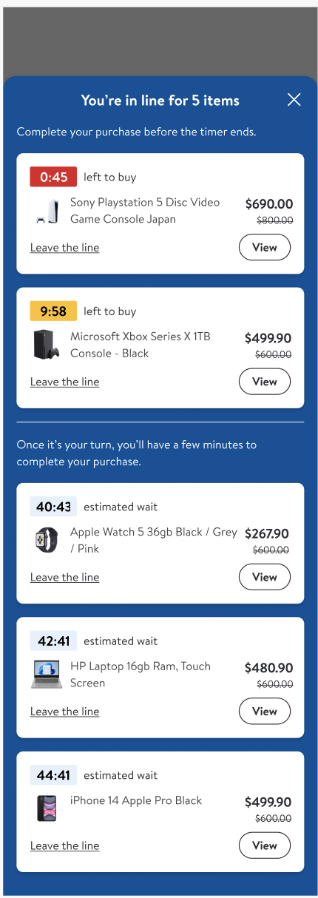](waitingRoom.md) |
