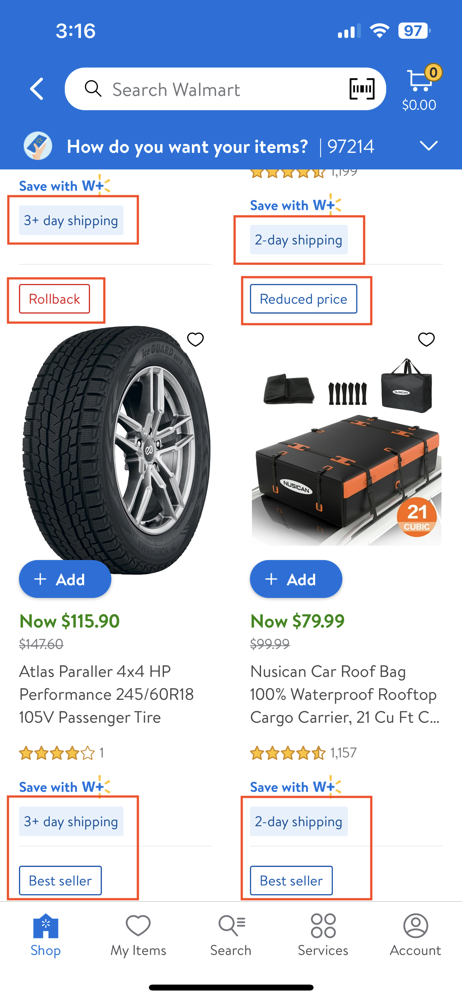
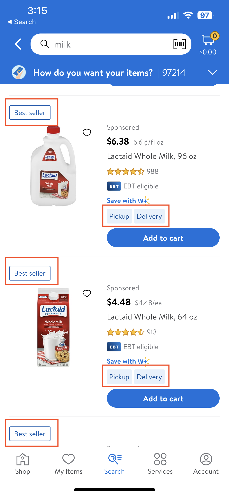
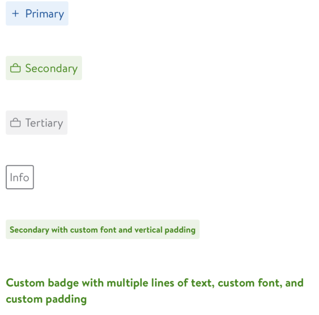
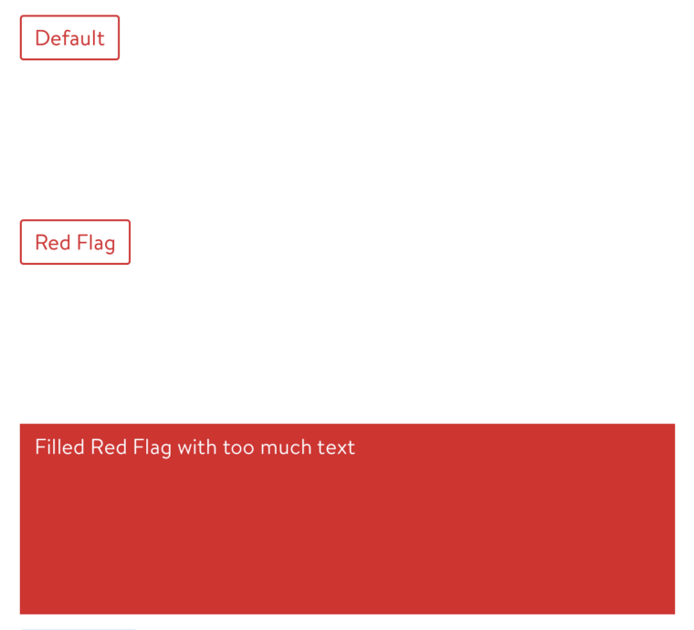

#  Labels

## Description:

Labels are used extensively in the Walmart app.

`GlassUI Labels` is responsible for adding styles to some text.

Feature teams can configure these Labels according to their use case.




## Overview



### GlassBadge

- A view with a colored background, a label, and an optional left-anchored icon

- To get a solid flag background, set the style to `fill`.

- Different `styles` available for `GlassBadge`
```swift
case .outline:
    label.text = model.text
    label.textColor = model.textColor.uiColor
    label.font = model.font.uiFont
case .fill(textColor: _):
    label.text = model.text
    label.textColor = model.textColor.uiColor
    label.font = model.font.uiFont
case .bold(textColor: _):
    label.text = model.text
    label.textColor = model.textColor.uiColor
    label.font = model.font.uiFont.bolded()
```

- Different `text` colors available based on `style`:
```swift
public var textColor: LDColor {
    switch style {
    case .fill(let textColor): return textColor
    case .bold(let textColor): return textColor
    case .outline: return badgeColor
    }
}
```

- Different `border` colors available based on `style`:
```swift
public var borderColor: UIColor {
    switch style {
    case .fill: return .clear
    case .bold: return .clear
    case .outline: return badgeColor.uiColor
    }
}
```

- Different `background` colors available based on `style`:
```swift
public var backgroundColor: LDColor {
    switch style {
    case .fill: return badgeColor
    case .bold: return badgeColor
    case .outline: return .gray00
    }
}
```

- Different `GlassBadge` types:
  - primary,
  - secondary,
  - tertiary,
  - info

- Different `styles` and `badgeColors` available based on `badgeType`:
```swift
var style: Style {
    switch self {
    case .primary: return .fill(textColor: .blue130)
    case .secondary: return .fill(textColor: .green100)
    case .tertiary: return .fill(textColor: .gray100)
    case .info: return .outline
    }
}
var badgeColor: LDColor {
    switch self {
    case .primary: return .blue10
    case .secondary: return .green10
    case .tertiary: return .gray10
    case .info: return .gray100
    }
}
```




*Above image shows `GlassBadge` with different configurations:*

- `SwiftUIGlassBadge(model: .init(text: "Primary", type: .primary, icon: .plus))`

- `SwiftUIGlassBadge(model: .init(text: "Secondary", type: .secondary, icon: .bag))`

- `SwiftUIGlassBadge(model: .init(text: "Tertiary", type: .tertiary, icon: .bag))`

- `SwiftUIGlassBadge(model: .init(text: "Info", type: .info, icon: nil))`

- `SwiftUIGlassBadge(model: .init(text: "longtext", font: LDDynamicFont.bold(9).fontType, type: .secondary, verticalPadding: 2.0))`

- `SwiftUIMultiLineGlassBadge(model: .init(text: "longtext", font: LDFont.captionBold(), textNumberOfLines: 0, badgeColor: .clear, style: .fill(textColor: .green100), horizontalPadding: 0, verticalPadding: 0))`


**Example:** Generating `GlassBadge` for `discounts`

```swift
public static func discount(text: String? = nil,
                            bundleId: String? = nil,
                            isMultiSaveEnabled: Bool = false,
                            multiSaveTapped: ((String?) -> Void)? = nil) -> Self {
    let icon: GlassIcon?
    icon = (text == "Rebaja") ? .discount : nil
    return .init(text: text ?? "product-tile.flag.rollback".localize(),
                 badgeColor: .red130,
                 icon: icon,
                 style: .outline,
                 horizontalPadding: LDSpacing.space8,
                 bundleId: bundleId,
                 isMultiSaveEnabled: isMultiSaveEnabled,
                 multiSaveTapped: multiSaveTapped)
}
```

### GlassFlag

- Flags are text content with a stylized border color that matches the label font color.

- To get a solid flag background, set the style to `fill`.

- Different `GlassFlag` types available:
```swift
private enum FlagType {
    case regular
    case multiSave
}
```

- Different Flag `styles` available:
```swift
case .outline:
    backgroundColor = LDColor.clear.uiColor
    containerView.backgroundColor = LDColor.clear.uiColor
    label.font = LDFont.captionRegular().uiFont
case .fill(textColor: _):
    backgroundColor = model.flagColor?.uiColor
    containerView.backgroundColor = model.flagColor?.uiColor
    label.font = LDFont.captionRegular().uiFont
case .bold(textColor: _):
    backgroundColor = model.flagColor?.uiColor
    containerView.backgroundColor = model.flagColor?.uiColor
    label.font = LDFont.captionBold().uiFont
```




*Above image shows `GlassFlag` with different configurations:*

- `SwiftUIGlassFlag(text: "Default")`

- `SwiftUIGlassFlag(text: "Red Flag", flagColor: LDColor.red100)`

- `SwiftUIGlassFlag(text: "longtext", flagColor: LDColor.red100, isFilled: true)`


**Example:** Generating `GlassFlag` for `lowInStock`

```swift
public static func lowInStock(text: String? = nil) -> Self {
    .init(text: text ?? "product-tile.label.lowInStock".localize(),
          flagColor: .gray100,
          style: .outline)
}
```


### Tests

- Tests if data is getting added to GlassBadge as expected

```swift
func testBasicInfoBadge() {
    // Given
    let model = Model(text: "hi",
                      badgeColor: .blue10,
                      icon: .clock,
                      style: .outline,
                      iconRenderingMode: .alwaysOriginal,
                      bundleId: "bundleId",
                      isMultiSaveEnabled: true)

    // When
    let badge = GlassBadge(model: model)

    // Then
    XCTAssertEqual(badge.label.text, "hi")
    XCTAssertEqual(badge.label.textColor, LDColor.blue10.uiColor)
    XCTAssertEqual(badge.iconView.tintColor, LDColor.blue10.uiColor)
    XCTAssertFalse(badge.iconView.isHidden)
    XCTAssertNotNil(badge.iconView.image, "Image view was set but should be empty")
    XCTAssertEqual(badge.iconView.image?.renderingMode, .alwaysOriginal)
    XCTAssertEqual(badge.linkButton.currentTitle, "View all")
}
```
