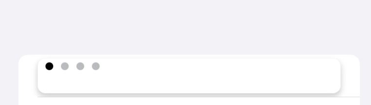
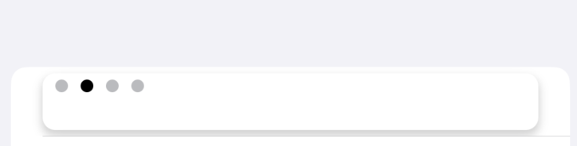
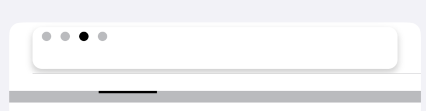

#  Pagination

## Description:

Pagination provides the ability to display dots that indicate which page a user is on.

`GlassPageIndicator` shows a light grey line (for total number of pages) with bold indicator to show the user current page.

It is up to the feature teams on how they want to configure GlassPageIndicator.

**Example:**

-  **Page(1/4)**

-  **Page(2/4)**

-  **Page(3/4)**

## Overview

- Two types of color for indicating:
  - Current page
  - Total number of pages
```swift
internal var selectedColor = LDColor.gray200
internal var indicatorColor = LDColor.gray50
```

- Updates the view for `GlassPageIndicator`
```swift
func update(newIndex: Int, oldIndex: Int) {
    let newView = stackView.arrangedSubviews[newIndex]
    let oldView = stackView.arrangedSubviews[oldIndex]

    UIView.animate(withDuration: LDAnimation.animationTimeMedium) { [weak self] in
        guard let self = self else { return }
        oldView.backgroundColor = self.indicatorColor.uiColor
        newView.backgroundColor = self.selectedColor.uiColor
    }
}
```

### Tests

- Tests if `GlassPageIndicator`is working as expected
```swift
func testBasicPageIndicator() {
    let pageIndicator = GlassPageIndicator(3)

    pageIndicator.selectedIndex = 1

    XCTAssert(pageIndicator.selectedIndex == 1, "")
}
```

- Tests if `GlassPageIndicator` fails when given out of bounds selectedIndex
```swift
func testOutOfBoundsPageIndicator() {
    let pageIndicator = GlassPageIndicator(3)

    pageIndicator.selectedIndex = 1
    pageIndicator.selectedIndex = 4

    XCTAssert(pageIndicator.selectedIndex == 1,
              "Changing value of page indicator was set to value outside of valid range")
}
```
