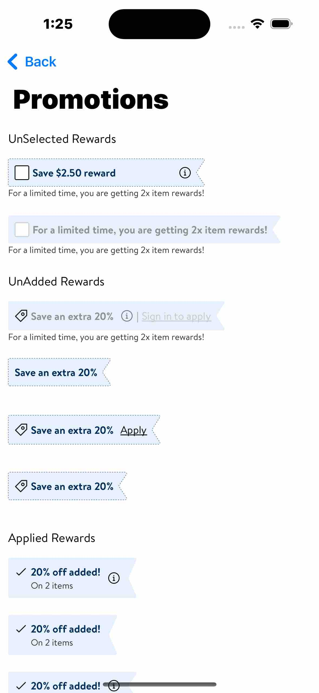
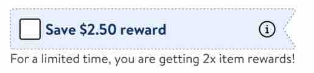
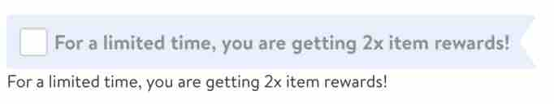
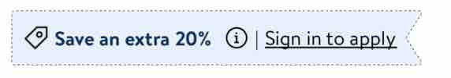
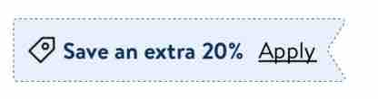
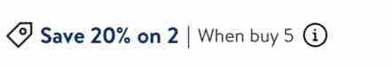
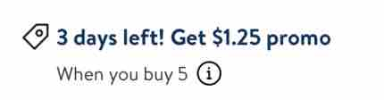
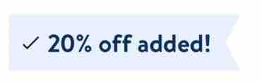
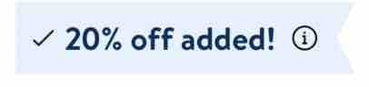
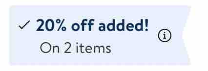

#  PromotionsView

PromotionsView is used to display promotions that are available for the user on any item.


## Description:

- Promotions View is used by different teams to display promotions on an item.

## Overview:

Below are the different variation from Demo App that we can configure 
Now we can construct a disabled promotion view as well
We can also add a footer label to promotion box which is an optional




- Product tile Grid


The above image shows when user applied promo on the product, the product tile contains Applied PromoView like this


 **Types of PromotionsView:**
 
 - UnAdded PromotionsView



This type of PromotionsView is displayed when a user has a checkbox option to select and a footer label.




This type of PromotionsView is displayed when a user has disabled promotion which has a checkbox option and a footer label.

- UnAdded PromotionsView



This type of PromotionsView is displayed when a user is signed out and there info related to the promotion.




This type of PromotionsView is displayed when a user is signedIn and there no info available to the promotion.


- UnAdded w/Restriction PromotionsView



This type of PromotionsView is displayed when the promotion has restrictions and info available.




This type of PromotionsView is displayed when the promotion has restrictions and info available but the size the line is long.


- Applied PromotionsView


This type of PromotionsView is displayed when a user has applied a promo with No Info



This type of PromotionsView is displayed when a user has applied a promo with Info



This type of PromotionsView is displayed when a user has applied a promo with Info and also has SubTitle


## Example (Most used):

**Unselected PromotionsView**

Parameters:
 - title: String
 - trailingIcon: UIImage?
 - selectedClosure: () -> Void
 - trailingButtonClosure: (() -> Void)?
 - trailingButtonAccessibilityLabel: String?

**UnAdded PromotionsView**

Parameters:
- leadingIcon: UIImage?
- title: String
- infoIcon: UIImage?
- linkButtonText: String?
- infoButtonAccessibilityLabel: String?
- infoButtonClosure: (() -> Void)?
- linkButtonClosure: (() -> Void)?
- linkButtonAccessibilityLabel: String?


**UnAdded w/Restrictions PromotionsView**

Parameters:
- leadingIcon: UIImag
- title: String
- subTitle: String?
- trailingIcon: UIImage?
- trailingButtonAccessibilityLabel: String?
- trailingButtonClosure: ((UIButton?) -> Void)?


**Applied PromotionsView**

Parameters:
- leadingIcon: UIImage
- title: String
- subTitle: String?
- trailingIcon: UIImage?
- trailingButtonAccessibilityLabel: String?
- trailingButtonClosure: (() -> Void)?


**This is how PromotionsView is used in code (applied Promotions type)**

*Setting up PromotionsBox view*

```swift
struct SwiftUIPromotionsBoxView: UIViewRepresentable {
    @State var model: PromotionsViewModel

    func updateUIView(_ uiView: PromotionsView, context: Context) {
        // no-op
    }

    func makeUIView(context: Context) -> PromotionsView {
        let promotionsBox = PromotionsView(model)

        return promotionsBox
    }
}
```

*Using promotionsBox view to display Applied PromotionsView*

```swift
SwiftUIPromotionsBoxView(model: .init(promotionType: .applied(leadingIcon: LDIcon.check.image,
                                                              title: "20% off added!",
                                                              subTitle: "On 2 items",
                                                              trailingIcon: LDIcon.infoCircle.image,
                                                              trailingButtonAccessibilityLabel: "Info",
                                                              trailingButtonClosure: trailingButtonClosure)))
```

This is how the above promo will look


**This is how PromotionsView is used in code (unAdded reward with restriction type)**

*Using promotionsBox view to display unAdded reward with restriction PromotionsView*

```swift
SwiftUIPromotionsBoxView(model: .init(promotionType: .unaddedrestriction(leadingIcon: GlassIcon.promoCoupon.image,
                                                                                             title: "3 days left! Get $1.25 promo",
                                                                                             subTitle: "When you buy 5",
                                                                                             trailingIcon: LDIcon.infoCircle.image,
                                                                                             wrapped: false,
                                                                                             trailingButtonAccessibilityLabel: "More information on rewards",
                                                                                             trailingButtonClosure: trailingButtonClosure)))
```

This is how the above promo will look


*Using promotionsBox view to display unAdded reward with restriction PromotionsView*

```swift
SwiftUIPromotionsBoxView(model: .init(promotionType: .unaddedrestriction(leadingIcon: GlassIcon.promoCoupon.image,
                                                                                             title: "Save 20% on 2",
                                                                                             subTitle: "When buy 5",
                                                                                             trailingIcon: LDIcon.infoCircle.image,
                                                                                             wrapped: true,
                                                                                             trailingButtonAccessibilityLabel: "More information on rewards",
                                                                                             trailingButtonClosure: trailingButtonClosure)))
```

This is how the above promo will look when wrapped: true


This is how the promo will look when wrapped: false


