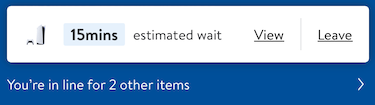
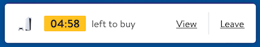
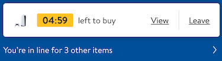
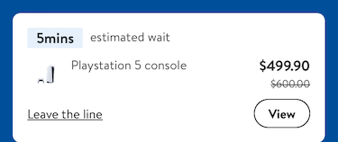
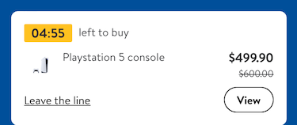

#  Queueing

## Description:

This feature allows the customers to join the waiting room and buy the items they want. 

The Queueing feature allows the customers to join a queue and enter into a waiting room to purchase items that are in high demand.

(Waiting room is a page where all the queued items will be displayed. Customers can use a Snackbar to view queued items while shopping for other items)

Customers will get an option to join the queue and continue shopping. Once, the customer's "Estimated waiting time" is over, they will be notified and will have
some time only to buy that item.

Customers can use this feature for multiple items at once.

This feature is currently being used for Holidays.

## Overview

The purpose of this feature is to give time contraints to customers for items in high demand. The reasoning behind this is to limit the amount of time for someone to purchase an item so our services' don't have to hold that item for a customer who might not purchase it. This gives clear intent of the customer so we can fulfill the need's of those who is actually going to make that purchase. This feature helps offload unnecessary work for our servers during the holidays to give a better user experience to those who shop for high demand items. 

 ### Example Usage 

- *Setup the ViewController*

```swift
import GlassUI
import LivingDesign
import PluginAPIs
import UIKit
import WaitingRoom
import WalmartFoundation
import WalmartPlatform

class ViewController: UIViewController {
    
}

/// Make sure your `ViewController` conforms to the `GlassQueueBannerDelegate`
extension ViewController: GlassQueueBannerDelegate {

    func didTapEstimatedWait() {}
    func didTapMulti() {}
    func didTapView() {}
    func didTapLeave() {}
    func didExpire() {}
}
```

- *Add a BannerView Container and Image url*
```swift
    let ps5url = URL(string: "https://i5.walmartimages.com/asr/fd596ed4-bf03-4ecb-a3b0-7a9c0067df83.bb8f535c7677cebdd4010741c6476d3a.png")!
    let bannerView = UIView()
    func addBanner(_ banner: UIView) {
        bannerView.addAutoLayoutSubview(banner)

        NSLayoutConstraint.activate([
            banner.constraints(pinningTo: bannerView,
                                      edges: .all)
        ])
    }
    
    func addModelToBannerThenAddToBannerViewContainer(with model: GlassQueueBanner.Model) {
        // Make the banner
        let banner = GlassQueueBanner(model: model)
        // Conform it's delegate to the VC's `GlassQueueBannerDelegate`
        banner.delegate = self
        // Add the banner to the bannerView Container
        addBanner(banner)
    }
}
```

- *SingleReadyMinimal Example*

```swift
    func addMinimal() {
        // configure the Model and make it of kind `.singleReadyMinimal`
        let model = GlassQueueBanner.Model(kind: .singleReadyMinimal,
                                           imageURL: ps5url,
                                           expiresAt: Date(timeIntervalSinceNow: (60 * 3), using: clock),
                                           labeledBy: "Playstation five console",
                                           content: "left to buy")
        addModelToBannerThenAddToBannerViewContainer(with: model)
    }
```

- *SingleReadyMinimal Image*


- *SingleWait Example*

```swift
    func addSingleWaiting() {
        // configure the Model and make it of kind `.singleWait`
        let model = GlassQueueBanner.Model(kind: .singleWait,
                                           imageURL: ps5url,
                                           expiresAt: Date(timeIntervalSinceNow: (60 * 15), using: clock),
                                           labeledBy: "Playstation five console",
                                           content: "estimated wait")
        addModelToBannerThenAddToBannerViewContainer(with: model)
    }
```

- *SingleWait Image*


- *MultiWait Example*

```swift
    func addMultiWait() {
        let model = GlassQueueBanner.Model(kind: .multiWait,
                                           imageURL: ps5url,
                                           expiresAt: Date(timeIntervalSinceNow: (60 * 15), using: clock),
                                           labeledBy: "Playstation five console",
                                           content: "estimated wait",
                                           subContent: "You’re in line for 2 other items")
        addModelToBannerThenAddToBannerViewContainer(with: model)
    }
```

- *MultiWait Image*



- *SingleReady Example*

```swift
    func addSingleReady() {
        let model = GlassQueueBanner.Model(kind: .singleReady,
                                           imageURL: ps5url,
                                           expiresAt: Date(timeIntervalSinceNow: (60 * 5), using: clock),
                                           labeledBy: "Playstation 5 console",
                                           content: "left to buy",
                                           subContent: "Woohoo — the wait is over!")
         addModelToBannerThenAddToBannerViewContainer(with: model)
    }
```

- *SingleReady Image*


- *MultiReady Example*
```swift
    func addMultiReady() { 
        let model = GlassQueueBanner.Model(kind: .multiReady,
                                           imageURL: ps5url,
                                           expiresAt: Date(timeIntervalSinceNow: (60 * 5), using: clock),
                                           labeledBy: "Playstation 5 console",
                                           content: "left to buy",
                                           subContent: "You’re in line for 3 other items")
        addModelToBannerThenAddToBannerViewContainer(with: model)
    }
```

- *MultiReady Image*


- *SingleWaitExpanded Example*
```swift
    func addSingleWaitExpanded() { 
        let model = GlassQueueBanner.Model(
            kind: .singleWaitExpanded(itemDetail: .init(itemName: "Playstation 5 console",
                                                        itemPrice: "$499.90",
                                                        itemWasPrice: "$600.00")),
            imageURL: ps5url,
            expiresAt: Date(timeIntervalSinceNow: (60 * 5), using: clock),
            labeledBy: "Playstation 5 console",
            content: "estimated wait")
        addModelToBannerThenAddToBannerViewContainer(with: model)
    }
```

- *SingleWaitExpanded Image*


- *SingleReadyExpanded Example*
```swift
    func addSingleReadyExpanded() { 
        let model = GlassQueueBanner.Model(
            kind: .singleReadyExpanded(itemDetail: .init(itemName: "Playstation 5 console",
                                                         itemPrice: "$499.90",
                                                         itemWasPrice: "$600.00")),
            imageURL: ps5url,
            expiresAt: Date(timeIntervalSinceNow: (60 * 5), using: clock),
            labeledBy: "Playstation 5 console",
            content: "left to buy")
         addModelToBannerThenAddToBannerViewContainer(with: model)
    }
```

- *SingleReadyExpanded Image*


### WaitingRoomApp Reference

[Code](https://gecgithub01.walmart.com/walmart-ios/glass-app/blob/development/Plugins/WaitingRoom/WaitingRoomApp/BannerUIViewController.swift)
