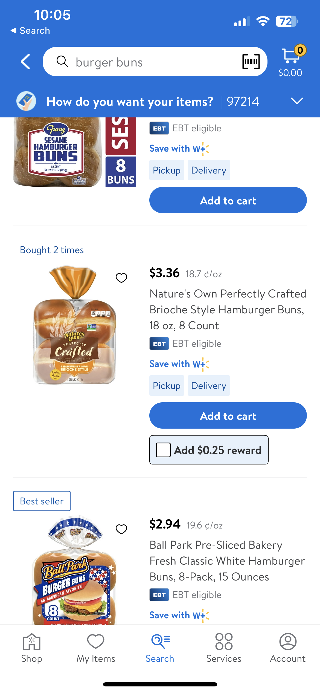
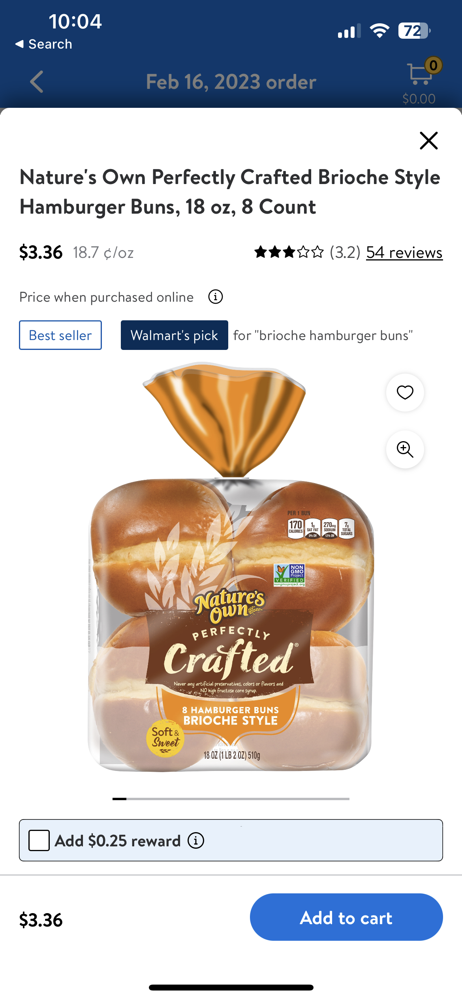
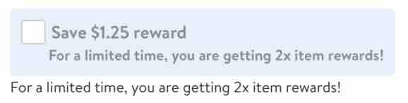
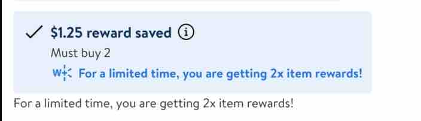
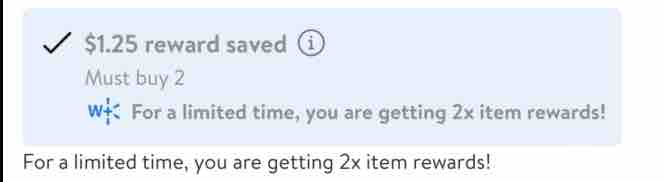

#  RewardsView

RewardsView is used to display rewards that are available for the user on any item. and can be disabled in multi variants


## Description:

- Rewards View is used by different teams to display rewards on an item.

- W+ team uses this view to display rewards available for W+ members. Users who have not signed up can subscribe to W+ and get offers


## Overview:

**RewardsView is available on:**

- Product tile (Search page)



The above image shows "unselected" rewardsView when a user searches for an item (search page). User can choose to add this offer to their order


- Product tile (Item page)



The above image shows "unselected" rewardsView when a user selects an item (item page). User can choose to add this offer to their order


 **Types of RewardsView:**

- unselected RewardsView


This type of rewardsView is displayed when a user has a reward available but has not selected to use it.

- unselected RewardsView Disabled and also with footerLabel



This type of rewardsView is displayed when a user has a reward available but has not selected to use it.


- selected RewardsView


This type of rewardsView is displayed when a user has a reward available and has selected to use it.


- locked RewardsView (also known as unauthenticated rewardsView)


This type of rewardsView is displayed when a user has a reward available but has not signed up for W+ membership.


- special RewardsView


This type of rewardsView is displayed when there is a special type of reward available for the user


- small RewardsView


This type of rewardsView is displayed when user has earned a reward


- large RewardsView


This type of rewardsView is displayed when a user has applied a reward


## Example (Most used):

**unselected rewardsView**

Parameters:
- rewardConfig: UnselectedRewardConfig
- footerLabel: String?
- selectedClosure: () -> Void
- trailingButtonClosure: (() -> Void)?

UnselectedRewardConfig Parameters:
- title: String
- subTitle: String?
- trailingIcon: UIImage?
- tertiaryText: String?
- tertiaryImage: UIImage?
- trailingButtonAccessibilityLabel: String?
- unstyledTertiaryText: Bool?


**selected rewardsView**

Parameters:
- let rewardConfig: SelectedRewardConfig
- footerLabel: String?
- trailingButtonClosure: (() -> Void)?

SelectedRewardConfig Parameters:
- title: String
- subTitle: String?
- leadingIcon: UIImage
- tertiaryText: String?
- tertiaryImage: UIImage?
- trailingIcon: UIImage?
- trailingButtonAccessibilityLabel: String?
- unstyledTertiaryText: Bool?


**locked rewardsView (also known as unauthenticated rewardsView)**

Parameters:
- rewardConfig: UnAuthenticatedRewardConfig
- footerLabel: String?
- linkButtonClosure: ((_ button: UIButton?) -> Void)?

UnAuthenticatedRewardConfig Parameters:
- leadingIcon: UIImage
- title: String
- titleTrailIcon: UIImage?
- buttonText: String
- tertiaryText: String?
- rewardsLayout: RewardsLayout  (2 types of layouts for this reward)
- shouldShowSignInButton: Bool


**This is how rewardsView is used in code (selected Rewards type)**

*Setting up rewardsBox view*

```swift
struct SwiftUIRewardsBoxView: UIViewRepresentable {
    @State var model: RewardsViewModel

    func updateUIView(_ uiView: RewardsView, context: Context) {
        // no-op
    }

    func makeUIView(context: Context) -> RewardsView {
        let rewardsBox = RewardsView(model)

        return rewardsBox
    }
}
```

*Using rewardsBox view to display selected rewardsView*

```swift
let selectedRewardConfig = SelectedRewardConfig(title: "$1.25 reward Added",
                                                 subTitle: "Must buy 2",
                                                 tertiaryText: "For a limited time, you are getting 2x item rewards!",
                                                 leadingIcon: LDIcon.check.image,
                                                 trailingIcon: LDIcon.infoCircle.image,
                                                 tertiaryImage: LDIcon.walmartPlus.image
                                                 .withTintColor(LDColor.blue100.uiColor),
                                                 trailingButtonAccessibilityLabel: "Info")
SwiftUIRewardsBoxView(model: .init(rewardType: .selected(rewardConfig: selectedRewardConfig,
                                                         footerLabel:  a limited time, you are getting 2x item rewards!",
                                                         trailingButtonClosure: trailingButtonClosure),
                                   isDisabled: false))
```

This is how the above reward will look




*Using rewardsBox view to display selected rewardsView when disabled annd with footer*

```swift
let selectedRewardConfig = SelectedRewardConfig(title: "$1.25 reward Added",
                                                 subTitle: "Must buy 2",
                                                 tertiaryText: "For a limited time, you are getting 2x item rewards!",
                                                 leadingIcon: LDIcon.check.image,
                                                 trailingIcon: LDIcon.infoCircle.image,
                                                 tertiaryImage: LDIcon.walmartPlus.image
                                                 .withTintColor(LDColor.blue100.uiColor),
                                                 trailingButtonAccessibilityLabel: "Info")
SwiftUIRewardsBoxView(model: .init(rewardType: .selected(rewardConfig: selectedRewardConfig,
                                                         footerLabel:  a limited time, you are getting 2x item rewards!",
                                                         trailingButtonClosure: trailingButtonClosure),
                                   isDisabled: true))
```

This is how the above reward will look when disabled


