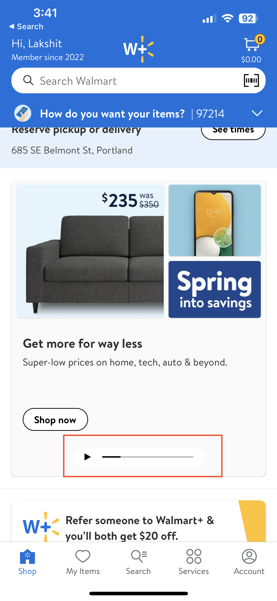
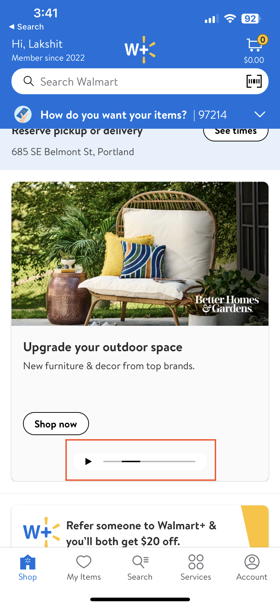
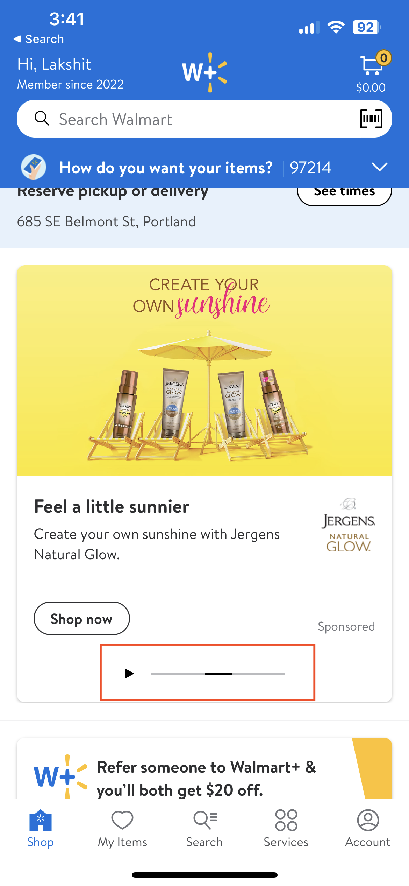

#  Scrollbar

## Description:

`GlassScrollBar` Gives the ability to scroll between pages *horizontally*.

This feature is currently being used on home page by the ads team.

-  **Page (1/5)**

-  **Page (2/5)**

-  **Page (3/5)**


## Overview

- Feature teams need to provide the below values when using `GlassScrollbar`:
  - `pageCount:` Int
    - Default value is 1
  - `scrollBarWidth:` CGFloat
    - Default value is 200

**Example:**

```swift
private lazy var scrollBar = GlassScrollbar(pageCount: 5, scrollbarWidth: configuration.scrollbarWidth)
```

- This function helps with updating the page view and animates when transitioning from one page to the next.

```swift
func updateCurrentPageView(oldLocation: Int, newLocation: Int) {
    UIView.animate(withDuration: LDAnimation.animationTimeMedium) { [weak self] in
        guard let self = self else { return }
        let widthOfSelected = self.currentView.frame.width
        let diff = newLocation - oldLocation
        self.indicatorLeadingConstraint?.constant += CGFloat(diff) * CGFloat(widthOfSelected)

        self.layoutIfNeeded()
    }
}
```
