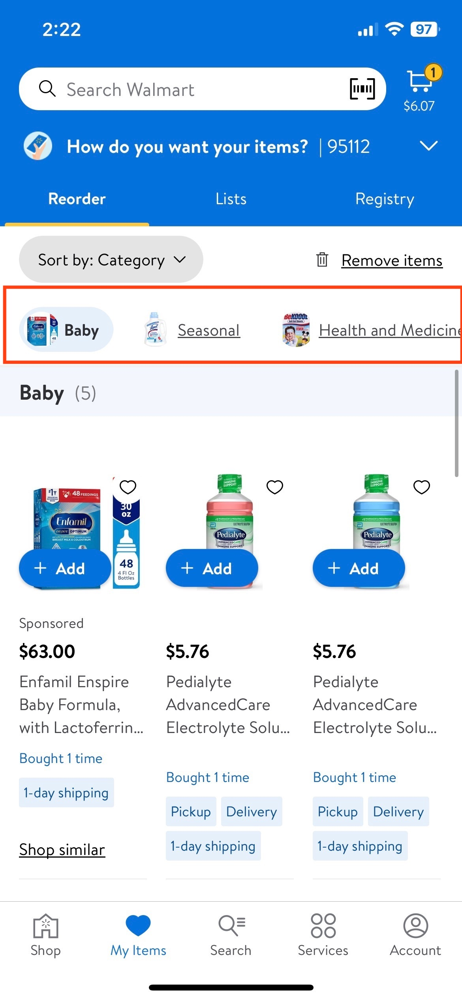
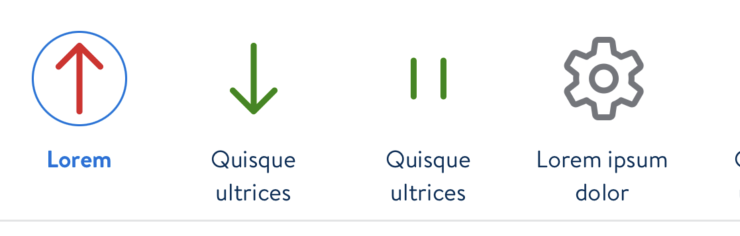
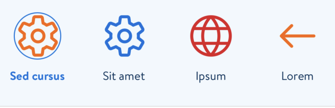

#  SideScrollNavigation

## Description:

`SideScrollNavigation` is a navigation component that can scroll horizontally and is currently being used by Health and MyItems team


- 


- 


## Overview:

Teams should use `SideScrollNavigation` through `SideScrollNavigationController`.

**Important functions that feature teams can use:**

- Use this function to set items for `SideScrollNavigation`

```swift
public func setMenuItems(_ menuItems: [SideScrollNavigationView.Item]) {
    menuView.items = menuItems
    showMenuIfNeeded()
    setSelected(itemIndex: 0, animated: false)
}
```

*Items being added can have the following:*
- `title:` String
- `icon:` Icon?
- `action:` (Item) -> Void


- Use this function to set the selectedIndex for `SideScrollNavigation`

```swift
public func setSelected(itemIndex: Int, animated: Bool) {
    menuView.setSelected(itemIndex: itemIndex, animated: animated)
}
```

- Use this function to set the content for `SideScrollNavigation`

```swift
public func setContent(viewController: UIViewController?, animated: Bool = true) {
    containerViewController.setContentViewController(viewController)
    title = viewController?.title
}
```

### Styling

- Available `Background` styles that can be used by teams according to their use case.
  - default:
    - LDColor.white.uiColor
  - lightAccent:
    - LDColor.blue05.uiColor

 (LDColor.white.uiColor)

 (LDColor.blue05.uiColor)

- Available `Presentation` styles that can be used by teams according to their use case.
  - collapsed
  - scrolling *(mostly used)*
  - expanded
