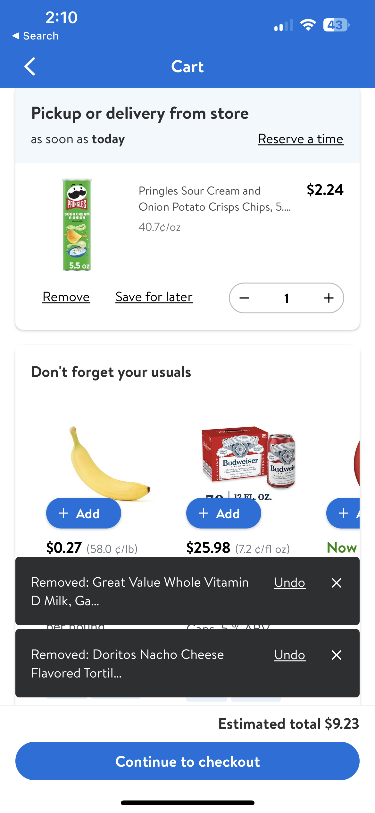

#  Snackbar

## Description:

The Snackbar is used as a popover view to help alert the customer when a certain event has happened.

Shared-components team owns `GlassSnackbarStackView` which is responsible for stacking Snackbars over each other.




## Overview

- Feature teams need to provide the below values when using `GlassSnackbarStackView`
  - `limit:` The maximum number of snackbars that can display on screen
    - Default value is 2
  - `spacing:` The vertical spacing between snackbar views
    - Default value is 0

**Example:**
```swift
maxVisibleSnackbars: Int = 2
snackbarSpacing: CGFloat = 4

private var snackbarStackView = GlassSnackbarStackView(limit: maxVisibleSnackbars, spacing: snackbarSpacing)
```


- `insertSnackbarView` function is a convenience method to show the snackbar.
  - Parameters:
    - `model:` The configuration model for the snackbar.
    - `additionalInsets:` Used for positioning the snackbar. Default is 16 for horizontal and 8 for vertical
    - `action:` The action to perform when the user taps the action button on the snackbar.
    - `animated:` True if the snackbar should animate

```swift
public func insertSnackbarView(
    model: LDSnackbar.Model,
    additionalInsets: LayoutConstrainingInsets = .init(
        vertical: LDSpacing.space8,
        horizontal: LDSpacing.space16
    ),
    action: (() -> Void)? = nil,
    onDismiss: (() -> Void)? = nil,
    animated: Bool = true
) -> LDSnackbar {
    let snackbar = LDSnackbar(dataModel: model, action: action, onDismiss: onDismiss)
    showSnackbar(snackbar, animated: animated)
    removeOldestSnackbarIfNeeded()
    return snackbar
}
```

- There are 2 types of Presentation mode available for `GlassSnackbarStackView`:
  - inView (UIView)
    - Specifies to present Snackbars within the given view.
  - alwaysOnTop *(mostly used)*
    - Specifies that snackbars should be presented in a separate window above all content.


- This function removes the oldest snackbar (shown first), when the limit exceeds.

```swift
private func removeOldestSnackbarIfNeeded() {
      while snackbarViews.count > limit {
          let snackbar = snackbarViews.first
          snackbar?.hideSnackbar()
          snackbarViews.removeFirst()
      }
  }
```
