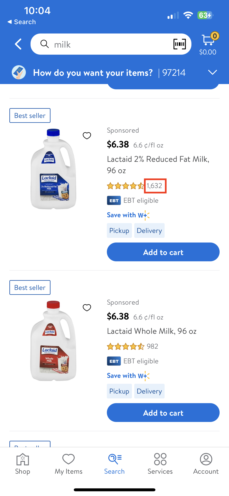
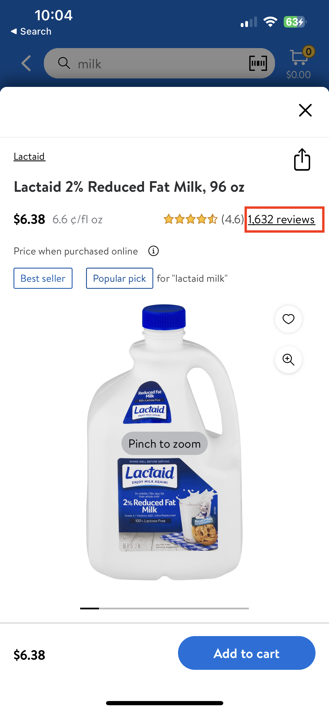

#  StarRating

## Description:

A view for displaying a customer rating in a five star format with some info labels/buttons.


## Overview:

- Ratings provide insight into how well a product or service has been received by those who have bought or used it previously.
- The starRatings view comes in two styles:
  - `Style.abbreviated` and
  - `Style.expanded`.
- The abbreviated style is typically used on **product tiles** while the expanded style is used on the **item page** as a navigation button to the review page.
- There is also the ability to show the average ratings beside the star ratings on ProductTile/ItemPage.




Above image is an example of `Style.abbreviated` on ProductTile. The *ratingCount* here is just a label to display.



Above image is an example of `Style.expanded` on ItemPage. The *ratingCount* here is a clickable button which takes the user to review page.

*Shared-components team uses LD starRating to make GlassUI starRating with additional labels/buttons*

## Topics

### GlassStarRatingView

- This part is responsible for generating the view for GlassUI StarRating.
- There are different styles available for feature teams to use, according to their use case:
  - case abbreviated
    - Displays the stars and the rating count label. e.g. `⭑⭑⭑⭒⭒ 23`
  - case abbreviatedWithAverage
    - Displays the stars, the average in parenthesis, and the rating count label. e.g. `⭑⭑⭑⭒⭒ (3.0) 23`
  - case expanded
    - Displays the stars and a review count button. e.g. `⭑⭑⭑⭒⭒ 23 reviews`
  - case expandedWithAverage
    - Displays the stars, the average in parenthesis and the review count button. e.g. `⭑⭑⭑⭒⭒ (3.0) 23 reviews`

Below `init` Creates a rating view with the provided `style` and `model`.
- Parameters:
  - style: The preferred style of the rating view. This cannot be changed. The default value is `abbreviated`.
  - model: The view model to configure the rating view. The default value is `nil`.

```swift
public init(style: Style = .abbreviated, model: Model = Model()) {
    self.style = style
    self.model = model
    ratingView = LDRating(model: LDRating.Model(rating: model.rating))
    switch style {
    case .abbreviated:
        ratingsLabel = LDLabel(labelStyle: .captionLight)
        averageLabel = nil
        reviewButton = nil

    case .abbreviatedWithAverage:
        ratingsLabel = LDLabel(labelStyle: .captionLight)
        averageLabel = LDLabel(labelStyle: .body2)
        reviewButton = nil

    case .expanded:
        ratingsLabel = nil
        averageLabel = nil
        reviewButton = LDLinkButton()

    case .expandedWithAverage:
        ratingsLabel = nil
        averageLabel = LDLabel(labelStyle: .body2)
        reviewButton = LDLinkButton()
    }

    ratingsLabel?.isHidden = model.shouldHideText
    reviewButton?.isHidden = model.shouldHideText

    super.init(frame: .zero)

    applyModel()
}
```
*Depending on their use-case, feature teams can select the type of StarRating*


### GlassStarRatingView+Model

- A view model for configuring a `GlassStarRatingView` instance.
- `public var shouldHideText = false`
  - Allows hiding of the label and button
- `public let rating: Double`
  - The rating corresponding to the active stars.
- `public let numberOfReviews: Int`
  - The review count text.
  - The count will be automatically formatted based on the Style, e.g. `1,337` or `1,337 reviews`
- `public let additionalText: String`
  - Additional text for review count text. e.g. `1337 product reviews`.
  - Needs a space after the word e.g. `product ` or `seller `, so that the final text has proper spaces.

```swift
func reviewText(for style: Style) -> String {
    switch style {
    case .abbreviated, .abbreviatedWithAverage:
        return LocalizedStrings.starRatingAbbreviatedReviewText(count: numberOfReviews).value
    case .expanded, .expandedWithAverage:
        return LocalizedStrings.starRatingExpandedReviewText(reviewCount: numberOfReviews,
                                                             additionalText: additionalText).value
    }
}
```


### GlassUserStarRatingView

- An interactive star rating view.
- It helps users to interact with StarRatings like click button, view rating, etc
- Some additional helpers are also available here which enables us to setup, update stars.

```swift
@objc
private func didReachForTheStars(_ dreams: UIGestureRecognizer) {
    updateStars(fromTouching: dreams.location(in: self))

    if dreams.state == .ended {
        notifyDelegateOfRatingSelection()
    }
}
```
```swift
private func updateStars(fromTouching point: CGPoint) {
    guard let selectedStar = starViews.last(where: { point.x > convert($0.bounds.origin, from: $0).x }) else {
        return
    }
    model.rating = selectedStar.model.rating
    selectRating(selectedStar.model.rating)
}
```

- A set of method(s) for monitoring the interaction of a user star rating view.

```swift
public protocol GlassUserStarRatingViewDelegate: AnyObject {
    // Tells the delegate that a `rating` has been selected.
    func glassUserStarRatingView(_: GlassUserStarRatingView, didSelectRating rating: Int)
}
```


### GlassUserStarView

- A view model for configuring a `GlassUserStarView` instance.
- var state: State
  - selected or unselected state of rating
- var size: GlassIcon.Size
  - The preferred size of each star.
- var fillStarIcon: GlassIcon
  - The image of the stars when selected.
- var starIcon: GlassIcon
  - The image of the stars when unselected.
- var rating: Int
  - The selected rating that corresponds to the number of stars filled in.

```swift
private func applyModel() {
    let selectedIcon: GlassIcon
    switch model.state {
    case .selected:
        selectedIcon = model.fillStarIcon

    case .unselected:
        selectedIcon = model.starIcon
    }
    iconView.image = selectedIcon.image(model.size)
}
```

### Tests

#### GlassStarRatingViewTests

- Tests to check if the `StarRatingView` is working as expected

```swift
typealias Model = GlassStarRatingView.Model
```

```swift
// Tests if Abbreviated type of StarRating is working correctly
func testAbbreviatedGlassStarRating() {
    let model = Model(rating: 3, numberOfReviews: 5)

    let ratingController = GlassStarRatingView(style: .abbreviated, model: model)
    XCTAssertNil(ratingController.reviewButton, "Review button should be nil for abbreviated rating view")
}
```

```swift
// Tests if ExpanedWithAverage type of StarRating is working correctly
func testExpandedWithAverageGlassStarRating() {
    let model = Model(rating: 3, numberOfReviews: 5)

    let ratingController = GlassStarRatingView(style: .expandedWithAverage, model: model)
    XCTAssertNotNil(ratingController.reviewButton, "Review button should NOT be nil for abbreviated rating view")
    XCTAssertNotNil(ratingController.testHooks.averageLabel)
    XCTAssertEqual(ratingController.testHooks.averageLabel?.text, "(3.0)")
}
```

#### GlassUserStarRatingViewTests

- Tests to check if the `UserStarRatingView` is working as expected

```swift
// Tests if starRating more than 5, then it should be nil
func testChangeRatingOutsideRange() {
    let starRatingView = GlassUserStarRatingView()
    starRatingView.model = GlassUserStarRatingView.Model(rating: 7)
    XCTAssertNil(starRatingView.model.rating)
}
```

```swift
// Tests accessibility
func testStarViewAccessibilityFiveStarSelected() {
    let starRatingView = GlassUserStarRatingView()
    starRatingView.model = GlassUserStarRatingView.Model(rating: 5)
    XCTAssertEqual(starRatingView.accessibilityValue, "5 stars")
}
```

```swift
// Test for starRating image size
func testStarViewSize() {
    let starRatingView = GlassUserStarRatingView()
    starRatingView.model = GlassUserStarRatingView.Model(starSize: .size32)
    let firstImageSize = starRatingView.testHooks.starViews
        .first?.testHooks.iconView.image?.size
    XCTAssertEqual(firstImageSize, GlassIcon.Size.size32.cgSize)
}
```
