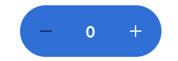
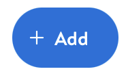
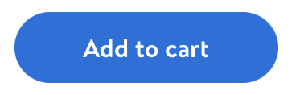
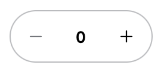
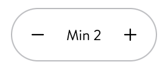
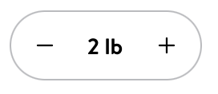
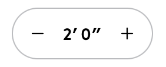

#  GlassStepperView

## Description:

The **GlassStepperView** is the child view of the **AddToCartButton** it is supplied controls by the **AddToCartButton** on state changes as well as animations, callbacks and other UI implementations.

### Example Usage

- Initialization Overview
```swift
    init(style: StepperStyle, // See *StepperStyle*
         type: StepperType, // See *StepperType*
         elevationLevel: LDElevationLevel, // Whether the button appears Elevated
         /// If this is set to true then if clicked will become itle or inactive for 4 seconds.
         tracksIdle: Bool,
         /// A collection of steppers where only one stepper can be "active" (i.e. non-idle) at a time.
         activationGroup: ActivationGroup?,
         collapsesWhenIdle: Bool,
         allowsDecrementAtMin: Bool,
         allowsIncrementAtMax: Bool,
         isMainButtonInteractableInStepper: Bool,
         /// The text to show for the "add" button, when the stepper's value is `0`
         addTitle: String,
         /// The text to show for the suffix when idle
         idleSuffix: String,
         /// See the *GlassStepperView.Model* implementation
         model: Model)
    /// Stepper visual style (sizing) - small/large/variable width
    enum StepperStyle: CaseIterable {
        /// Fixed width of 120px, smaller height and font/icon sizes
        case small
        /// Fixed width of 164px, larger height and font/icon sizes
        case large
        /// Variable width, smaller height and font/icon sizes
        case variableWidth
    }

    enum StepperType: CaseIterable {
        case primary, secondary, secondaryOutlinedBlack
    }
}

extension GlassStepperView.StepperType {
    var appearance: LDViewAppearance {
        switch self {
        case .primary:
            return .filledBlue
        case .secondary:
            return .outlinedGray1
        case .secondaryOutlinedBlack:
            return .outlinedBlack1
        }
    }

    var normalButtonText: LDColor {
        switch self {
        case .primary:
            return .gray00
        case .secondary:
            return .gray200
        case .secondaryOutlinedBlack:
            return .gray200
        }
    }

    var highlightedButtonText: LDColor {
        .gray00
    }

    var highlightedButtonBackground: LDColor {
        switch self {
        case .primary:
            return .blue130
        case .secondary:
            return .gray200
        case .secondaryOutlinedBlack:
            return .gray200
        }
    }

    var disabledButtonText: LDColor {
        switch self {
        case .primary:
            return .blue160
        case .secondary:
            return .gray100
        case .secondaryOutlinedBlack:
            return .gray100
        }
    }
}

```

- Model Overview

```swift
import LivingDesign
import UIKit

    struct GlassStepperView.Model {
        /// The value for the quantity or weight of the item or the dimension of the item
        /// i.e. weight of *14.5* or *12* inches in height.
        public var value: Double
        /// A Boolean value to determine if the quantity of the item is at the minimum amount.
        public var isAtMin: Bool
        /// A Boolean value to determine if the quantity of the item is at the maximum amount.
        public var isAtMax: Bool
        /// A Boolean value to determine if the minimum amount hides its prefix.
        public var hidesMinPrefix: Bool
        /// The time debounce should wait before triggering a new event,
        public var debounceDueTime: Int
        /// The value of the suffix used on the quantity label i.e. *lbs.* or *"* to represent inches.
        public var valueSuffix: String
        /// The value of the accessibilityLabel for the label.
        public var adjustableAccessibilityLabel: String
        /// See the *GlassStepperView.AccessibilityModel* for more documentation details
        public var accessibilityModel: AccessibilityModel
        /// See the *AddOnModel* for more documentation details
        public var addOnModel: AddOnModel?
    }

    struct GlassStepperView.AccessibilityModel {
        /// The accessibility title
        public let title: String
        /// The accessibility title when collapsed
        public let collapsed: String
        /// The accessibility title in init
        public let increment: String
        /// whether or not the accessibility title has a suffix i.e. "lbs"
        public let useSuffix: Bool

        public let buttonLabel: String?
        /// whether or not the accessibility title uses a quantity menu title
        public let useQuantityMenuTitle: Bool
        /// The accessibility title when incrementing
        public let incrementButtonLabel: String
        /// The accessibility title when decrementing
        public let decrementButtonLabel: String
        /// The quantity menu title announcement value
        public let quantityMenuTitle: String
    }

    /// The model used to set formatted strings context/information
    /// where `GlassStepperView.Model` gets initialized.
    struct AddOnModel {
        /// Used as the values of the label if there is more than one value in the label
        /// i.e. 2lbs 3oz where 2 and 3 are the values
        public var values: (first: Double, last: Double)
        /// Used as the values of the label if there is more than one value suffix in the label
        /// i.e. 2lbs 3oz where lbs and oz are the values
        public var valuesSuffix: (first: String, last: String)
    }
```
- Callback Overview

```swift
    /// Used when the increment button has been pressed
    public var onIncrement: () -> Void = {}
    /// Used when the decrement button has been pressed
    public var onDecrement: () -> Void = {}
    /// Used when the label has been first tapped, after this the increment and decrement will be used
    public var onLabelTap: () -> Void = {}
    ///
    /// Called before becoming idle to query if can enter idle state
    ///
    public var onCanBecomeIdle: () -> Bool = { true }
    ///
    /// Called before becoming idle.
    /// Can start additive animations here to animate along side `GlassStepperView`
    ///
    public var onWillBecomeIdle: () -> Void = {}
    ///
    /// Called before becoming active.
    /// Can start additive animations here to animate along side `GlassStepperView`
    ///
    public var onWillBecomeActive: () -> Void = {}

    /// Called on increment or on decrement
    /// onChange is triggered only after onIncrement and onDecrement
    ///  stop being called for debounceDueTime milliseconds.
    /// - Parameters:
    ///   - delta: the change (# of increments + # of decrements, decrements are negative).
    public var onChange: (_ delta: Int) -> Void = { _ in }
```

- Construct A Simple Stepper

```swift
    func constructDefaultStepperView() {
        let stepper = .init(style: .small,
                            type: .primary,
                            elevationLevel: .zero,
                            tracksIdle: false,
                            activationGroup: .default,
                            collapsesWhenIdle: false,
                            allowsDecrementAtMin: false,
                            allowsIncrementAtMax: false,
                            isMainButtonInteractableInStepper: true,
                            addTitle: "",
                            idleSuffix: "",
                            model: Model())
         addAutoLayoutSubview(stepper)
    }
```



- Construct A Small Stepper

```swift
    func constructSmallStepperView() {
        let stepper = .init(style: .small,
                            type: .primary,
                            elevationLevel: .zero,
                            tracksIdle: false,
                            activationGroup: .default,
                            collapsesWhenIdle: true,
                            allowsDecrementAtMin: true,
                            allowsIncrementAtMax: true,
                            isMainButtonInteractableInStepper: true,
                            addTitle: "Add to cart",
                            idleSuffix: "",
                            model: Model())
         addAutoLayoutSubview(stepper)
    }
```



- Construct A Large Stepper

```swift
    func constructLargeStepperView() {
        let stepper = .init(style: .large,
                            type: .primary,
                            elevationLevel: .zero,
                            tracksIdle: false,
                            activationGroup: .default,
                            collapsesWhenIdle: true,
                            allowsDecrementAtMin: false,
                            allowsIncrementAtMax: true,
                            isMainButtonInteractableInStepper: false,
                            addTitle: "Add to cart",
                            idleSuffix: " added",
                            model: Model())
         addAutoLayoutSubview(stepper)
    }
```



- Construct A Cart Stepper

```swift
    func constructCartStepperView() {
        let stepper = .init(style: .small,
                            type: .secondary,
                            elevationLevel: .zero,
                            tracksIdle: false,
                            activationGroup: .default,
                            collapsesWhenIdle: false,
                            allowsDecrementAtMin: true,
                            allowsIncrementAtMax: true,
                            isMainButtonInteractableInStepper: false,
                            addTitle: "",
                            idleSuffix: "",
                            model: Model())
         addAutoLayoutSubview(stepper)
    }
```



- Construct An Each Product Stepper

```swift
    func constructEachProductStepperView() {
        var model = GlassStepperView.Model()
        model.valueSuffix = ""
        model.adjustableAccessibilityLabel = "Quantity"
        model.value = 2
        model.isAtMin = true
        let stepper = .init(style: .small,
                            type: .secondary,
                            elevationLevel: .zero,
                            tracksIdle: false,
                            activationGroup: .default,
                            collapsesWhenIdle: false,
                            allowsDecrementAtMin: true,
                            allowsIncrementAtMax: true,
                            isMainButtonInteractableInStepper: false,
                            addTitle: "",
                            idleSuffix: "",
                            model: Model())
         addAutoLayoutSubview(stepper)
    }
```



- Construct A Weighted Product Stepper

```swift
    func constructWeightedProductStepperView() {
        var model = GlassStepperView.Model()
        model.valueSuffix = " lb"
        model.adjustableAccessibilityLabel = "Weight"
        model.value = 3.25
        model.isAtMax = true
        let stepper = .init(style: .small,
                            type: .secondary,
                            elevationLevel: .zero,
                            tracksIdle: false,
                            activationGroup: .default,
                            collapsesWhenIdle: false,
                            allowsDecrementAtMin: true,
                            allowsIncrementAtMax: true,
                            isMainButtonInteractableInStepper: false,
                            addTitle: "",
                            idleSuffix: "",
                            model: Model())
         addAutoLayoutSubview(stepper)
    }
```



- Construct A Size In Feet Product Stepper

```swift
    func constructSizeInFeetProductStepperView() {
        var model = GlassStepperView.Model()
        model.addOnModel = .init(values: (2, 0), valuesSuffix: ("′", "″"))
        model.adjustableAccessibilityLabel = "Size In Feet"
        model.value = 1
        let stepper = .init(style: .small,
                            type: .secondary,
                            elevationLevel: .zero,
                            tracksIdle: false,
                            activationGroup: .default,
                            collapsesWhenIdle: false,
                            allowsDecrementAtMin: true,
                            allowsIncrementAtMax: true,
                            isMainButtonInteractableInStepper: false,
                            addTitle: "",
                            idleSuffix: "",
                            model: Model())
         addAutoLayoutSubview(stepper)
    }
```


