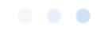
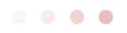
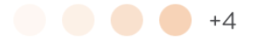

#  GlassSwatch

## Description:

A simple view of which display up to four circular swatches. There isn't a limit to how many *images* or *swatches* can be added to the **GlassSwatch** but only the **first four** will be displayed with every succeeding *swatch* being added to a label which appears as a number and a *+* sign. This is used in the **VariantView** and consists mainly of *colored circles*. An example of this would be if there are five images it would show four of them and have a label that appears as *+1*. The result would look like *⚫️🔵🟢🟤+1*.

### Model Setup

```swift
    public typealias SwatchConfiguration = (UIImageView) -> Void

    struct Model {
        public static let maxSwatches = 4

        public enum Size {
            case regular, small
        }

        /// An array of closures for configuring a swatch image view. For instance, you may configure the image view
        /// to load a remote image or have a particular background color.
        public var swatchConfigurations: [SwatchConfiguration]

        /// The swatch count text, e.g. +4.
        public var countText: String

        /// Determines whether the count label is hidden.
        public var isCountLabelHidden: Bool

        /// The desired size of the swatch.
        public var size: Size

        /// The diameter of the circular swatch.
        public var diameter: CGFloat {
            switch size {
            case .regular: return 16.0
            case .small: return 8.0
            }
        }
    }
```

### Composition

- First Example

```swift
import GlassUI
import LivingDesign

func addGlassSwatchExampleOne() {
    let colors: [LDColor] = [
        .blue05,
        .blue10,
        .blue20]
    let model: GlassSwatch.Model = .init(swatchConfigurations: colors.map { imageView in { $0.backgroundColor = imageView.uiColor } },
                                         size: .small)
    let swatch = GlassSwatch(model: model)
    addAutoLayoutSubview(swatch)
}
```



- Second Example

```swift
func addGlassSwatchExampleTwo() {
    let colors: [LDColor] = [
        .red05,
        .red10,
        .red20,
        .red30]
    let model: GlassSwatch.Model = .init(swatchConfigurations: colors.map { imageView in { $0.backgroundColor = imageView.uiColor } },
                                         size: .small)
    let swatch = GlassSwatch(model: model)
    addAutoLayoutSubview(swatch)
}
```



- Third Example

```swift
func addGlassSwatchExampleThree() {
    let colors: [LDColor] = [
        .orange05,
        .orange10,
        .orange20,
        .orange30,
        .orange40,
        .orange50,
        .orange60,
        .orange70]
    let model: GlassSwatch.Model = .init(swatchConfigurations: colors.map { imageView in { $0.backgroundColor = imageView.uiColor } },
                                         size: .regular)
    let swatch = GlassSwatch(model: model)
    addAutoLayoutSubview(swatch)
}
```


