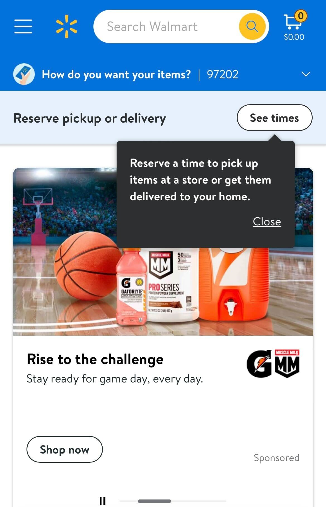
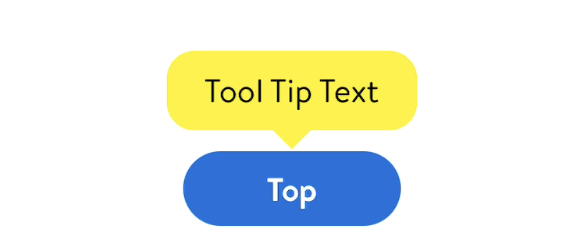
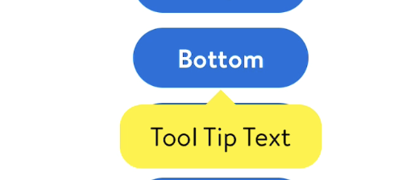
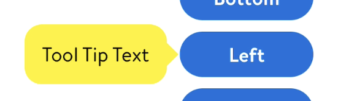
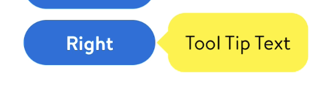

#  ToolTip

## Description:

ToolTip is a type of view that can be displayed "anywhere" on screen but which is typically anchored relative to an existing view.




## Overview

- ToolTip points to and describes another component.
- The tooltip is dismissed on first tap of the screen, whether on the tooltip or anywhere else.
- It will be up to the feature teams to implement the logic behind tooltip (how many times to show, when to show, etc)

**Different arrow directions for ToolTip:**

- 
  - top (arrow point downwards)


- 
  - Bottom (arrow points upwards)


- 
  - Left (arrow point towards right)


- 
  - Right (arrow points towards left)


**Note: 📝**
- We use `EasyTipView` to display a tooltip from the reference frame
- While most of the code in EasyTipView.swift is used from the original git version,
  - some syntax changes are made to silence swift lint warnings.
  - Access specifiers are made internal/fileprivate instead of public/open
  - Accessibility support has been added which was not provided in git version
  - Also, swift version checks were removed as GlassStyles is already on Swift-5.0


## Topics

### GlassToolTip

- GlassToolTip allows feature teams to add a tooltip on UI components
- Parameters:
  - text: Text to be displayed in tooltip
  - font: Text font (Defaults to `LDFont.body2().uiFont`)
  - sourceView: Source view from where the tooltip is displayed
  - parentView: Optional view to anchor the tooltip to. Useful if you want your tooltip to scroll with this view
  - arrowDirection: Direction of tooltip arrow (Defaults to top ⬆️)
  - delegate: Delegate to get callback

Example:
```swift
let toolTip = GlassToolTip(with: "Text", font: font, sourceView: someUIView, arrowDirection: .left, delegate: self)
```


### EasyTipView

- Presents an EasyTipView pointing to a particular `UIView` instance within the specified superview
- Parameters:
  - animated: Pass true to animate the presentation.
  - view: The UIView instance which the EasyTipView will be pointing to.
  - superview: A view which is part of the UIView instances superview hierarchy (Ignore this parameter in order to display the EasyTipView within the main window)
  - text: The text to be displayed.
  - preferences: The preferences which will configure the EasyTipView.
  - delegate: The delegate.

```swift
class func show(animated: Bool = true,
                forView view: UIView,
                withinSuperview superview: UIView? = nil,
                text: String,
                preferences: Preferences = EasyTipView.globalPreferences,
                delegate: EasyTipViewDelegate? = nil) {

    let ev = EasyTipView(text: text,
                         preferences: preferences,
                         delegate: delegate)

    ev.show(animated: animated,
            forView: view,
            withinSuperview: superview)
}
```

- Dismisses the EasyTipView
- Parameter:
  - completion: Completion block to be executed after the EasyTipView is dismissed.

```swift
func dismiss(withCompletion completion: (() -> Void)? = nil) {
    let damping = preferences.animating.springDamping
    let velocity = preferences.animating.springVelocity
    UIView.animate(withDuration: preferences.animating.dismissDuration,
                   delay: 0,
                   usingSpringWithDamping: damping,
                   initialSpringVelocity: velocity,
                   options: [.curveEaseInOut],
                   animations: {
                       self.transform = self.preferences.animating.dismissTransform
                       self.alpha = self.preferences.animating.dismissFinalAlpha
                   }, completion: { _ in
                       self.removeFromSuperview()
                       self.transform = CGAffineTransform.identity
                       self.delegate?.easyTipViewDidDismiss(self)
                       completion?()
                   })
}
```


### Tests

#### GlassToolTipTests

- Checks if ToolTip is getting generated as expected

```swift
func testBasicToolTip() {
    let exp = expectation(description: "ToolTip calls the delegate")
    let mockDelegate = MockGlassToolTipDelegate()
    mockDelegate.asyncExpectation = exp
    let superView = UIView(frame: .zero)
    let sourceView = UIView(frame: .zero)
    superView.addSubview(sourceView)

    let toolTip = GlassToolTip(
        with: "Some Text",
        sourceView: sourceView,
        arrowDirection: .left,
        delegate: mockDelegate
    )

    DispatchQueue.main.asyncAfter(deadline: .now() + 0.5) {
        toolTip.dismissToolTip()
    }

    wait(for: [exp])
}
```

#### EasyTipViewTests

- Checks if dismiss functionality of EasyTipView is working as expected

```swift
func testDismissRemovesFromSuperview() throws {
    let barItem = UIBarButtonItem(customView: UIView())

    EasyTipView.show(animated: false, forItem: barItem, contentView: UIView())

    let window = UIApplication.shared.windows.first!
    let easyTipView = try XCTUnwrap(window.subviews.compactFirst { $0 as? EasyTipView })

    let expectation = self.expectation(description: "dismiss finish")
    easyTipView.dismiss {
        expectation.fulfill()
    }

    wait(for: [expectation])

    try waitForCondition(easyTipView.superview == nil)
    XCTAssertTrue(easyTipView.superview == nil)
}
```
