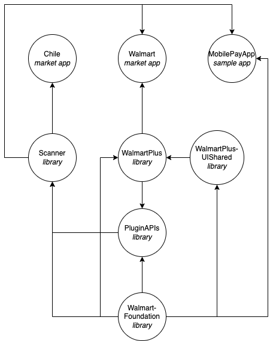

## Continuous Integration Testing Strategy

The glass workspace is vast and contains a myriad of unit and UI test targets containing tens of thousands of _hopefully_ high-quality tests. As one might conclude, executing all of these tests for every code change is untenable and undesirable because of the long execution time. Therefore, a subset of of the test suites are executed in CI based on the modification to the code.

## Test Plan Selection

All tests executed in CI are derived from test plans (`.xctestplan`) associated with the Walmart USA scheme. Test plans are used because they provide fine-grained control of the test targets and tests executed. In addition, they make it easy to split up large suites into smaller ones for parallelization on different CI nodes. Test plans are located in the containing module's test target directory, e.g. `MyPluginTests/MyPluginTestsUnitDefault.xctestplan`.

When a pull request is opened, the code modifications are associated with a module target and its respective test plans. For example, a modification to target A results in A's test plans being selected for execution. If other targets in the codebase depend on A, their test plans are also selected for _execution_ or _building_ based on A's _dependent testing strategy_. Building refers to compiling the targets associated with a test plan to ensure there are no compilation errors. There are currently three types of dependent testing strategies described below.

### Dependent Strategy

| Strategy     | Description                                                                                                                                                                                                                                                                                                                                                                                                                                                                                         |
|--------------|-----------------------------------------------------------------------------------------------------------------------------------------------------------------------------------------------------------------------------------------------------------------------------------------------------------------------------------------------------------------------------------------------------------------------------------------------------------------------------------------------------|
| build        | Build the dependents of an impacted target to ensure the modification to the target did not result in a compilation error. The strategy is used for targets that do not contain business logic such as a target containing only protocol declarations and helper types, e.g. PluginAPIs. The idea is that the dependents depend primarily on types and small utilities rather than core logic. In addition, the dependents' tests should not rely on implementation details of the modified target. |
| execute      | Execute the dependents' test plans of an impacted target. The strategy ensures the dependents do not incur regressions from changes in the implementation of the impacted target.                                                                                                                                                                                                                                                                                                                   |
| semantic     | Execute the dependents' test plans of an impacted target when the change is MAJOR or build the dependent targets when the change is MINOR or PATCH. Semantic should only be used for 'shared' modules with lots of dependents.                                                                                                                                                                                                                                                                      |
| smartExecute | Build or execute the dependents' test plans of an impacted target based on the dependent's "target type".                                                                                                                                                                                                                                                                                                                                                                                           |

The default dependent testing strategy is `smartExecute`.

#### Semantic

The `semantic` dependent strategy is used to reduce the "time to merge" and CI overhead for benign changes to shared modules. Shared modules are excellent at reducing duplicative code and consolidating common logic, but can be costly when dependent test suites must be executed in a monorepo. For example, a simple addition to a shared module may result in 4-6 hours of CI time because of the requirement that dependent test suites be executed. `semantic` attempts to prevent this 'churn' by forcing the developer to increment a semantic version associated with the shared module target. Based on the [semantic change](https://semver.org/), the dependent targets may be built or tested. Currently, only MAJOR changes result in the dependent test suites being executed.

#### Smart execute

The `smartExecute` dependent strategy resolves to `build` or `execute` based on the dependent's target type.

| Target type    | Resolved strategy | Reason                                                                                                                                                                     |
|----------------|-------------------|----------------------------------------------------------------------------------------------------------------------------------------------------------------------------|
| app extension  | execute           | App extensions are associated with a market app and core to the user journey.                                                                                             |
| library        | execute           | Regressions can occur from dependency changes.                                                                                                                             |
| marketApp      | execute           | Market apps are core to the user journey.                                                                                                                                  |
| resourceBundle | execute           | A missing resource can cause a crash or test failure.                                                                                                                      |
| sample app     | build             | Sample apps utilize mocks rather than the concrete implementation of dependencies. A change to a dependency of a sample should not result in a test failure in most cases. |
| test           | build             | The test plans of the impacted target are already executed, it should be safe to simply build the test targets that depend on the impacted target.                         |


### Target test configuration

A target can override the the default target and dependent test strategies by specifying a test configuration in the target's respective `glassconf` file. For example the `PluginAPIs` plugin sets the `dependentStrategy` for targets `PluginAPIs` and `PluginAPIsMocks` to `build` to prevent unnecessary test execution.

```json
{
  "pluginName": "PluginAPIs",
  "targets": [
    {
      "name": "PluginAPIs", 
      "test": {
        "strategy": "whenImpacted",
        "dependentStrategy": "build"
      }
    },
    {
      "name": "PluginAPIsMocks",
      "test": {
        "strategy": "whenImpacted",
        "dependentStrategy": "build"
      }
    }
  ]
}
```

The target's own test strategy can also be set to `whenImpacted` or `alwaysExecute`. The `whenImpacted` strategy executes the target's test plans when a modification impacting the target is made. Conversely, the `alwaysExecute` strategy executes a target's test plan regardless of the code change.

## Market apps

The USA market app serves as the "host app" for test plans; all test plans requiring execution in CI are added to the `Walmart.xcsheme`. The other market apps execute a small suite of test plans when they are impacted. If they are not impacted, the market apps are not built in CI to save resources.

## Examples

A sample target dependency graph and the impact of modifying a target is provided below to help illustrate the testing strategies.

### Dependency Graph

A directed edge (x, y) indicates that `y` has a dependency on `x`. e.g. Chile depends directly on Scanner.



| Target              | Target Type | Dependent Strategy | Direct dependencies                                |
|---------------------|-------------|--------------------|----------------------------------------------------|
| Chile               | market app  | smartExecute       | Scanner                                            |
| Walmart             | market app  | smartExecute       | Scanner, WalmartPlus                               |
| MobilePayApp        | sample app  | smartExecute       | Scanner, WalmartFoundation                         |
| Scanner             | library     | smartExecute       | PluginAPIs, WalmartFoundation                      |
| WalmartPlus         | library     | smartExecute       | PluginAPIs, WalmartFoundation, WalmartPlusUIShared |
| WalmartPlusUIShared | library     | smartExecute       | WalmartFoundation                                  |
| PluginAPIs          | library     | build              | WalmartFoundation                                  |
| WalmartFoundation   | library     | smartExecute       |                                                    |

### Test execution

The table below shows what target test plans are built or executed when a target is impacted by a code modification.

| Impacted target     | Execute                                                                        | Build                                              |
|---------------------|--------------------------------------------------------------------------------|----------------------------------------------------|
| Chile               | Chile                                                                          |                                                    |
| Scanner             | Chile, Scanner, Walmart                                                        | MobilePayApp                                       |
| WalmartPlus         | Walmart, WalmartPlus                                                           |                                                    |
| WalmartPlusUIShared | Walmart, WalmartPlus, WalmartPlusUIShared                                      |                                                    |
| PluginAPIs          | PluginAPIs                                                                     | Chile, MobilePayApp, Scanner, Walmart, WalmartPlus |
| WalmartFoundation   | Chile, PluginAPIs, Scanner, WalmartFoundation WalmartPlus, WalmartPlusUIShared | MobilePayApp                                       |
