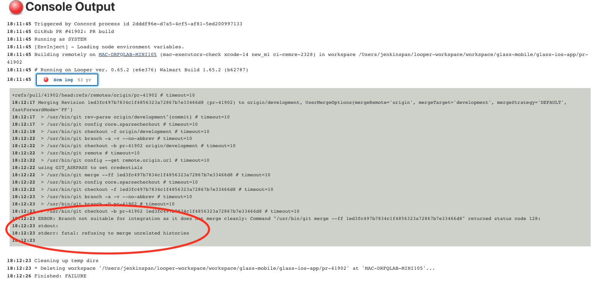
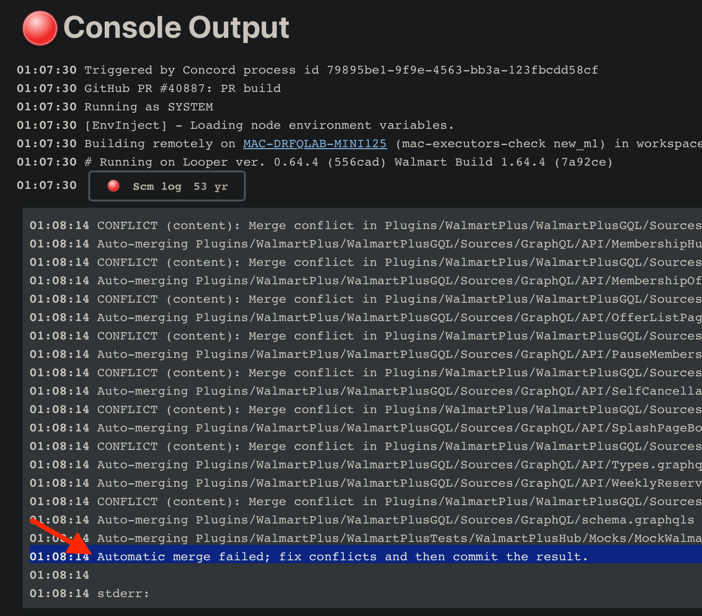
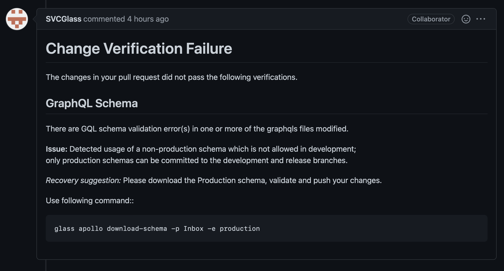
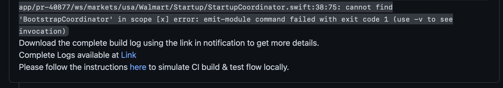
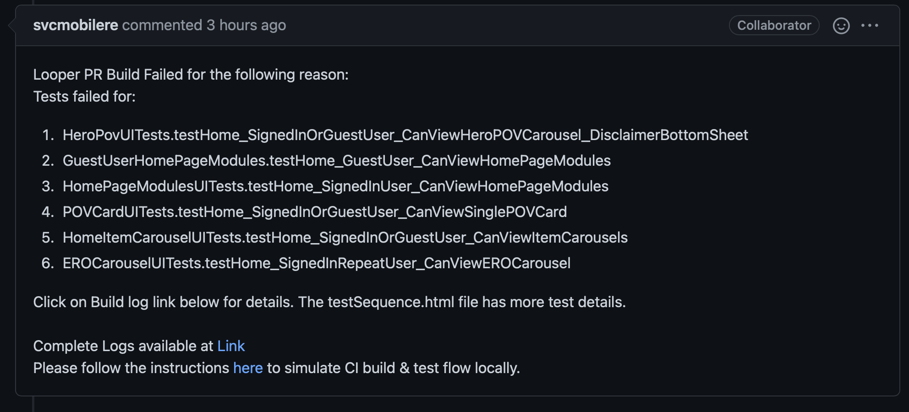
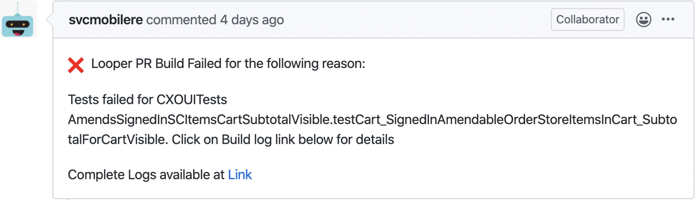
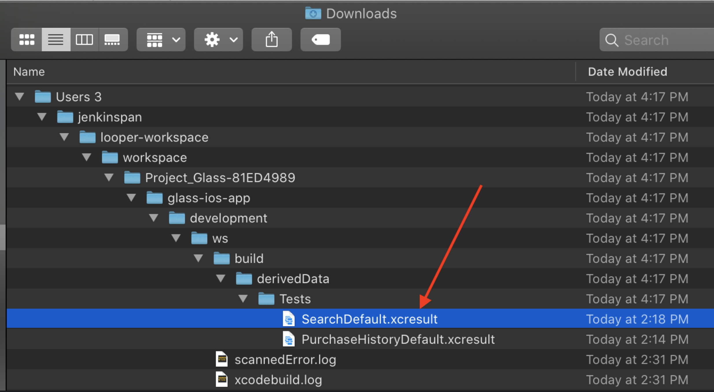
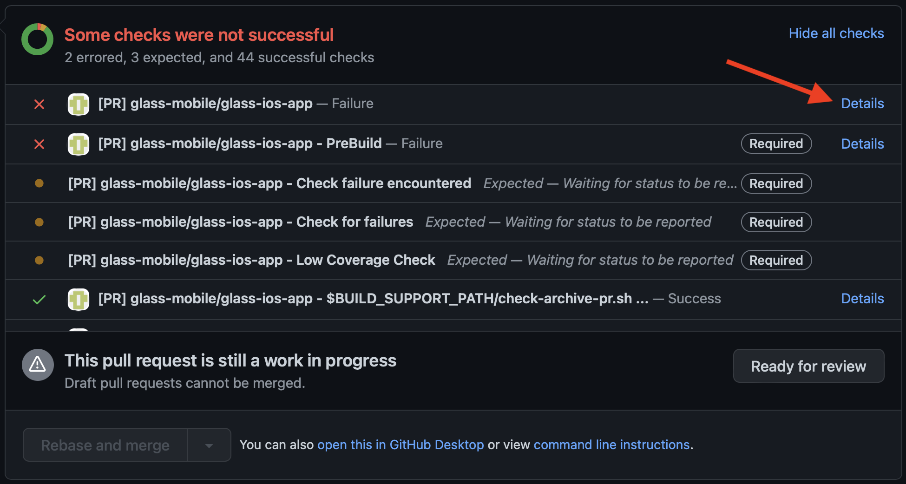
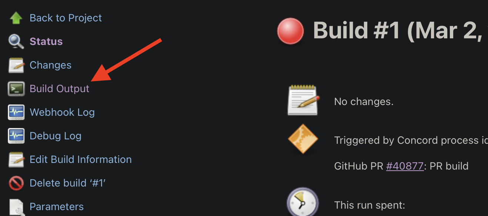
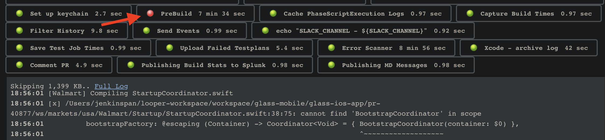

# CI Failures

Failures happen and they may be due to your changes as well as due to something else. Please be respectful of the time of your colleagues and especially of MRE and Platform teams. Before asking for help, please do the initial investigation following the steps below. If you still need help, try to route your request to the appropriate team and share the details about your findings.

## First Steps

1. [Identify the failure](#identifying-the-failure) to understand how to troubleshoot
2. Use the [troubleshooting guides](index.md) to troubleshoot common build failures such as [verification failures](#verification-failures), [compilation failures](#compilation-failures), and [test failures](#test-failures)
3. [Get more help](#more-help) if you have followed the troublshooting guides and cannot resolve your issue after spending a sensible amount of time troubleshooting

## Identifying the Failure

CI can fail for several different reasons and it's helpful to understand the type of failure so you can effectively troubleshoot the issue. To identify the failure:

- Read the failure PR comment that CI posted to determine the [type of failure](#types-of-failures). Most failures can be identified by reading the failure PR comment
- [Download and review the build log](#review-the-build-log) for more information about the build or test failure.
- [Review the looper job log](#review-the-looper-job-log) if you cannot determine the cause of the failure from looking the PR comment or reviewing the build log.

### Types of Failures

The most common types of CI failures are:

- [**SCM Log failures**](#scm-log-failures) - typically indicates that your branch does not merge cleanly with development
- [**Verification failures**](#verification-failures) - a verification check failed
- [**Compilation failures**](#compilation-failures) - the code failed to compile
- [**Test failures**](#test-failures) - the code compiled successfully but one or more tests were run and did not complete successfully

#### SCM Log Failures

Errors during the `SCM Log` looper step typically indicate that your branch does not merge cleanly with development. If your branch is old and is 200+ commits behind latest development, the PR checks are bound to fail with the following error -
  `stderr: fatal: refusing to merge unrelated histories`
Rebase your branch with the latest development, resolve the conflicts, and push your branch.

#### Verification Failures

Follow the recovery suggestion to resolve a verification error.

#### Compilation Failures

One or more build targets failed to compile. 

- Make sure you have rebased with the latest on the development branch
- [Review the build](#review-the-build-log) log to see which target(s) failed and why.
- Build the target(s) that failed locally to attempt to reproduce the failure
- Check the [CODEOWNERS](https://gecgithub01.walmart.com/walmart-ios/glass-app/blob/development/.github/CODEOWNERS) file to reach out to other teams for help with failures in modules owned by other teams

#### Test Failures

Test failures occur when a test case executes but does not finish successfully. See [test troubleshooting](test-troubleshooting.md) for information on how to troubleshoot failing tests.

## Review the Build Log

### Download the Build Log

Download the build log files from the link contained in the PR's failure comment. 

### `xcresult` File

Use the `xcresult` file to see which tests failed and why. See the [test troubleshooting](#test-troubleshooting) guide for information on how to troubleshoot failing tests.

## Review the Looper Job Log

It's helpful to read the looper job log when you cannot identify the failure from the PR failure comment or Xcode build logs. The looper job log is useful for cases when CI fails for reasons other than verification failures, compilation errors, and test failures.

Click the Details link to view the looper job log.

Click Build Output in the looper job to view the build log.

Look through the log of build steps to find the step that failed. 

### Looper Build Steps

Build steps that commonly fail:

- `Scm log` - See [Scm Log failures](#scm-log-failures) for info on troubleshooting Scm log failures.
- `glass pull request verify` - Indicates that a [verification failed](#verification-failures)
- `PreBuild` - typically indicates that the code failed to compile. See [compilation failures](#compilation-failures) for troubleshooting steps.
- `Validate Fixtures` - indicates that the fixture validation check failed

## More Help

- Make sure you have rebased with the latest development branch. Many times build failures unrelated to your branch's changes have already been resolved in the development branch.
- Search slack to see if the failure is a known issue and if others have discussed a resolution.
- Check the [CODEOWNERS](https://gecgithub01.walmart.com/walmart-ios/glass-app/blob/development/.github/CODEOWNERS) file to find the right team to reach out to for help with build and test failures in another team's module.
- If you think your failure is a CI infrastructure issue and you cannot identify your issue as one of the [common failures](#types-of-failures) listed in the doc, reach out to the MRE team in the [#mobile-release-eng](https://walmart.slack.com/archives/C9F2RS6M8) for support.
